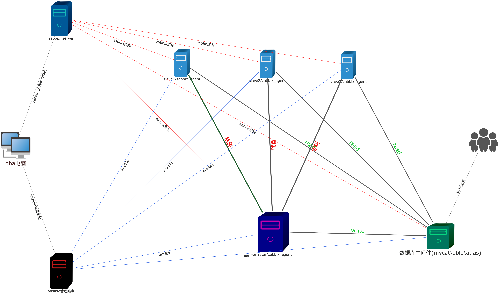
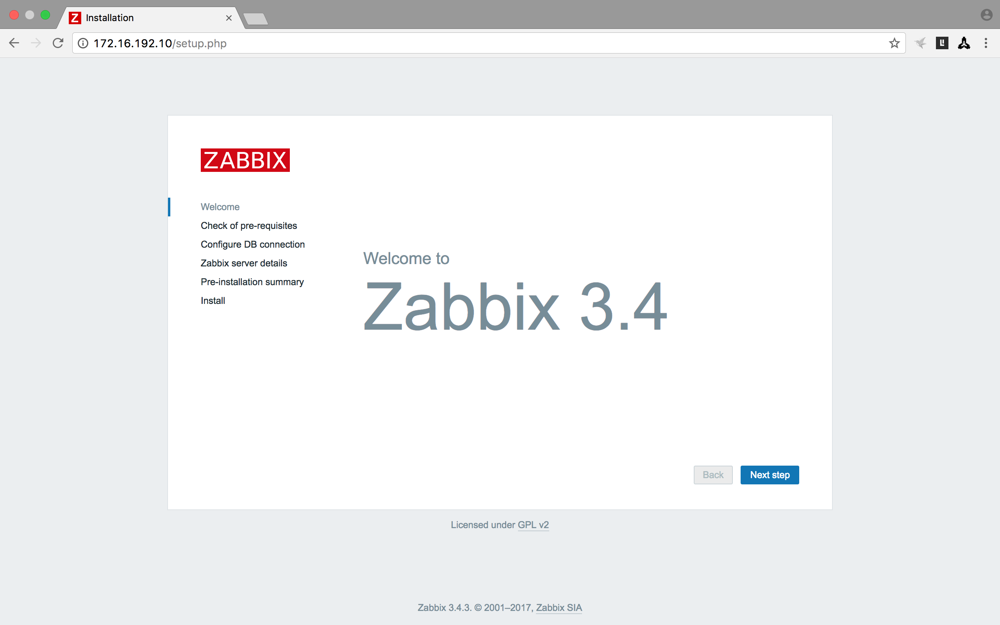
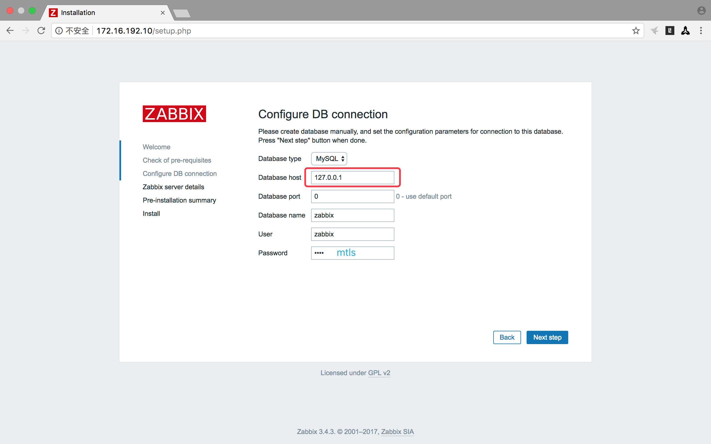
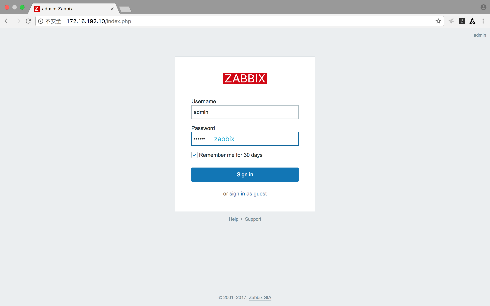
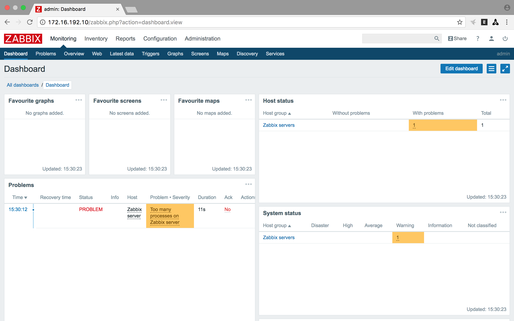

**文档目录**

<!-- 目录开始 -->
- [mysqltools简介](#mysqltools简介)
    - [mysqltools特性](#mysqltools特性)
        - 1 mysql、master-slaves、innodb-cluster、mysql-group-replication等mysql相关环境的自动化安装与配置
        - 2 mysql高可用、读写分离、负载均衡 集群的自动化安装与配置
        - 3 mysql全备、增备、验证、还原 整个生命周期的管理
        - 4 mysql监控环境的自动化安装、配置
        - 5 mysql巡检
        - 6 mysql优化
        - 7 私人定制/商务合作/学习交流/技术支持
    - [mysqltools要解决的问题](#mysqltools要解决的问题)
    - [mysqltools如何解决问题](#mysqltools如何解决问题)
    - [mysqltools示意拓扑图](#mysqltools示意拓扑图)
    - [安装与配置mysqltools](#安装与配置mysqltools)
        - [安装python](#安装python)
            - [安装python第一步](#安装python第一步)
            - [安装python第二步](#安装python第二步)
            - [自动化安装python](#自动化安装python)
        - [安装ansible](#安装ansible)
            - [安装ansibe第一步解决依赖问题](#安装ansibe第一步解决依赖问题)
                - [安装pycparser](#安装pycparser)
                - [安装six](#安装six)
                - [安装asn1crypto](#安装asn1crypto)
                - [安装idna](#安装idna)
                - [安装cryptography](#安装cryptography)
                - [安装pyasn1](#安装pyasn1)
                - [安装pPyNaCl](#安装pPyNaCl)
                - [安装bcrypt](#安装bcrypt)
                - [安装paramiko](#安装paramiko)
                - [安装PyYAML](#安装PyYAML)
                - [安装MarkupSafe](#安装MarkupSafe)
                - [安装Jinja2](#安装Jinja2)
            - [安装ansibe第二步安装ansible](#安装ansibe第二步安装ansible)
            - [自动化安装ansible](#自动化安装ansible)
        - [其它依赖软件的安装](#mtls_install_self_others)
- [mysqltools快速入门](#mysqltools快速入门)
    - [配置ansible](#配置mysqltools)
    - [下载mysql二进制安装包](#下载mysql二进制安装包)
    - [配置mysqltools](#配置mysqltools)
    - [ansible文档](#ansible文档)
- [mysqltools功能列表](#mysqltools功能列表)
    - [mysql安装](#mysql安装)
        - [单实例mysql的安装](#单机实例mysql的安装)
        - [master-slaves复制环境的安装](#mtls_master_slaves_install)
        - [mysql-group-replication环境的安装](#mysql-group-replication环境的安装)
        - [multi-source-replicationg环境的安装](#multi-source-replicationg环境的安装)
        - [mysql-cluster环境的安装](#mtls_mysql_cluster)
    - [被控主机上的python安装](#被控主机上的python安装)
    - [Master High Availability(mha)环境的安装](#mtls_mha)
        - [manger 节点的安装](#mtls_mha_manager)
        - [node   节点的安装](#mtls_mha_node)
    - [mysql中间件](#mysql中间件)
        - [dble](#爱可生分布式中间件)
        - [mycat读写分离](#mycat读写分离)
        - [atlas](#mtls_mysql_proxy_atlas)
    - [mysql备份生命周期管理](#mtls_mysql_backups)
        - [基于MySQL Enterprise Backup(meb)备份周期的管理](#mtls_meb_backup)
        - [基于percona-xtrabackup(xtrabackup)备份周期的管理](#mtls_xbk_backup)
    - [mysql监控环境的安装](#mysql监控环境的安装)
        - [安装zabbix自用的后台mysql数据库](#安装zabbix自用的后台mysql数据库)
        - [httpd的安装](#httpd的安装)
        - [php的安装](#php的安装)
        - [zabbix-server的安装](#zabbix-server的安装)
        - [zabbix-agent的安装](#zabbix-agent的安装)
        - [mysql监控程序monitor](#mysql监控程序monitor)
        - [zabbix 自动化监控mysql的配置](#mtls_zabbix_config)
    - [mysql深度巡检](#mtls_mysql_inspection)
    - [mysql 优化](#mtls_mysql_tuning)
        - [mysql 参数优化](#mtls_mysql_tuning_parta)
        - [sql 语句优化](#mtls_mysql_tuning_partb)
- [私人定制/商务合作/学习交流](#私人定制/商务合作/学习交流)

<!-- 目录结束 -->

<!-- 正文开始 -->
# mysqltools简介

-  ##  mysqltools要解决的问题
    - 1 自动化安装配置各类mysql相关环境

            之前有人对我说：“安装一个mysql这么容易的事还要写个工具？半个小时就能解决的事！” 你打算每次都手工做吗？ ... 
            我想说“年轻人你的思想很危险啊！”
            1、 这样发展下去第2、第3 ... 第100 个的时候都还是要花你半小时、你的生产力没有提高呀！
            2、 你的输出只是一碗“蛋炒饭”、这碗”蛋炒饭"好不好吃、很大一部分取决你炒它时的心情；想想KFC的汉堡、它只要做出一个
                80分的汉堡，然而再把这个汉堡的制作流程记录下来、以后的每个汉堡都完全按这个程序走、每汉堡都是80分的；如果以后找到
                了流程中可以改进的地方、就可以把输出汉堡的质量再提高； 最大的好处在于这个上过程中没有减法、只有加法。

    - 2 自动化监控各类mysql相关环境

            高质量的安装好各类mysql环境只是一个好的开始、mysqltools不只能在安装这个阶段大大的节约mysql-dba要花费的时间、
            还能在mysql整个生命周期中监控mysql、做到有问题早发现、早解决、常见问题自动解决。让dba的时间用到更有价值的地方。

    - 3 自动化备份生命周期管理

    - 4 深度mysql巡检/优化/自动化故障解决

-  ##  mysqltools如何解决问题

    - 1 自动化安装配置功能 mysqltool使用的是国际一流的开源的批量管理工具 ansible:  https://www.ansible.com
    
    - 2 自动化监控mysql功能 mysqltools使用的是国际一流的开源的企业级监控工具zabbix: https://www.zabbix.com

    - 3 动化备份生命周期管理功能 mysqltools使用的是开源的extrabackup | 和企业版的 meb 

    - 4 深度mysql巡检/优化/自动化故障解决功能/监控项的收集功能 mysqltools使用的是自己用python3编码的方式实现的

    - 5 高可用方面mysqltools采用的是mha这个开源解决方案

    - 6 读写分离\分库\分表方面mysqltools 采用的是dble\mycat\atlas这三个开源的解决方案

-  ##  mysqltools示意拓扑图

    1、上面的拓扑图刻画的是一个一主三从的mysql集群、各个mysql客户端通过中间件连接进集群、zabbix_agent会安装在master/slave/中间件/zabbix_server/
    ansible/所在的主机上用于监控信息的收集、收集到的监控信息会汇总到zabbix_server、如果监控到出现了问题，zabbix会触发相关操作的执行以解决相应问题
    (mysqltools中已经定义了常见问题的解决操作)、或是发邮件给dba。由上面可以看出mysql在运行期间遇到的各种问题通常是自动解决的。
    2、mysql相关环境的安装是通过上面的ansible主机来批量、自动化完成的。
    mysqltools开发的综指就是为了解放生产力！

## 安装与配置mysqltools
mysqltools 提供的自动化，集中化运维能力是建立在ansible的基础之上，所以安装ansible 就成了使用mysqltools先决条件；
ansible 这个软件又是由python写出来的，实际上绝大部分linux操作系统都已经安装上了python2.x，作为一个面向未来的软件
mysqltools并没有使用python2.x而是基于python3.6.x上开发完成的。所以在你安装ansible之前还要先安装上python.3.6.x
好在所有的安装包mysqltool都已经为你准备好了，mysqltools/deploy/packages/目录下；不只是这样，还把安装流程写成
了脚本，这样你就只要运行一下mysqltools给出的安装脚本就能自动化安装mysqltools了。

### 安装python
为了方便离线安装python3.6.x 的安装包已经打包到了mysqltools/deploy/packages/python中 注意安装的过程要用root用户

#### 安装python第一步
安装python3.6.x 的相关依赖包

    yum -y install gcc gcc-c++ libffi libffi-devel zlib zlib-devel openssl openssl-devel libyaml sqlite-devel libxml2 libxslt-devel libxml2-devel

#### 安装python第二步
安装python-3.6.x 

    cd mysqltools/deploy/packages/python
    tar -xvf python-3.6.2.tar.xz -C /tmp/
    cd /tmp/Python-3.6.2/
    ./configure --prefix=/usr/local/python-3.6.2/
    make -j 2
    make install
    cd /usr/local/
    ln -s /usr/local/python-3.6.2  python
    echo 'export PATH=/usr/local/python/bin/:$PATH' >> /etc/profile
    source /etc/profile

#### 自动化安装python
事实上mysqltools/deplay/packages/python/install.sh 脚本中包涵了上面两个步骤的命令可以用root用户直接运它以完成python的安装

    bash install.sh

### 安装ansible
为了方便离线安装 ansible-2.4.0.0 的安装包和与之相关的依赖包都已经保存到mysqltool/deploy/packages/ansible目录下

#### 安装ansibe第一步解决依赖问题

##### 安装pycparser
    cd mysqltool/deploy/packages/ansible
    tar -xvf pycparser-2.18.tar.gz -C /tmp/
    cd /tmp/pycparser-2.18
    python3 setup.py build
    python3 setup.py install

##### 安装six
    cd mysqltool/deploy/packages/ansible
    tar -xvf six-1.11.0.tar.gz -C /tmp/
    cd /tmp/six-1.11.0
    python3 setup.py build
    python3 setup.py install

##### 安装asn1crypto
    cd mysqltool/deploy/packages/ansible
    tar -xvf asn1crypto-0.23.0.tar.gz -C /tmp/
    cd /tmp/asn1crypto-0.23.0
    python3 setup.py build
    python3 setup.py install

##### 安装idna
    cd mysqltool/deploy/packages/ansible
    tar -xvf idna-2.6.tar.gz -C /tmp/
    cd /tmp/idna-2.6
    python3 setup.py build
    python3 setup.py install

##### 安装cryptography
    cd mysqltool/deploy/packages/ansible
    tar -xvf cryptography-2.1.1.tar.gz -C /tmp/
    cd /tmp/cryptography-2.1.1/
    python3 setup.py build
    python3 setup.py install

##### 安装pyasn1
    cd mysqltool/deploy/packages/ansible
    tar -xvf pyasn1-0.3.7.tar.gz -C /tmp/
    cd /tmp/pyasn1-0.3.7
    python3 setup.py build
    python3 setup.py install

##### 安装PyNaCl
    cd mysqltool/deploy/packages/ansible
    tar -xvf PyNaCl-1.1.2.tar.gz -C /tmp/
    cd /tmp/PyNaCl-1.1.2
    python3 setup.py build
    python3 setup.py install 

##### 安装bcrypt
    cd mysqltool/deploy/packages/ansible
    tar -xvf bcrypt-3.1.4.tar.gz -C /tmp/
    cd /tmp/bcrypt-3.1.4 
    python3 setup.py build
    python3 setup.py install 

##### 安装paramiko
    cd mysqltool/deploy/packages/ansible
    tar -xvf paramiko-2.3.1.tar.gz -C /tmp/
    cd /tmp/paramiko-2.3.1
    python3 setup.py build
    python3 setup.py install 

##### 安装PyYAML
    cd mysqltool/deploy/packages/ansible
    tar -xvf PyYAML-3.12.tar.gz -C /tmp/
    cd /tmp/PyYAML-3.12
    python3 setup.py build
    python3 setup.py install 

##### 安装MarkupSafe
    cd mysqltool/deploy/packages/ansible
    tar -xvf MarkupSafe-1.0.tar.gz -C /tmp/
    cd /tmp/MarkupSafe-1.0
    python3 setup.py build
    python3 setup.py install    

##### 安装Jinja2
    cd mysqltool/deploy/packages/ansible
    tar -xvf Jinja2-2.9.6.tar.gz -C /tmp/
    cd /tmp/Jinja2-2.9.6
    python3 setup.py build
    python3 setup.py install 

#### 安装ansibe第二步安装ansible
    cd mysqltools/deploy/packages/ansible/
    tar -xvf ansible-2.4.0.0.tar.gz -C /tmp/
    cd /tmp/ansible-2.4.0.0
    python3 setup.py build
    python3 setup.py install 

#### 自动化安装ansible
作为一个着眼于自动化的工具当然是不应该有这么困难的安装方式的，mysqltools为自己写好自动化安装的脚本，注意这个要用root身份运行

    cd mysqltools/deploy/package/ansible
    bash install.sh

# mysqltools快速入门

在这里我们假设你已经根据上面的步骤完成了 [安装python](#安装python) 、[安装ansible](#安装ansible) ；
由于mysqltools在批量管理方面是由ansible来实现的、所以要想正常使用mysqltools就要正确的配置好ansible。
在入门配置中我们以在172.16.192.10上安装mysql为例、用于说明整个配置过程。

## 配置ansible
- 1 、增加到172.16.192.10主机的互信

        ssh-copy-id root@172.16.192.10

- 2 、创建ansible配置文件

        mkdir /etc/ansible/
        touch /etc/ansible/hosts

- 3 、172.16.192.10主机相关的配置增加到/etc/ansible/hosts 内容如下

        cat /etc/ansible/hosts
        cstudio ansible_user=root ansible_host=172.16.192.10

        在这里我为172.16.192.10起了个别名cstudio、以后在ansible中用这个别名就行了

- 4 、测试ansible有没有配置成功、通过pint cstudio 看有没有成功返回

        ansible -m ping cstudio
            cstudio | SUCCESS => {
            "changed": false,
            "failed": false,
            "ping": "pong"
            }

 - 5 、总结：

        由上面的返回可以看到ping 成功了、进一步说明ansible已经配置好了。

## 下载mysql二进制安装包

    cd /opt/
    wget https://dev.mysql.com/get/Downloads/MySQL-5.7/mysql-5.7.20-linux-glibc2.12-x86_64.tar.gz

## 配置mysqltools
mysqltools 只有一个全局配置文件mysqltools/config.yaml 、在这里我们假设你把mysqltools保存到了/opt/mysqltools、
那么配置文件的全路径就是/opt/mysqltools/config.yaml 

- 1 、配置 mtls_base_dir

    这个配置项指定的是mysqltools的基准目录、按上面的假设 mtls_base_dir应该配置成 /opt/mysqltools/ 
    注意在mysqltools的配置文件中所有的路径都要心/结束

        cat /opt/mysqltools/config.yaml | grep mtls_base_dir
        mtls_base_dir: /opt/mysqltools/

- 2 、配置 mysql_packages_dir 

    这个配置项指的是你把mysql的二进制安装包保存在了哪里、在上面的步骤中我们把它下载到了/opt/目录下
    所以mysql_packages_dir 就要配置成/opt/

        cat /opt/mysqltools/config.yaml | grep mysql_packages_dir
        /opt/

- 3 、配置 mysql_package

    这个配置项当前mysqltools要使用那个mysql安装包

        cat /opt/mysqltools/config.yaml | grep mysql_package
        mysql-5.7.20-linux-glibc2.12-x86_64.tar.gz

## ansible文档
由于mysqltools是基于ansible开发出为的工具集、所以要熟练的使用mysqltools你要先了解一下ansible
- 1 ansible中文文档：http://www.ansible.com.cn/index.html
- 2 ansible英文文档：http://docs.ansible.com/ansible/latest/index.html

# mysqltools功能列表

## mysql安装
### 单实例mysql的安装
- 1 进入mysql工具所在的目录

        cd mysqltools/deploy/ansible/mysql/

- 2 设置install_single_mysql.yaml文件中的hosts字段的值为你要执行mysql包安装的目标机器

- 3 调用ansible-playbook完成自动化安装过程

        ansible-playbook install_single_mysql.yaml 
        PLAY [cstudio] ****************************************************************************
        TASK [Gathering Facts] ********************************************************************
        ok: [cstudio]
        TASK [create mysql user] ******************************************************************
        changed: [cstudio]
        TASK [create and config /etc/my.cnf] ******************************************************
        changed: [cstudio]
        TASK [transfer mysql install package to remote host and unarchive to /usr/local/] *********
        changed: [cstudio]
        TASK [change owner to mysql user] *********************************************************
        changed: [cstudio]
        TASK [make link /usr/local/mysql-xx.yy.zz to /usr/local/mysql] ****************************
        changed: [cstudio]
        TASK [export mysql share object (*.os)] ***************************************************
        changed: [cstudio]
        TASK [load share object] ******************************************************************
        changed: [cstudio]
        TASK [export path env variable] ***********************************************************
        changed: [cstudio]
        TASK [export path env to /root/.bashrc] ***************************************************
        changed: [cstudio]
        TASK [make link /usr/local/mysql-xx.yy.zz to /usr/local/mysql] ****************************
        changed: [cstudio]
        TASK [create datadir] *********************************************************************
        changed: [cstudio]
        TASK [initialize-insecure] ****************************************************************
        changed: [cstudio]
        TASK [create libmysqlclient_r.so file for php-5.6] ****************************************
        changed: [cstudio]
        TASK [create systemd config file] *********************************************************
        changed: [cstudio]
        TASK [enable mysqld service] **************************************************************
        changed: [cstudio]
        TASK [start mysql(sytemctl)] **************************************************************
        changed: [cstudio]
        TASK [config mysql.service start up on boot] **********************************************
        changed: [cstudio]
        TASK [config sysv start script] ***********************************************************
        skipping: [cstudio]
        TASK [start mysql(service)] ***************************************************************
        skipping: [cstudio]
        TASK [config mysql.service start up on boot] **********************************************
        skipping: [cstudio]
        TASK [transfer sql statement to remonte] **************************************************
        changed: [cstudio]
        TASK [make mysql secure] ******************************************************************
        changed: [cstudio]
        TASK [clear /tmp/ directory] **************************************************************
        changed: [cstudio]
        PLAY RECAP ********************************************************************************
        cstudio                    : ok=21   changed=20   unreachable=0    failed=0 

- 4 测试mysql数据是否安装成功

        [root@cstudio data]# mysql -uroot -pmtls0352
        mysql: [Warning] Using a password on the command line interface can be insecure.
        Welcome to the MySQL monitor.  Commands end with ; or \g.
        Your MySQL connection id is 5
        Server version: 5.7.20-log MySQL Community Server (GPL)
        
        Copyright (c) 2000, 2017, Oracle and/or its affiliates. All rights reserved.
        
        Oracle is a registered trademark of Oracle Corporation and/or its
        affiliates. Other names may be trademarks of their respective
        owners.
        
        Type 'help;' or '\h' for help. Type '\c' to clear the current input statement.
        
        mysql> 

- 5 注意事项：
    - 1 如果你的目标端操作系统是linux-6.x 而且是最小化安装的情况下会有两个问题出现、原因是缺少selinux-python、numactl
    不过可以通过
    
            yum -y install selinux-python numactl
        把它们行安装一下

### mysql-group-replication环境的安装
- 1 进入mysql-group-replication工具所在的目录

        cd mysqltools/deploy/ansible/mysql/

- 2 告诉mysqltools你要在哪几台主机上安装mysql-group-replication

    >比如说我要在10.186.19.{17,18,19}这三个结点上安装，那么就要把vars/group_replication.yaml
    的内容改成如下

        mtls_with_mysql_group_replication: 1
        mysql_binlog_format: row
        mysql_mgr_port: 33060
        mysql_mgr_hosts: 
            - '10.186.19.17'
            - '10.186.19.18'
            - '10.186.19.19'

- 3 把要安装mysql-group-replication的主机分到一个ansible组中

    >比如说把上面3个实例分类到一个组中、那么/etc/ansible/hosts文件的内容如下

        [mgr1]
        mrg17 ansible_user=root ansible_host=10.186.19.17
        mrg18 ansible_user=root ansible_host=10.186.19.18
        mrg19 ansible_user=root ansible_host=10.186.19.19

- 4 修改mysql-group-replication.yaml文件中的hosts变量为mgr1
        
- 5 自动化安装mysql-group-replication

        ansible-playbook install_group_replication.yaml 
        PLAY [mgr1] **************************************************************************
        TASK [Gathering Facts] ***************************************************************
        ok: [mrg19]
        ok: [mrg17]
        ok: [mrg18]
        TASK [create mysql user] *************************************************************
        ok: [mrg17]
        ok: [mrg18]
        ok: [mrg19]
        TASK [create and config /etc/my.cnf] *************************************************
        changed: [mrg18]
        changed: [mrg17]
        changed: [mrg19]
        TASK [transfer mysql install package to remote host and unarchive to /usr/local/] ****
        changed: [mrg17]
        changed: [mrg18]
        changed: [mrg19]
        TASK [change owner to mysql user] ****************************************************
        changed: [mrg18]
        changed: [mrg17]
        changed: [mrg19]
        TASK [make link /usr/local/mysql-xx.yy.zz to /usr/local/mysql] ***********************
        changed: [mrg17]
        changed: [mrg18]
        changed: [mrg19]
        TASK [export mysql share object (*.os)] **********************************************
        ok: [mrg18]
        ok: [mrg17]
        ok: [mrg19]
        TASK [load share object] *************************************************************
        changed: [mrg18]
        changed: [mrg19]
        changed: [mrg17]
        TASK [export path env variable] ******************************************************
        ok: [mrg18]
        ok: [mrg19]
        ok: [mrg17]
        TASK [export path env to /root/.bashrc] **********************************************
        ok: [mrg17]
        ok: [mrg18]
        ok: [mrg19]
        TASK [make link /usr/local/mysql-xx.yy.zz to /usr/local/mysql] ***********************
        ok: [mrg17]
        ok: [mrg18]
        ok: [mrg19]
        TASK [create libmysqlclient_r.so file for php-5.6] ***********************************
        changed: [mrg17]
        changed: [mrg18]
        changed: [mrg19]
        TASK [create datadir] ****************************************************************
        changed: [mrg17]
        changed: [mrg18]
        changed: [mrg19]
        TASK [initialize-insecure] ***********************************************************
        changed: [mrg17]
        changed: [mrg18]
        changed: [mrg19]
        TASK [create systemd config file] ****************************************************
        changed: [mrg17]
        changed: [mrg18]
        changed: [mrg19]
        TASK [enable mysqld service] *********************************************************
        changed: [mrg18]
        changed: [mrg17]
        changed: [mrg19]
        TASK [start mysql(sytemctl)] *********************************************************
        changed: [mrg18]
        changed: [mrg17]
        changed: [mrg19]
        TASK [config mysql.service start up on boot] *****************************************
        changed: [mrg17]
        changed: [mrg18]
        changed: [mrg19]
        TASK [config sysv start script] ******************************************************
        skipping: [mrg17]
        skipping: [mrg18]
        skipping: [mrg19]
        TASK [start mysql(service)] **********************************************************
        skipping: [mrg17]
        skipping: [mrg18]
        skipping: [mrg19]
        TASK [config mysql.service start up on boot] *****************************************
        skipping: [mrg17]
        skipping: [mrg18]
        skipping: [mrg19]
        TASK [transfer sql statement to remonte] *********************************************
        changed: [mrg17]
        changed: [mrg18]
        changed: [mrg19]
        TASK [make config mgr] ***************************************************************
        changed: [mrg17]
        changed: [mrg19]
        changed: [mrg18]
        TASK [remove temp file /tmp/config_mysql_group_replication.sql] **********************
        changed: [mrg17]
        changed: [mrg18]
        changed: [mrg19]
        TASK [transfer sql statement to remonte] *********************************************
        skipping: [mrg18]
        skipping: [mrg19]
        ok: [mrg17]
        TASK [make mysql secure] *************************************************************
        skipping: [mrg18]
        skipping: [mrg19]
        changed: [mrg17]
        TASK [remove temp file /tmp/make_mysql_secure.sql] ***********************************
        skipping: [mrg18]
        skipping: [mrg19]
        changed: [mrg17]
        PLAY RECAP ***************************************************************************
        mrg17                      : ok=24   changed=17   unreachable=0    failed=0   
        mrg18                      : ok=21   changed=15   unreachable=0    failed=0   
        mrg19                      : ok=21   changed=15   unreachable=0    failed=0 

- 6 查看各结点状态、确认mysql-group-replication正确的安装了

        mysql> select * from performance_schema.replication_group_members;
        +---------------------------+--------------------------------------+-------------+-------------+--------------+
        | CHANNEL_NAME              | MEMBER_ID                            | MEMBER_HOST | MEMBER_PORT | MEMBER_STATE |
        +---------------------------+--------------------------------------+-------------+-------------+--------------+
        | group_replication_applier | 616fc577-c78c-11e7-bd86-1e1b3511358e | mtsl18      |        3306 | ONLINE       |
        | group_replication_applier | 624b4142-c78c-11e7-9a2a-9a17854b700d | mtls17      |        3306 | ONLINE       |
        | group_replication_applier | 643af870-c78c-11e7-8ffa-8a7c439b72d9 | mtls19      |        3306 | ONLINE       |
        +---------------------------+--------------------------------------+-------------+-------------+--------------+
        3 rows in set (0.00 sec)

### multi-source-replicationg环境的安装
- 1 把要安装multi-source-replication的各个主机加入到ansible的一个组中

        cat /etc/ansible/hosts
        [multi_source]
        mtls16 ansible_user=root ansible_host=10.186.19.16
        mtls18 ansible_user=root ansible_host=10.186.19.18
        mtls19 ansible_user=root ansible_host=10.186.19.19

- 2 修改mysqltools/deploy/ansible/mysql/vars/multi_source_replication.yaml这个配置文件
这样mysqltools时就知道那些主机是master角色、那个主机是slave角色了。

        cat multi_source_replication.yaml 
        #master_ips 定义多个master主机ip组成的列表
        master_ips:
         - '10.186.19.16'
         - '10.186.19.18'

        #定义slave的ip
        slave_ip: '10.186.19.19'

- 3 修改mysqltools/deploy/ansible/mysql/install_multi_source_replication.yaml文件中的hosts:变量为 1 中
定义好的组名

        cat install_multi_source_replication.yaml | grep hos
         - hosts: multi_source

- 4 自动化安装multi_source_replication复制环境

        ansible-playbook install_multi_source_replication.yaml 
        PLAY [multi_source] *******************************************************************************
        TASK [Gathering Facts] ****************************************************************************
        ok: [mtls16]
        ok: [mtls19]
        ok: [mtls18]
        TASK [create mysql user] **************************************************************************
        changed: [mtls16]
        changed: [mtls18]
        changed: [mtls19]
        TASK [create and config /etc/my.cnf] **************************************************************
        changed: [mtls16]
        changed: [mtls18]
        changed: [mtls19]
        TASK [transfer mysql install package to remote host and unarchive to /usr/local/] *****************
        changed: [mtls16]
        changed: [mtls18]
        changed: [mtls19]
        TASK [change owner to mysql user] *****************************************************************
        changed: [mtls18]
        changed: [mtls16]
        changed: [mtls19]
        TASK [make link /usr/local/mysql-xx.yy.zz to /usr/local/mysql] ************************************
        changed: [mtls16]
        changed: [mtls18]
        changed: [mtls19]
        TASK [export mysql share object (*.os)] ***********************************************************
        ok: [mtls18]
        ok: [mtls19]
        changed: [mtls16]
        TASK [load share object] **************************************************************************
        changed: [mtls18]
        changed: [mtls19]
        changed: [mtls16]
        TASK [export path env variable] *******************************************************************
        ok: [mtls16]
        ok: [mtls18]
        ok: [mtls19]
        TASK [export path env to /root/.bashrc] ***********************************************************
        changed: [mtls16]
        ok: [mtls18]
        ok: [mtls19]
        TASK [make link /usr/local/mysql-xx.yy.zz to /usr/local/mysql] ************************************
        ok: [mtls18]
        changed: [mtls16]
        ok: [mtls19]
        TASK [create libmysqlclient_r.so file for php-5.6] ************************************************
        changed: [mtls16]
        changed: [mtls18]
        changed: [mtls19]
        TASK [create datadir] *****************************************************************************
        changed: [mtls16]
        changed: [mtls18]
        changed: [mtls19]
        TASK [initialize-insecure] ************************************************************************
        changed: [mtls18]
        changed: [mtls19]
        changed: [mtls16]
        TASK [create systemd config file] *****************************************************************
        changed: [mtls18]
        changed: [mtls16]
        changed: [mtls19]
        TASK [enable mysqld service] **********************************************************************
        changed: [mtls18]
        changed: [mtls19]
        changed: [mtls16]
        TASK [start mysql(sytemctl)] **********************************************************************
        changed: [mtls16]
        changed: [mtls18]
        changed: [mtls19]
        TASK [config mysql.service start up on boot] ******************************************************
        changed: [mtls16]
        changed: [mtls18]
        changed: [mtls19]
        TASK [config sysv start script] *******************************************************************
        skipping: [mtls16]
        skipping: [mtls18]
        skipping: [mtls19]
        TASK [start mysql(service)] ***********************************************************************
        skipping: [mtls16]
        skipping: [mtls18]
        skipping: [mtls19]
        TASK [config mysql.service start up on boot] ******************************************************
        skipping: [mtls16]
        skipping: [mtls18]
        skipping: [mtls19]
        TASK [transfer sql to remonte host] ***************************************************************
        ok: [mtls18]
        changed: [mtls16]
        changed: [mtls19]
        TASK [create multi source replication user on master / start slave on slave] **********************
        changed: [mtls18]
        changed: [mtls16]
        changed: [mtls19]
        TASK [clear temp file /tmp/config_mutli_source_replication.sql] ***********************************
        changed: [mtls16]
        changed: [mtls18]
        changed: [mtls19]
        PLAY RECAP ****************************************************************************************
        mtls16                     : ok=21   changed=19   unreachable=0    failed=0   
        mtls18                     : ok=21   changed=15   unreachable=0    failed=0   
        mtls19                     : ok=21   changed=16   unreachable=0    failed=0 

- 5 验证一下slave上两条复制通道是否都正常：

        Welcome to the MySQL monitor.  Commands end with ; or \g.
        Your MySQL connection id is 24
        Server version: 5.7.20-log MySQL Community Server (GPL)

        Copyright (c) 2000, 2017, Oracle and/or its affiliates. All rights reserved.

        Oracle is a registered trademark of Oracle Corporation and/or its
        affiliates. Other names may be trademarks of their respective
        owners.

        Type 'help;' or '\h' for help. Type '\c' to clear the current input statement.

        mysql> show slave status \G
        *************************** 1. row ***************************
                       Slave_IO_State: Waiting for master to send event
                          Master_Host: 10.186.19.16
                          Master_User: rple_user
                          Master_Port: 3306
                        Connect_Retry: 60
                      Master_Log_File: mysql-bin.000002
                  Read_Master_Log_Pos: 150
                       Relay_Log_File: mtls19-relay-bin-master1.000002
                        Relay_Log_Pos: 355
                Relay_Master_Log_File: mysql-bin.000002
                     Slave_IO_Running: Yes
                    Slave_SQL_Running: Yes
                    ..........
                        Auto_Position: 1
                 Replicate_Rewrite_DB: 
                         Channel_Name: master1
        *************************** 2. row ***************************
                       Slave_IO_State: Waiting for master to send event
                          Master_Host: 10.186.19.18
                          Master_User: rple_user
                          Master_Port: 3306
                        Connect_Retry: 60
                      Master_Log_File: mysql-bin.000002
                  Read_Master_Log_Pos: 150
                       Relay_Log_File: mtls19-relay-bin-master2.000002
                        Relay_Log_Pos: 355
                Relay_Master_Log_File: mysql-bin.000002
                     Slave_IO_Running: Yes
                    Slave_SQL_Running: Yes
                    ..........
                        Auto_Position: 1
                 Replicate_Rewrite_DB: 
                         Channel_Name: master2

## mysql中间件

### mycat读写分离
**mycat是一款非常优秀的中间件、如果要自动化完成mycat分库分表的配置基本上不可能的、这个只能是“人工智能”了；但是读写分离相对简单mysqltool目前只能完成读写分离的配置**

- 1、**配置vars/var_mycat.yaml**
  >vars/var_mycat.yaml 这个配置文件中的配置项就是用于说明整个读写分离集群逻辑构架的

      master_ip: "10.186.19.17"
      #master_ip 用于指定集群的vip / 或主库的ip(如果你没有vip的话)

      slave_ips:
       - "10.186.19.18"
       - "10.186.19.19"
       - "10.186.19.20"
      #slave_ips 从库的ip

      schemas:
       - "appdb"
       - "blogdb"

      #schemas 要导出来的schema

- 2、**修改install_mycat.yaml中的host为目标主机**
  >ansible-playbook是通过hosts属性来指定目标主机的

      ---
       - hosts: cstudio 
         # 这样就表示在cstudio主机上安装mycat
         remote_user: root
         become_user: yes
         vars_files:
          - ../../../config.yaml
          - vars/var_mycat.yaml

- 3、**执行安装**

      ansible-playbook install_mycat.yaml 
      
      PLAY [cstudio] ******************************************************************************************
      
      TASK [Gathering Facts] **********************************************************************************
      ok: [cstudio]
      
      TASK [install java-1.7.0-openjdk] ***********************************************************************
      ok: [cstudio]
      
      TASK [create mycat user] ********************************************************************************
      changed: [cstudio]
      
      TASK [trasfer mycat-server-1.6.5-linux.tar.gz to remonte host] ******************************************
      changed: [cstudio]
      
      TASK [export MYCAT_HOME env to /etc/profile] ************************************************************
      ok: [cstudio]
      
      TASK [config schema.xml] ********************************************************************************
      changed: [cstudio]
      
      TASK [config server.xml] ********************************************************************************
      changed: [cstudio]
      
      TASK [transfer start_mycat.sh to remonte /tmp/] *********************************************************
      changed: [cstudio]
      
      TASK [start mycat] **************************************************************************************
      changed: [cstudio]
      
      TASK [remove start_mycat.sh] ****************************************************************************
      changed: [cstudio]
      
      PLAY RECAP **********************************************************************************************
      cstudio                    : ok=10   changed=7    unreachable=0    failed=0   

- 4、**测试mycat是否正常工作**

      mysql -uappuser -pmtls0352 -h10.186.19.17 -P8066
      mysql: [Warning] Using a password on the command line interface can be insecure.
      Welcome to the MySQL monitor.  Commands end with ; or \g.
      Your MySQL connection id is 1
      Server version: 5.7.200-mycat-1.6.5-release-20171117203123 MyCat Server (OpenCloundDB)
      
      Copyright (c) 2000, 2017, Oracle and/or its affiliates. All rights reserved.
      
      Oracle is a registered trademark of Oracle Corporation and/or its
      affiliates. Other names may be trademarks of their respective
      owners.
      
      Type 'help;' or '\h' for help. Type '\c' to clear the current input statement.
      
      mysql> show databases;
      +----------+
      | DATABASE |
      +----------+
      | appdb    |
      | blogdb   |
      +----------+
      2 rows in set (0.01 sec)
      mysql> use appdb;
      Reading table information for completion of table and column       names
      You can turn off this feature to get a quicker startup with -A
      
      Database changed
      mysql> show tables;
      +-----------------+
      | Tables_in_appdb |
      +-----------------+
      | t               |
      +-----------------+
      1 row in set (0.00 sec)
      
      mysql> insert into t(x,y) values(2,2);
      Query OK, 1 row affected (0.23 sec)

## 被控主机上的python安装
这里介绍的python的安装与前面介绍的[安装python](#安装python)所面向的问题是不一样的、[安装python](#安装python)是为了
在主控机上安装ansible,mysqltools才安装的python；这里介绍的python安装是在已经安装完成ansible之后，在被控主机上安装
python。之所以要在被控机上安装python是因为mysqltools的大多数功能是用python写的，比如对mysql进行监控时，mysql各项
指标的收集工作是通过python语言来实现的。

- 1 进入安装python的playbook所在的目录

        cd mysqltools/deploy/ansible/python

- 2 修改install_python.yaml文件中的hosts变量为你要安装的主机

- 3 执行安装

        ansible-playbook install_python.yaml 
        PLAY [cstudio] ************************************************************************
        TASK [Gathering Facts] ****************************************************************
        ok: [cstudio]
        TASK [install gcc] ********************************************************************
        ok: [cstudio]
        TASK [install gcc-c++] ****************************************************************
        ok: [cstudio]
        TASK [install libyaml-devel] **********************************************************
        ok: [cstudio]
        TASK [install libffi-devel] ***********************************************************
        ok: [cstudio]
        TASK [install zlib-devel] *************************************************************
        ok: [cstudio]
        TASK [install openssl-devel] **********************************************************
        ok: [cstudio]
        TASK [install sqlite-devel] ***********************************************************
        ok: [cstudio]
        TASK [install libxslt-devel] **********************************************************
        ok: [cstudio]
        TASK [install libxml2-devel] **********************************************************
        ok: [cstudio]
        TASK [transfer python-3.6.2.tar.x zpackage to remonte host] ***************************
        changed: [cstudio]
        TASK [transfer python install script to remonte host /tmp/] ***************************
        changed: [cstudio]
        TASK [install python] *****************************************************************
        changed: [cstudio]
        TASK [create link file] ***************************************************************
        changed: [cstudio]
        TASK [export path env variable(/etc/profile)] *****************************************
        ok: [cstudio]
        TASK [export path env variable(/root/.bashrc)] ****************************************
        ok: [cstudio]
        TASK [remove /tmp/install_python.sh] **************************************************
        changed: [cstudio]
        TASK [remove /tmp/Python-3.6.2] *******************************************************
        changed: [cstudio]
        TASK [transfer mysql-connector-python-2.1.5.tar.gz to remonte host] *******************
        ok: [cstudio]
        TASK [transfer mysql-connector-python install script to remonte host] *****************
        ok: [cstudio]
        TASK [install mysql-connector-python] *************************************************
        changed: [cstudio]
        TASK [remove tmp/install_mysql_connector_python.sh] ***********************************
        ok: [cstudio]
        PLAY RECAP ****************************************************************************
        cstudio                    : ok=22   changed=7    unreachable=0    failed=0 

- 4 测试python3有没有安装成功

        python3
        Python 3.6.2 (default, Nov  3 2017, 14:09:03) 
        [GCC 4.8.5 20150623 (Red Hat 4.8.5-4)] on linux
        Type "help", "copyright", "credits" or "license" for more information.
        >>> import mysql
        >>> print("hello mtls")
        hello mtls
        >>> 

 - 5 注意事项
 >由于mysqltools主要是解决mysql相关的问题、解决问题用到的语言是python、目前mysql官方的python连接mysql驱动
 包就是mysql-connector-python 所以mysqltools会在安装python的同时也把这个包也安装上；当然你也可以通过设置
 std_vars.yaml配置文件中mtls_with_mysql_conntor_python的值为0 来禁止这一操作
        
## mysql监控环境的安装
对于mysql的监控mysqltools采用国际一流的开源解决方案(zabbix)来实现、各项监控指标会由zabbix_agent完成收集、并发往zabbix_server、在zabbix_server收到数据后会做一些动作如：数据超过事先设定阈值时会告警，对于每一项收到到的数据zabbix_server都
会把它保存到zabbix自用的后台的数据库中；zabbix为了方便使用还给用户配了一个web界面；当然这个web界面的所有数据都来自于zabbix自用的后台的数据库。这里的介绍有些片面，只是因为我在这里想表达的重点是zabbix环境的建设是在<strong style="color:red;">LAMP</strong>的基础上搞出来的；所以要建设zabbix监控环境
就要先把<strong style="color:red;">LAMP</strong>搭建起来。

### 安装zabbix自用的后台mysql数据库
这个可以参照 [单机实例mysql的安装](#单机实例mysql的安装)

### httpd的安装
mysqltools已经把httpd的源码包都打包进来了，只要简单的两步就能完成httpd的安装

- 1 进入安装httpd的playbook所在的目录

        cd mysqltools/deploy/ansible/httpd/

- 2 修改install_httpd.yaml文件中的hosts变量为你要安装的主机

- 3 执行安装
        
        ansible-playbook install_httpd.yaml 
        PLAY [cstudio] ****************************************************************************
        TASK [Gathering Facts] ********************************************************************
        ok: [cstudio]
        TASK [install gcc] ************************************************************************
        ok: [cstudio]
        TASK [install gcc-c++] ********************************************************************
        ok: [cstudio]
        TASK [install pcre-devel] *****************************************************************
        ok: [cstudio]
        TASK [openssl-devel] **********************************************************************
        ok: [cstudio]
        TASK [expat-devel] ************************************************************************
        ok: [cstudio]
        TASK [transfer apr-1.6.2.tar.gz to remote host] *******************************************
        changed: [cstudio]
        TASK [copy install script to remote] ******************************************************
        changed: [cstudio]
        TASK [install apr] ************************************************************************
        changed: [cstudio]
        TASK [remove /tmp/install_apr.sh] *********************************************************
        changed: [cstudio]
        TASK [remove /tmp/apr-1.6.2] **************************************************************
        changed: [cstudio]
        TASK [transfer apr-util-1.6.0.tar.gz to remote host] **************************************
        changed: [cstudio]
        TASK [copy install script to remote] ******************************************************
        changed: [cstudio]
        TASK [install apr_util] *******************************************************************
        changed: [cstudio]
        TASK [clear /tmp/ directory] **************************************************************
        changed: [cstudio]
        TASK [clear /tmp/ directory] **************************************************************
        changed: [cstudio]
        TASK [copy httpd-2.4.28.tar.gz to remonte host] *******************************************
        changed: [cstudio]
        TASK [copy install scripts to remonte host] ***********************************************
        changed: [cstudio]
        TASK [install httpd] **********************************************************************
        changed: [cstudio]
        TASK [copy httpd.conf to remonte host] ****************************************************
        changed: [cstudio]
        TASK [config sysctl] **********************************************************************
        changed: [cstudio]
        TASK [start httpd] ************************************************************************
        changed: [cstudio]
        TASK [start httpd] ************************************************************************
        skipping: [cstudio]
        TASK [config sysv start script(only linux-6)] *********************************************
        skipping: [cstudio]
        TASK [config httpd start up on boot(only linux-6)] ****************************************
        skipping: [cstudio]
        TASK [start httpd(only linux-6)] **********************************************************
        skipping: [cstudio]
        TASK [remove /tmp/install_httpd.sh] *******************************************************
        changed: [cstudio]
        TASK [remove /tmp/httpd-2.4.28.tar.gz] ****************************************************
        changed: [cstudio]
        PLAY RECAP ********************************************************************************
        cstudio                    : ok=24   changed=18   unreachable=0    failed=0
        
### php的安装
mysqltools会把php安装成httpd的一个模块

- 1 进入到安装php的playbook的目录

        cd mysqltools/deploy/ansible/php

- 2 修改install_php.yaml文件中的hosts变量为你要安装的主机

- 3 执行安装

        ansible-playbook install_php.yaml 
        PLAY [cstudio] ****************************************************************************
        TASK [Gathering Facts] ********************************************************************
        ok: [cstudio]
        TASK [install gcc] ************************************************************************
        ok: [cstudio]
        TASK [install gcc-c++] ********************************************************************
        ok: [cstudio]
        TASK [install bzip2-devel] ****************************************************************
        changed: [cstudio]
        TASK [install libjpeg-devel] **************************************************************
        changed: [cstudio]
        TASK [install libpng-devel] ***************************************************************
        changed: [cstudio]
        TASK [install freetype-devel] *************************************************************
        changed: [cstudio]
        TASK [install freetype-devel] *************************************************************
        ok: [cstudio]
        TASK [copy and untar php-5.6.31.tar.gz to remonte host] ***********************************
        changed: [cstudio]
        TASK [copy install_php.sh to remonte host] ************************************************
        changed: [cstudio]
        TASK [install php] ************************************************************************
        changed: [cstudio]
        TASK [copy php.ini to remote] *************************************************************
        changed: [cstudio]
        TASK [remove /tmp/install_php.sh] *********************************************************
        changed: [cstudio]
        TASK [remove /tmp/php-5.6.31] *************************************************************
        changed: [cstudio]
        PLAY RECAP ********************************************************************************
        cstudio                    : ok=14   changed=10   unreachable=0    failed=0 

### zabbix-server的安装
- 1 进入安装zabbix-server的目录

        cd mysqltools/deplay/ansible/zabbix/

- 2 修改nstall_zabbix_server.yaml 文件中的hosts变量为你要安装的主机

- 3 执行安装脚本

        ansible-playbook install_zabbix_server.yaml 
        PLAY [cstudio] ****************************************************************************
        TASK [Gathering Facts] ********************************************************************
        ok: [cstudio]
        TASK [add zabbix user to system] **********************************************************
        ok: [cstudio]
        TASK [remove /usr/local/httpd/htdocs/index.html] ******************************************
        ok: [cstudio]
        TASK [install gcc] ************************************************************************
        ok: [cstudio]
        TASK [install gcc-c++] ********************************************************************
        ok: [cstudio]
        TASK [install libxml2-devel] **************************************************************
        ok: [cstudio]
        TASK [install curl-devel] *****************************************************************
        ok: [cstudio]
        TASK [install unixODBC-devel] *************************************************************
        ok: [cstudio]
        TASK [install net-snmp-devel] *************************************************************
        ok: [cstudio]
        TASK [install OpenIPMI-devel] *************************************************************
        ok: [cstudio]
        TASK [install libevent-devel] *************************************************************
        ok: [cstudio]
        TASK [transfer zabbix install package to remote host and unarchive to /tmp/] **************
        changed: [cstudio]
        TASK [transfer install script to remonte host] ********************************************
        ok: [cstudio]
        TASK [install zabbix_server_node] *********************************************************
        changed: [cstudio]
        TASK [copy zabbix web-site file to /usr/local/httpd/htdocs/] ******************************
        changed: [cstudio]
        TASK [change /usr/local/httpd/htdocs/ owner and group] ************************************
        changed: [cstudio]
        TASK [change owner to zabbix user] ********************************************************
        changed: [cstudio]
        TASK [make link] **************************************************************************
        changed: [cstudio]
        TASK [transfer zabbix config file to remonte host] ****************************************
        changed: [cstudio]
        TASK [transfer zabbix database init script to remonte host] *******************************
        changed: [cstudio]
        TASK [init zabbix database] ***************************************************************
        changed: [cstudio]
        TASK [remove /tmp/install_zabbix_server.sh] ***********************************************
        changed: [cstudio]
        TASK [remove /tmp/zabbix-3.4.3] ***********************************************************
        changed: [cstudio]
        TASK [remove /tmp/init_zabbix_database.sql] ***********************************************
        changed: [cstudio]
        TASK [stop httpd(linux-6)] ****************************************************************
        skipping: [cstudio]
        TASK [stop httpd(linux-7)] ****************************************************************
        ok: [cstudio]
        TASK [start zabbix-server] ****************************************************************
        changed: [cstudio]
        TASK [start zabbix-agent(on zabbix-server host)] ******************************************
        changed: [cstudio]
        PLAY RECAP ********************************************************************************
        cstudio                    : ok=27   changed=14   unreachable=0    failed=0 
    
- 4 通过浏览器测试zabbix-server是否安装成功

### zabbix-agent的安装

- 1 进入安装zabbix-agent的目录

        cd mysqltools/deplay/ansible/zabbix/

- 2 修改nstall_zabbix_agent.yaml 文件中的hosts变量为你要安装的主机，由于zabbix_agent还要与zabbix_server间进行
通信，所以在安装zabbix_agent时还要告诉它zabbix-server的IP地址，这个地址值可以在std_vars.yaml文件中的zabbix_server_ip配置项指定。

- 3 执行安装脚本

        ansible-playbook install_zabbix_agent.yaml 
        PLAY [cstudio] ****************************************************************************
        TASK [Gathering Facts] ********************************************************************
        ok: [cstudio]
        TASK [add zabbix user to system] **********************************************************
        ok: [cstudio]
        TASK [install gcc] ************************************************************************
        ok: [cstudio]
        TASK [install gcc-c++] ********************************************************************
        ok: [cstudio]
        TASK [install libxml2-devel] **************************************************************
        ok: [cstudio]
        TASK [install curl-devel] *****************************************************************
        ok: [cstudio]
        TASK [install unixODBC-devel] *************************************************************
        ok: [cstudio]
        TASK [install net-snmp-devel] *************************************************************
        ok: [cstudio]
        TASK [install OpenIPMI-devel] *************************************************************
        ok: [cstudio]
        TASK [install libevent-devel] *************************************************************
        ok: [cstudio]
        TASK [transfer zabbix install package to remote host and unarchive to /tmp/] **************
        changed: [cstudio]
        TASK [transfer install script to remonte host] ********************************************
        changed: [cstudio]
        TASK [install zabbix_agent_node] **********************************************************
        changed: [cstudio]
        TASK [change owner to zabbix user] ********************************************************
        changed: [cstudio]
        TASK [make link] **************************************************************************
        changed: [cstudio]
        TASK [transfer zabbix config file to remonte host] ****************************************
        changed: [cstudio]
        TASK [remove /tmp/install_zabbix_agent.sh] ************************************************
        changed: [cstudio]
        TASK [remove /tmp/zabbix-3.4.3] ***********************************************************
        changed: [cstudio]
        TASK [start zabbix-agent] *****************************************************************
        changed: [cstudio]
        PLAY RECAP ********************************************************************************
        cstudio                    : ok=19   changed=9    unreachable=0    failed=0 

- 4 查看abbix-agent 是否正常运行

        ps -ef | grep zabbix                                                                   
        zabbix    89267      1  0 15:46 ?        00:00:00 /usr/local/zabbix/sbin/zabbix_agentd                       
        zabbix    89268  89267  0 15:46 ?        00:00:00 /usr/local/zabbix/sbin/zabbix_agentd: collector [idle 1 sec]
        zabbix    89269  89267  0 15:46 ?        00:00:00 /usr/local/zabbix/sbin/zabbix_agentd: listener #1 [waiting for connection]
        zabbix    89270  89267  0 15:46 ?        00:00:00 /usr/local/zabbix/sbin/zabbix_agentd: listener #2 [waiting for connection]
        zabbix    89271  89267  0 15:46 ?        00:00:00 /usr/local/zabbix/sbin/zabbix_agentd: listener #3 [waiting for connection]
        zabbix    89272  89267  0 15:46 ?        00:00:00 /usr/local/zabbix/sbin/zabbix_agentd: active checks #1 [idle 1 sec]
        zabbix    89273  89267  0 15:46 ?        00:00:00 /usr/local/zabbix/sbin/zabbix_agentd: active checks #2 [idle 1 sec]

### mysql监控程序monitor

- 1 monitor 监控mysql举例:
    
        cd mysqltools/mysqltoolspy/
        python3 monitor.py -s 10.186.19.17 -P3306 -umonitor -pmtls0352  InnodbLogWaits
        0
- 2 monitory 已经实现的监控项列表

    *监控项名*                         |               *简介*                |               *采集方式*        
    ----------------------------------|----------------------------------- |----------------------------------------------
    |`mysql配置(variable)相关的监控项列表`|如果人为修改了mysql参数(variable)并引起了问题、那么对关键参数的监控就能方便的定位问题
    |`-- ServerID`                    | 对应server_id                      | variable |
    |`-- BaseDir`                     | 对应basedir                        | variable |
    |`-- DataDir`                     | 对应datadir                        | variable |
    |`-- Port`                        | 对应port                           | variable |
    |`-- CharacterSetServer`          | 对应character_set_server           | variable |
    |`-- Socket`                      | 对应socket                         | variable |
    |`-- ReadOnly`                    | 对应readonly                       | variable |
    |`-- SkipNameResolve`             | 对应skip_name_resolve              | variable |
    |`-- LowerCaseTableNames`         | 对应lower_case_table_names         | variable |
    |`-- ThreadCacheSize`             | 对应thread_cache_size 、线程池的大小、如果池有空闲的线程、那么新的连接就不单独创建新的线程了 |variable|
    |`-- TableOpenCache`              | 对应table_open_cache               | variable |
    |`-- TableDefinitionCache`        | 对应table_definition_cache         | variable |
    |`-- TableOpenCacheInstances`     | 对应table_open_cache_instance      | variable |
    |`-- MaxConnections`              | 对应max_connections                | variable |
    |`-- BinlogFormat`                | 对应binlog_format                  | variable |
    |`-- LogBin`                      | 对应log_bin                        | variable |
    |`-- BinlogRowsQueryLogEvents`    | 对应binlog_rows_query_log_events   | variable |
    |`-- LogSlaveUpdates`             | 对应log_slave_updates              | variable |
    |`-- ExpireLogsDays`              | 对应expire_logs_days               | variable |
    |`-- BinlogCacheSize`             | 对应binlog_cache_size              | variable |
    |`-- SyncBinlog`                  | 对应sync_binlog                    | variable |
    |`-- ErrorLog`                    | 对应error_log                      | variable |
    |`-- GtidMode`                    | 对应gtid_mode                      | variable |
    |`-- EnforceGtidConsistency`      | 对应enforce_gtid_consistency       | variable |
    |`-- MasterInfoRepository`        | 对应master_info_repository         | variable |
    |`-- RelayLogInfoRepository`      | 对应relay_log_info_repository      | variable |
    |`-- SlaveParallelType`           | 对应slave_parallel_type            | variable |
    |`-- SlaveParallelWorkers`        | 对应slave_parallel_workers         | variable |
    |`-- InnodbDataFilePath`          | 对应innodb_data_file_path          | variable |
    |`-- InnodbTempDataFilePath`      | 对应innodb_temp_data_file_path     | variable |
    |`-- InnodbBufferPoolFilename`    | 对应innodb_buffer_pool_filename    | variable |
    |`-- InnodbLogGroupHomeDir`       | 对应innodb_log_group_home_dir      | variable |
    |`-- InnodbLogFilesInGroup`       | 对应innodb_log_file_in_group       | variable |
    |`-- InnodbLogFileSize`           | 对应innodb_log_file_size           | variable |
    |`-- InnodbFileformat`            | 对应innodb_fileformat              | variable |
    |`-- InnodbFilePerTable`          | 对应innodb_file_per_table          | variable |
    |`-- InnodbOnlineAlterLogMaxSize` | 对应innodb_online_Alter_log_max_size      |variable |
    |`-- InnodbOpenFiles`             | 对应innodb_open_files              | variable |
    |`-- InnodbPageSize`              | 对应innodb_page_size               | variable |
    |`-- InnodbThreadConcurrency`     | 对应innodb_thread_concurrency      | variable |
    |`-- InnodbReadIoThreads`         | 对应innodb_read_io_threads         | variable |
    |`-- InnodbWriteIoThreads`        | 对应innodb_write_io_threads        | variable |
    |`-- InnodbPurgeThreads'`         | 对应innodb_purge_threads           | variable |
    |`-- InnodbLockWaitTimeout`       | 对应innodb_lock_wait_timeout       | variable |
    |`-- InnodbSpinWaitDelay`         | 对应innodb_spin_wait_delay         | variable |
    |`-- InnodbAutoincLockMode`       | 对应innodb_autoinc_lock_mode       | variable |
    |`-- InnodbStatsAutoRecalc`       | 对应innodb_stats_auto_recalc       | variable |
    |`-- InnodbStatsPersistent`       | 对应innodb_stats_persistent        | variable |
    |`-- InnodbStatsPersistentSamplePages`    |对应innodb_stats_persistent_sample_pages    | variable |
    |`-- InnodbBufferPoolInstances`   | 对应innodb_buffer_pool_instances   | variable |
    |`-- InnodbAdaptiveHashIndex`     | 对应innodb_adaptive_hash_index     | variable |
    |`-- InnodbChangeBuffering`       | 对应innodb_change_buffering        | variable |
    |`-- InnodbChangeBufferMaxSize`   | 对应innodb_change_buffer_max_size  | variable |
    |`-- InnodbFlushNeighbors`        | 对应innodb_flush_neighbors         | variable |
    |`-- InnodbFlushMethod`           | 对应innodb_flush_method            | variable |
    |`-- InnodbDoublewrite`           | 对应innodb_doublewrite             | variable |
    |`-- InnodbLogBufferSize`         | 对应innodb_log_buffer_size         | variable |
    |`-- InnodbFlushLogAtTimeout`     | 对应innodb_flushLog_at_timeout     | variable |
    |`-- InnodbFlushLogAtTrxCommit`   | 对应innodb_flushLog_at_trx_commit  | variable |
    |`-- InnodbBufferPoolSize`        | 对应innodb_buffer_pool_size        | variable |
    |`-- Autocommit`                  | 对应autocommit                     | variable |
    |`-- InnodbOldBlocksPct`          | 对应innodb_lld_blocks_pct          | variable |
    |`-- InnodbOldBlocksTime`         | 对应innodb_old_blocks_time         | variable |
    |`-- InnodbReadAheadThreshold`    | 对应innodb_read_ahead_threshold    | variable |
    |`-- InnodbRandomReadAhead`       | 对应innodb_random_read_ahead       | variable |
    |`-- InnodbBufferPoolDumpPct`     | 对应innodb_buffer_pool_dump_pct    | variable |
    |`-- InnodbBufferPoolDumpAtShutdown` |对应innodb_buffer_pool_dump_at_shutdown | variable |
    |*********************************|                                   |      |
    |`mysql状态(status)相关监控`        | 通过对status进行监控可得知mysql当前的性能表现
    |`-- AbortedClients`              | 对应aborted_clients 、client异常退出使得连接没有被正常关闭的次数       | status | 
    |`-- AbortedConnects`             | 对应borted_connects 、没有成功连接到server端的次数                   | status |
    |`-- BinlogCacheDiskUse`          | 对应binlog_cache_disk_use 、使用临时文件存储事务语句的次数            | status |
    |`-- BinlogCacheUse`              | 对应binlog_cache_user 、使用binlog_cache存储事务语句的次数           | status |
    |`-- BinlogStmtCacheDiskUse`      | 对应binlog_stmt_cache_disk_use 、非事务语句使用临时文件存储的次数     | status |
    |`-- BinlogStmtCacheUse`          | 对应binlog_stmt_cache_use 、非事务语句使用binlog_cache存储的次数     | status |
    |`-- BytesReceived`               | 对应bytes_received、从客户端收到的字节数                            | status |
    |`-- BytesSent`                   | 对应bytes_sent、发送给客户端的字节数                                | status |
    |`-- ComBegin`                    | 对应com_begin、         语句执行的次数                             | status |
    |`-- ComCallProcedure`            | 对应com_call_procedure、语句执行的次数                             | status |
    |`-- ComChangeMaster`             | 对应com_change_master、 语句执行的次数                             | status |
    |`-- ComCommit`                   | 对应com_commit、        语句执行的次数                             | status |
    |`-- ComDelete`                   | 对应com_delete、        语句执行的次数                             | status |
    |`-- ComDeleteMulti`              | 对应com_delete_multi、  语句执行的次数                             | status |
    |`-- ComInsert`                   | 对应com_insert、        语句执行的次数                             | status |
    |`-- ComInsertSelect`             | 对应com_insert_select、 语句执行的次数                             | status |
    |`-- ComSelect`                   | 对应com_select、        语句执行的次数                             | status |
    |`-- ComUpdate`                   | 对应com_update、        语句执行的次数                             | status |
    |`-- ComUpdateMulti`              | 对应com_update_multi、  语句执行的次数                             | status |
    |`-- Connections`                 | 对应connections、尝试连接的次数                                    | status |
    |`-- CreatedTmpDiskTable`         | 对应created_tmp_disk_table、创建磁盘临时表的次数                    | status |
    |`-- CreatedTmpFiles`             | 对应created_tmp_files、创建临时文件的次数                           | status |
    |`-- CreatedTmpTables`            | 对应created_tmp_tables、创建临时表的次数                            | status |
    |`-- InnodbBufferPoolDumpStatus`  | 对应innodb_buffer_pool_dump_status innodb_xx_dump的进度          | status |
    |`-- InnodbBufferPoolLoadStatus`  | 对应innodb_buffer_pool_load_status innodb_xx_load的进度          | status |
    |`-- InnodbBufferPoolResizeStatus`| 对应innodb_buffer_pool_resize_status              进度           | status |
    |`-- InnodbBufferPoolBytesData`   | 对应innodb_buffer_pool_bytes_data buffer_pool中的数据量(单位字节)  | status |
    |`-- InnodbBufferPoolPagesData`   | 对应innodb_buffer_pool_pages_data buffer_pool中数据页面数         | status |
    |`-- InnodbBufferPoolPagesDirty`  | 对应innodb_buffer_pool_pages_dirty buffer_pool中脏页数量          | status |
    |`-- InnodbBufferPoolBytesDirty`  | 对应innodb_buffer_pool_bytes_dirty buffer_pool中脏数据量(单位字节) | status |
    |`-- InnodbBufferPoolPagesFlushed`| 对应innodb_buffer_pool_pages_flushed 请求刷新出buffer_pool的页面数 | status |
    |`-- InnodbBufferPoolPagesFree`   | 对应innodb_buffer_pool_pages_free buffer_pool中空闲页面数         | status |
    |`-- InnodbBufferPoolPagesMisc`   | 对应innodb_buffer_pool_pages_misc buffer_pool  total_page -(free + data) | status |
    |`-- InnodbBufferPoolPagesTotal`  | 对应innodb_buffer_pool_pages_total buffer_pool 总项目数          | status |
    |`-- InnodbBufferPoolReadAhead`   | 对应innodb_buffer_pool_read_ahead 由read-ahead机制读入的页面数     | status |
    |`-- InnodbBufferPoolReadAheadEvicted`   | 对应innodb_buffer_pool_read_ahead_evicted 由raed-ahead机制读入的页面中、由于读入后没有被访问而淘汰的页面
    |`-- InnodbBufferPoolReadRequests`| 对应innodb_buffer_pool_read_requests 逻辑读的次数(读buffer_pool)  | status |
    |`-- InnodbBufferPoolReads`       | 对应innodb_buffer_pool_reads 物理读的次数(读磁盘)                  | status |
    |`-- InnodbBufferPoolWaitFree`    | 对应innodb_buffer_pool_wait_free 等待有可用页面的次数              | status |
    |`-- InnodbBufferPoolWriteRequests`|对应innodb_buffer_pool_write_requests 请求写buffer_pool的次数     | status |
    |`-- InnodbDataFsyncs`            | 对应innodb_data_fsyncs fsyncs()函数调用的次数                     | status |
    |`-- InnodbDataPendingFsyncs`     | 对应innodb_data_pending_fsyncs 当前挂起的fsyncs操作               | status |
    |`-- InnodbDataPendingReads`      | 对应innodb_data_pending_reads 当前挂起的读操作                    | status |
    |`-- InnodbDataPendingWrites`     | 对应innodb_data_pending_writes 当前挂起的写操作                   | status |
    |`-- InnodbDataRead`              | 对应innodb_data_read 自启动后读了多少数据进buffer_pool             | status |
    |`-- InnodbDataReads`             | 对应innodb_data_reads 自启动后读了多少次数据进buffer_pool          | status |
    |`-- InnodbDataWrites`            | 对应innodb_data_writes 自启动后写了多少次数据到buffer_pool         | status |
    |`-- InnodbDataWritten`           | 对应innodb_data_written 自启动后写了多少数据到buffer_pool          | status |
    |`-- InnodbDblwrPagesWritten`     | 对应innodb_dblwr_pages_written double_write写入到磁盘的页面数量   | status |
    |`-- InnodbDblwrWrites`           | 对应innodb_dblwr_writes double_write 执行的次数                 | status |
    |`-- InnodbLogWaits`              | 对应innodb_log_waits 写日志时的等待次数                           | status |
    |`-- InnodbLogWriteRequests`      | 对应innodb_log_write_requests 写请求次数                        | status |
    |`-- InnodbLogWrites`             | 对应innodb_log_writes 写磁盘的次数                               | status |
    |`-- InnodbOsLogFsyncs`           | 对应innodb_os_log_fsyncs fsync()函数调用的次数(针对redo log file) | status |
    |`-- InnodbOsLogPendingFsyncs`    | 对应innodb_os_log_pending_fsyncs 挂起的fsync操作数量             | status |
    |`-- InnodbOsLogPendingWrites`    | 对应innodb_os_log_pending_writes 挂起的write操作数量             | status |
    |`-- InnodbOsLogWritten`          | 对应innodb_os_log_written 写入的字节数量                         | status |
    |`-- InnodbPagesCreated`          | 对应innodb_pages_created  创建的页面数量                         | status |
    |`-- InnodbPagesRead`             | 对应innodb_pages_read 从buffer_pool中读出的页面数量               | status |
    |`-- InnodbPagesWritten`          | 对应innodb_pages_written 向buffer_pool写入的页面数量             | status |
    |`-- InnodbRowLockCurrentWaits`   | 对应innodb_row_lock_current_waits 当前的行锁等待数量              | status |
    |`-- InnodbRowLockTime`           | 对应innodb_row_lock_time 花费在获取行锁上的总时间                  | status |
    |`-- InnodbRowLockTimeAvg`        | 对应innodb_row_lock_time_avg 花费在获取行锁上的平均时间            | status |
    |`-- InnodbRowLockTimeMax`        | 对应innodb_row_lock_time_max 花费在获取行锁上的最大时间            | status |
    |`-- InnodbRowLockWaits`          | 对应innodb_row_lock_waits 行锁等待的总次数                       | status |
    |`-- InnodbRowsDeleted`           | 对应innodb_rows_deleted 删除的行数                              | status |
    |`-- InnodbRowsInserted`          | 对应innodb_rows_inserted 插入的行数                             | status |
    |`-- InnodbRowsRead`              | 对应innodb_rows_read 读取的行数                                 | status |
    |`-- InnodbRowsUpdated`           | 对应innodb_rows_updated 更新的行数                              | status |
    |`-- OpenTableDefinitions`        | 对应open_table_definitions 缓存中的.frm文件数量                  | status |
    |`-- OpenTables`                  | 对应open_tables 当前打开的表的数量                               | status |
    |`-- OpenedTableDefinitions`      | 对应opened_table_definitions 曾经缓存过的.frm文件数量             | status |
    |`-- OpenedTables`                | 对应opened_tables 曾经打开过的表                                 | status |
    |`-- TableOpenCacheOverflows`     | 对应table_open_cache_overflows 表打开又关闭的次数                | status |
    |`-- ThreadsCached`               | 对应threads_cached 当前线程池中线程的数量                         | status |
    |`-- ThreadsConnected`            | 对应threads_connected 当前打开的连接                            | status |
    |`-- ThreadsCreated`              | 对应threads_created   为了处理连接所创建的线程总数                 | status |
    |`-- ThreadsRunning`              | 对应threads_running   非sleep状态下的线程数                      | status |
    |`-- Uptime`                      | 对应uptime 从启动开始到现在已经运行了多少秒                         | status |          
    |`-- MgrTotalMemberCount`         | mgr集群中成员的数量                                             | p_s    |
    |`-- MgrOnLineMemberCount`        | mgr集群中online状态下的成员数量                                  | p_s    |
    |`-- MgrMemberState`              | 当前mgr成员的状态                                               | p_s    | 
    |`-- MgrCountTransactionsInQueue` | 当前mgr成员上等待进行冲突检查的事务数量                            | p_s    |
    |`-- MgrCountTransactionsChecked` | 当前mgr成员上已经完成冲突检测的事务数量                            | p_s    |
    |`-- MgrCountConflictsDetected`   | 当前mgr成员上没能通过冲突检测的事务数量                            | p_s    |
    |`-- MgrTransactionsCommittedAllMembers`|当前mgr成员上已经应用的事务总数量                            | p_s    |

- 3 为了更好的与zabbix-agent结合、目前monitor.py能自动导出zabbix的配置文件；方法如下：

        python3 monitor.py export > /tmp/zabbix_agent.conf

# 学习交流/捐赠/私人定制/商务合作/

...

