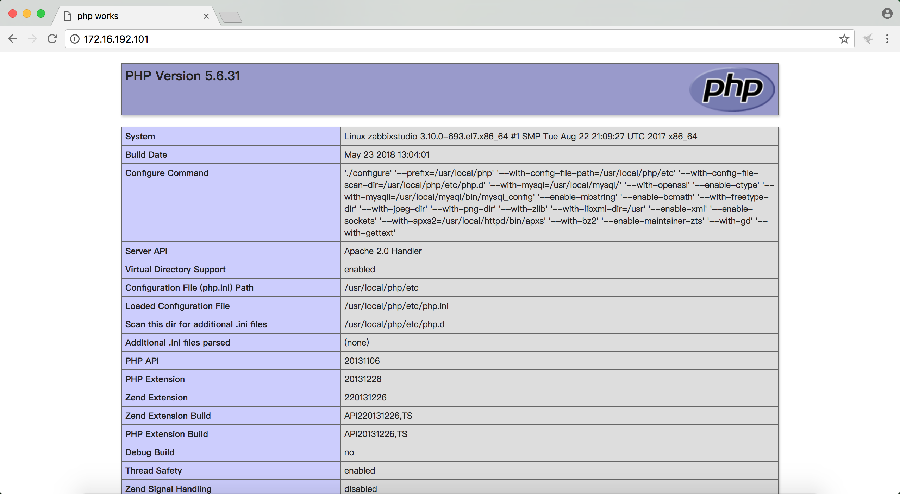
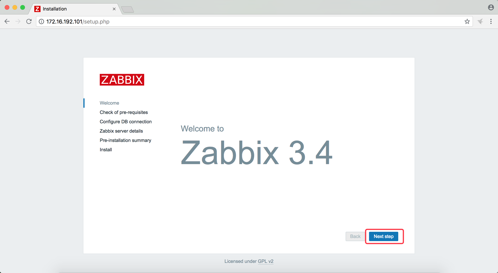
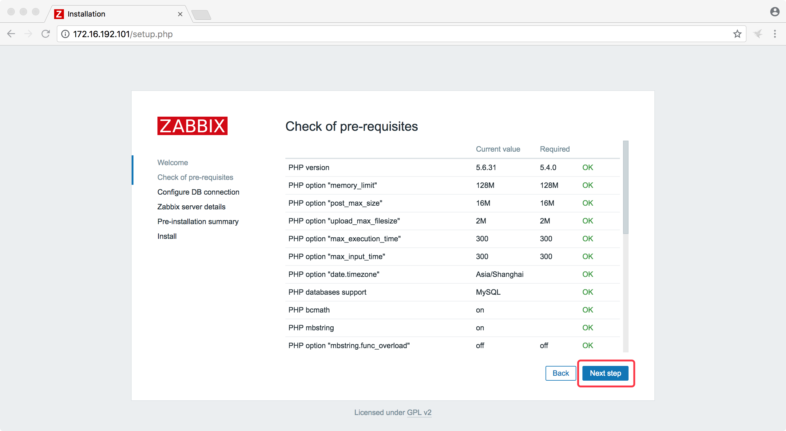
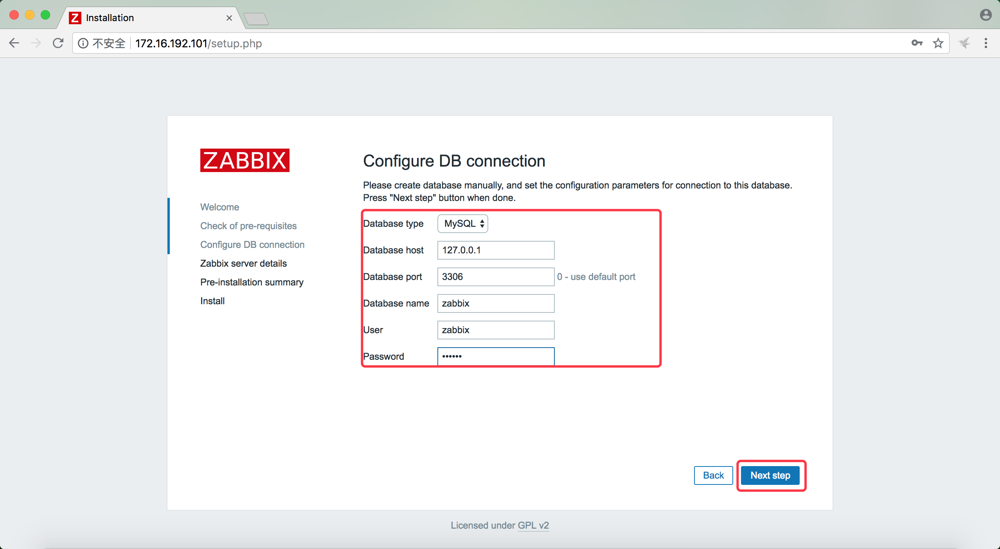
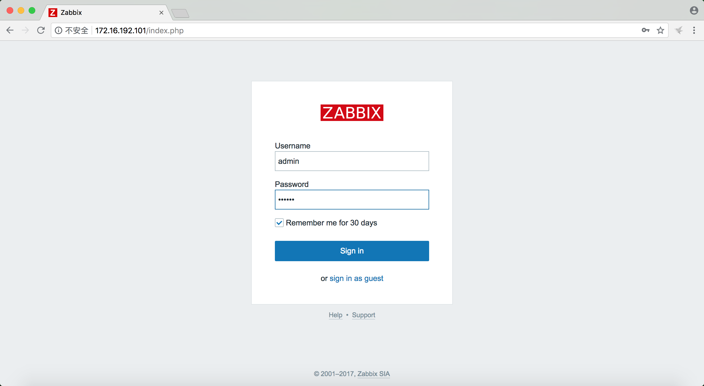
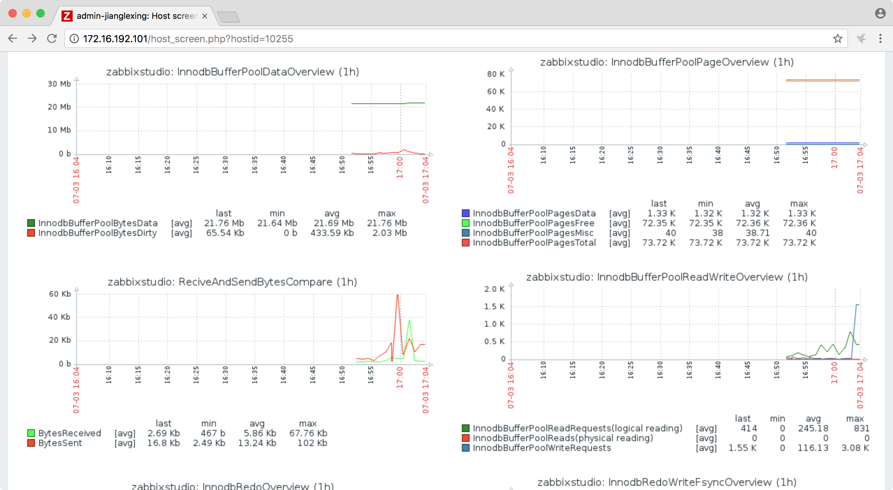

# mysqltools 权威指南

主编&作者:**蒋乐兴**

微信: **jianglegege**

---

## 文档结构
- [概要](#概要)
  - [质量](#质量)
  - [效率](#效率)
  - [经济](#经济)
  - [技术介绍](#技术介绍)
- [安装mysqltools](#安装mysqltools)
  - [安装前的准备](#安装前的准备)
  - [下载并解压](#下载并解压)
  - [安装Python](#安装Python)
  - [安装ansible](#安装ansible)
  - [配置ansible和mysqltools](#配置ansible和mysqltools)
- [mysqltools快速开始](#mysqltools快速开始)
  - [mysqltools目录介绍](#mysqltools目录介绍)
  - [自动化mysql单实例安装](#自动化mysql单实例安装)
    - [进入mysql功能目录](#进入mysql功能目录)
    - [指定安装的目标主机](#指定安装的目标主机)
    - [执行自动化安装](#执行自动化安装)
  - [谈谈mysqltools如何实现高效](#谈谈mysqltools如何实现高效)
  - [谈谈mysqltools如何实现高质量](#谈谈mysqltools如何实现高质量)
- [赞助/交流/技术支持](#联系我)
- [mysql原生环境安装](#mysql原生环境安装)
  - [mysql单机](#mysql单机)
  - [mysql主从复制](#mysql主从复制)
  - [mysql多源复制](#mysql多源复制)
  - [mysql组复制](#mysql组复制)
  - [mysql小版本升级](#mysql小版本升级)
- [读写分离](#读写分离)
  - [mycat读写分离](#mycat读写分离)
- [高可用](#高可用)
  - [mha](#mha)
    - [环境规划](#环境规划)
    - [配置mha的一些前置备件](#配置mha的一些前置备件)
    - [配置ansible的hosts文件](#配置ansible的hosts文件)
    - [配置mysqltools中mha相关的配置项](#配置mysqltools中mha相关的配置项)
    - [配置mha的相关信息](#配置mha的相关信息)
    - [准备安装配置mha](#准备安装配置mha)
    - [安装配置mha](#安装配置mha)
    - [验证是否成功完成](#验证是否成功完成)
- [备份](#备份)
  - [mysqltools备份相关的实现细节](#mysqltools备份相关的实现细节)
  - [实施备份计划的前期准备](#实施备份计划的前期准备)
  - [配置备份](#配置备份)
  - [检查配置是否成功的几个点](#检查配置是否成功的几个点)
  - [注意事项](#注意事项)
- [巡检](#巡检)
  - [开发中]
- [监控](#监控)
  - [目前已经实现的监控项](#目前已经实现的监控项)
  - [监控项的人肉使用方法](#监控项的人肉使用方法)
  - [zabbix监控环境介绍](#zabbix监控环境介绍)
  - [zabbix监控环境安装规划](#zabbix监控环境安装规划)
  - [安装用于保存监控数据的mysql数据库](#安装用于保存监控数据的mysql数据库)
  - [改配置文件中zabbix_server_ip这个配置项](#改配置文件中zabbix_server_ip这个配置项)
  - [安装httpd](#安装httpd)
  - [安装zabbix服务端](#安装zabbix服务端)
  - [安装zabbix客户端](#安装zabbix客户端)
  - [通过mysqltools中给出的模板来监控mysql](#通过mysqltools中给出的模板来监控mysql)
- [lnmp](#lnmp)
  - [安装mysql单机](#安装mysql单机)
  - [安装python](#安装python)
  - [安装nginx](#安装nginx)
  - [查看效果](#查看效果)


---


## 概要

   总的来说mysqltools源自于工作、一个dba的日常大概包括 数据库安装，读写分离、高可用、负载均衡等环境的配置，
   数据库备份策略拟定与实施，数据库相关的监控，数据库优化，故障分析，也有可能参与到数据库建模，SQL的编写。
   
   这样我们就面临两个问题 1、**质量** 质量表现在解决问题的深度(类似问题还会再出现吗？) 2、**效率** 效率表现在你单位时间内解决问题的数量(安装一百个库的用时是一个库的100倍   吗？)； 通常这两个目标并不是互斥的，也就是说我们可以两个都做到。

   ---

1. ## 质量
   **KFC** vs **学校后街的蛋炒饭**

   KFC根据既定的流程生产每一个汉堡，假设这个流程下公众对汉堡给出的评分是80分，那么不管哪个KFC的店它生产出来的汉堡都稳定在80分；一段时间后它发现这个流程中可以改进的项，把汉堡的质量提升到81分，那么它就能做到所有的店里的汉堡都能打81分。

   学校后街的蛋炒饭 好不好吃这个事难说；因为好多事都影响到它，有可能老板今天心情不好，也有可能是今天客人太多他比较急，这些都会影响到炒饭的质量。有一次我要买两盒，由于去的比较晚，老板只有一个鸡蛋了，你没有猜错！ 他就只放了一个蛋，按常理是要一盒一个的。

   表面上看**KFC** 流程化生产的好处在于它的东西质量有保障，**最要命的是KFC只做加法，它可以不断提升自己，学校后街的蛋炒饭上周一，做的好吃，我们没办法确认那是不是超水平发挥，蛋炒饭质量的方差太大了。**

   
   **对于DBA来说可以专门针对自己的日常工作开发一款工具，这样做的好处有 1:)由于工具已经把流程固定下来了所以“产出的质量”有保证 2:)随着自己技术的进步自己工作的输出也可以稳步提高。**  **这样我们在质量这个目标上就只做加法了。**
   
   ---

2. ## 效率
   
   **流水线** vs **手工作坊**

   流水线相对于手工作坊，那是生产力的巨大提升。我为什么要说这个？因为在MySQL的使用中可能会遇到一些场景，比如说“分库分表”，“高可用+读写分离”；特别是前者通常就是一个MyCAT后面有好几十个分片，上百个MySQL实例(通常它们会为一个分片做一主两从并加上高可用)，装100+个MySQL今晚加班不？ 配100+个主从今晚加班不？ 不要忘记还要给它们加
   高可用呢？ 好吧这只是测试环境生产环境和测试环境是1:1的，那接下来几天加班不？ 对于生产通常还要加备份，监控那接下来几天加班不？

   **DBA的工具不应该只是能输出高质量的交付物，更应该要解放生产力----有批量管理的能力。**

   ---

3. ## 经济
   **mysqltools 是开源的&免费的&高质量的MySQL数据管理工具**

   ---

4. ## 技术介绍
   1、mysqltools的高质量源自于**蒋乐兴**也就是我写出来的高质量的playbook

   2、mysqltools的高效源自于**ansible**这个批量管理工具

   3、1 , 2 基本上解决了原生MySQL的环境(**单机**、**master -->slave**、**mysql-group-replication** 、**multi-source-replication**)的安装部署

   4、mysqltools在为MySQL做**高可用**时采用的是**MHA**这个方案，**读写分离用**的是**MyCAT**

   5、mysqltools在**备份**时支持到了 **xtrabackup**,**mysql enterprise backup**,**mysqldump**

   6、mysqltools在**监控**MySQL时用的是**zabbix**

   7、其它开源工具无法满足的功能通常自己编写**Python** 程序实现

   mysqltools的定位是一个**集中化管理平台**你只要**在一台主机上安装好mysqltools就可以了**，其它主机作为被管理都的角色。由于mysqltools是基于**Python-3.x**开发
   出来的所以你的**主控机**上应该事先安装好python-3.x、还要安装上ansible。 好在mysqltools已经包含有所有**Python**和**ansible**所有的包。

   ---

## 安装mysqltools

   假设我们有如下一套环境、把**172.16.192.131**这台主机作为主控机.
   
   **角色**     | **ip地址**         | **系统版本**   |
   -----------:|:-------------------|--------------|
   主控机       | 172.16.192.131     |centos-7.4    |
   被控机       | 172.16.192.132     |centos-7.4    |
   ...         | ...                |centos-7.x    |

   ---

   1. ### 安装前的准备
      1): **你的主控机上要配置有yum**、因为mysqltools要源码编译安装Python-3.6.2、这就涉及gcc ... 等依赖
   
      2): **有主控机的root账号(安装软件时会用到)**
   
      3): **被控机上也要配置好yum**

      ---

   2. ### 下载并解压
      **mysqltools是开源在github上的、下载地址如下：https://github.com/Neeky/mysqltools/archive/master.zip** 
   
      linux可以直接执行如下命令完成下载并解压到/usr/local/
   
      ```bash
      cd /tmp/
      wget https://github.com/Neeky/mysqltools/archive/master.zip &
   
      ll -h /tmp/                                                                           
      -rwxr-xr-x. 1 root  root  194M 3月  23 11:52 master.zip
   
      unzip master.zip
   
      mv mysqltools-master /usr/local/mysqltools
      ```
   
      ---

   3. ### 安装Python
      **mysqltools包含了Python的自动化安装脚本、前提是yum已经可用**
   
      ```bash
      cd /usr/local/mysqltools/deploy/packages/python/
      bash install.sh
   
      ```
      安装成功后的最后几行输出如下：
      ```bash
      Collecting setuptools
      Collecting pip
      Installing collected packages: setuptools, pip
      Successfully installed pip-9.0.1 setuptools-28.8.0
      ```
   
      检查python3是否安装成功
      ```bash
      source /etc/profile
    
      python3 --version
      Python 3.6.2
      ```
   
      ---
   
   4. ### 安装ansible
      **ansible和它相关的依赖我都打包到mysqltools中了、也和上面安装python一样一行命令就行**
   
      ```bash
      source /etc/profile
      cd /usr/local/mysqltools/deploy/packages/ansible
      bash install.sh 
   
      ```
      安装成功后可以看到如下输出
      ```bash
      Using /usr/local/python-3.6.2/lib/python3.6/site-packages
      Finished processing dependencies for ansible==2.4.0.0
      ```
   
      ---

   5. ### 配置ansible和mysqltools
      1): **增加ansible的配置文件**

      ```bash
      # 增加ansible的配置文件
      mkdir -p /etc/ansible
      touch /etc/ansible/hosts
      ```
      /etc/ansible/hosts文件如下：
      ```
      host_131 ansible_user=root ansible_host=172.16.192.131
      host_132 ansible_user=root ansible_host=172.16.192.132
      ```

      ---

      2): **配置主控机与被控机之间的ssh信任**

      ```bash
      ssh-keygen
      ssh-copy-id root@172.16.192.131
      ssh-copy-id root@172.16.192.132
      ```
      命令输出大致如下：
      ```bash
      ssh-keygen # 一直回车就能生成钥匙对了
      Generating public/private rsa key pair.
      Enter file in which to save the key (/root/.ssh/id_rsa): 
      Enter passphrase (empty for no passphrase): 
      Enter same passphrase again: 
      Your identification has been saved in /root/.ssh/id_rsa.
      Your public key has been saved in /root/.ssh/id_rsa.pub.
      The key fingerprint is:
      SHA256:D9kR6/ehu5O99p/LRJlZWNqwZ0tzU4+jvPegq7j/Pq8 root@studio2018
      The keys randomart image is:
      +---[RSA 2048]----+
      |          .   . o|
      |           o   Oo|
      |          o   *+B|
      |         + o ..+X|
      |        S o + .* |
      |         o . +.. |
      |          . oo+. |
      |         .  ++=o.|
      |        ooo+EOo**|
      +----[SHA256]-----+
   
   
      ssh-copy-id root@172.16.192.131 # 回答yes、然后输入目标主机的root密码
      /usr/bin/ssh-copy-id: INFO: Source of key(s) to be installed: "/root/.ssh/id_rsa.pub"
      The authenticity of host '172.16.192.131 (172.16.192.131)' can't be established.
      ECDSA key fingerprint is SHA256:qdoqi3B2aqO3ssOIphwOiWLywSlAoflX2YH+LCG7T/E.
      ECDSA key fingerprint is MD5:8f:78:6e:20:ab:d0:2a:6b:c0:1a:e5:09:ac:82:7d:04.
      Are you sure you want to continue connecting (yes/no)? 
      root@172.16.192.131's password: 
      
      Number of key(s) added: 1
      
      Now try logging into the machine, with:   "ssh 'root@172.16.192.131'"
      and check to make sure that only the key(s) you wanted were added.
   
      .... ....
   
      ```
   
      ---

      3): **测试ansible是否配置成功**
      ```bash
      ansible -m ping host_132
   
      host_132 | SUCCESS => {
          "changed": false,
          "failed": false,
          "ping": "pong"
      }
      ```
   
      ---

      4): **配置mysqltools**
   
      mysqltools的配置文件是**mysqltools/config.yaml** 它是一个yaml格式的文件；配置项中最基本的有**mtls_base_dir、mysql_packages_dir、mysql_package**
   
      1、**mtls_base_dir用于配置mysqltools的安装路径**：在[下载并解压](#下载并解压)这个步骤中我们把mysqltools解压到了/usr/local/、所以mtls_base_dir的值就应该等于"/usr/local/mysqltools/"

      ---
   
      2、**mysql_packages_dir用于配置MySQL二进制安装包保存的位置**：MySQL的安装包有600+MB、出于体量的原因mysqltools并没有直接打包MySQL的二进制安装包、而是留有mysql_packages_dir这个配置项，mysqltools会从这个目录中去找MySQL的二进制安装包。

      ---
   
      3、**mysql_package用于配置MySQL安装包的名字**、有这个变量的因为是为了，可以做到有多个不同的MySQL的版本共存、默认值为   mysql-5.7.22-linux-glibc2.12-x86_64.tar.gz
      
      ---

      config.yaml的关键内容大致如下：
      ```yaml
      mtls_base_dir: /usr/local/mysqltools/
      mysql_packages_dir: /usr/local/src/mysql/
      mysql_package: mysql-5.7.21-linux-glibc2.12-x86_64.tar.gz
      ```
      注意：在mysqltools中所有的目录都是要以'/'号结尾的

      ---
   
      **如果你正确的完成了mysqltools相关的配置那么config.yaml看起来就应该是这样的**
      ```
      ---
      #----------------------------------mysqltools全局配置文件---------------------
      # section 1 #mysqltools所在的目录
      mtls_base_dir: /usr/local/mysqltools/
      #           #mysqltool自带的各类软件的安装文件所在路径(相对路径)
      mtls_packages: deploy/packages/
      #           #mysqltool自带的python脚本、下发到被控主机时所保存的路径
      mtls_client_base_dir: /usr/local/
      
      
      #  section 2  #mysqltools自带的各类软件安装文件 的全名、设置这些变量的作用是方便版本共存、mysql不在这里设置是因为
      #             #mysql的安装包太大了，mysqltools并没有把它打包进来         
      mtls_apr: apr-1.6.2.tar.gz
      mtls_apr_util: apr-util-1.6.0.tar.gz
      mtls_httpd: httpd-2.4.28.tar.gz
      mtls_php: php-5.6.31.tar.gz
      mtls_zabbix: zabbix-3.4.3.tar.gz
      mtls_python: python-3.6.2.tar.xz
      mtls_mysql_connector_python: mysql-connector-python-2.1.5.tar.gz
      mtls_mycat: mycat-server-1.6.5-linux.tar.gz
      mtls_mha_node: mhanode.tar.gz
      mtls_mha_manager: mhamanager.tar.gz
      mtls_git: git-2.9.5.tar.gz
      mtls_nginx: nginx-1.13.7.tar.gz
      mtls_sysbench: sysbench-1.1.0.tar.gz
      mtls_meb: meb-4.1.0-linux-glibc2.5-x86-64bit.tar.gz
      mtls_xtrb: percona-xtrabackup-2.4.9-Linux-x86_64.tar.gz
      mtls_mysqlclient: mysqlclient-1.3.12.tar.gz
      mtls_pytz: pytz-2018.4.tar.gz
      mtls_django: django-2.0.4.tar.gz
      mtls_uwsgi: uwsgi-2.0.17.tar.gz
      
      #mysql与php-5.6.x 是否要同时安装在一台主机上、如果是就要把这个设置成yes、以为php导出mysqclient_r.so文件
      mtls_with_php: 1
      #通过ansible在被控机上安装python-3.x的时候，是否自动安装好mysql-connector-python
      mtls_with_mysql_conntor_python: 1
      #是否给mysql用户加密码
      mtls_make_mysql_secure: 1
      #
      mtls_with_mysql_group_replication: 0
      #----------------------------------mysqltools全局配置文件---------------------
      
      
      ####
      #### mysql 相关的配置
      ####
      #mysql 安装包所在的目录
      mysql_packages_dir: /usr/local/src/mysql/
      #mysql 安装包的名字
      mysql_package: mysql-5.7.22-linux-glibc2.12-x86_64.tar.gz
      #linux 系统级别mysql用户相关信息
      mysql_user: mysql
      mysql_group: mysql
      mysql_user_uid: 3306
      mysql_user_gid: 3306
      #mysql 安装目录
      mysql_base_dir: /usr/local/mysql/
      #mysql 真正的datadir就会是mysql_data_dir_base+mysql_port
      mysql_data_dir_base: /database/mysql/data/
      mysql_port: 3306
      mysql_root_password: mtls0352
      mysql_zabbix_password: mtls
      mysql_rple_user: repl
      mysql_rple_password: repl0352
      mysql_mha_user: mha
      mysql_mha_password: mtls0352
      mysql_app_user: appuser
      mysql_app_password: mtls0352
      mysql_monitor_user: monitor
      mysql_monitor_password: monitor0352
      mysql_backup_user: backup
      mysql_backup_password: DX3906
      #mysql 配置文件模版
      mysql_binlog_format: row
      mysql_innodb_log_files_in_group: 16
      mysql_innodb_log_file_size: 256M
      mysql_innodb_log_buffer_size: 64M
      mysql_innodb_open_files: 65535
      mysql_max_connections: 1000
      mysql_thread_cache_size: 256
      mysql_sync_binlog: 1
      mysql_binlog_cache_size: 64K
      mysql_innodb_online_alter_log_max_size: 128M
      mysql_performance_schema: 'on'
      
      #mysql 
      
      ####
      #### zabbix 相关的配置
      #####
      zabbix_server_ip: 172.16.192.101

   
      ```
      为了你能更加方便的使用mysqltools我提供了份linux上的标准配置文件**mysqltools/config.yaml-for-linux** 使用时只要把它重命名成**cofnig.yaml**就行了
   
      ---

      5): **下载MySQL**
   
      根据上面的配置可以知道MySQL的安装包要保存到**/usr/local/src/mysql/**目录下、包的版本为mysql-5.7.22-linux-glibc2.12-x86_64.tar.gz
      
      下载地址如下：https://dev.mysql.com/get/Downloads/MySQL-5.7/mysql-5.7.22-linux-glibc2.12-x86_64.tar.gz
       
      ```bash
      cd /usr/local/src/mysql/
      wget https://dev.mysql.com/get/Downloads/MySQL-5.7/mysql-5.7.21-linux-glibc2.12-x86_64.tar.gz
      
   
      ```


---

## mysqltools快速开始
   **mysqltools的目录组织是根据它的功能来定的**
   1. ### mysqltools目录介绍

      ```
      cd /usr/local/mysqltools/
      tree ./
      
      ├── backup                        # 与备份相关的功能
      │   ├── meb
      │   ├── extrabackup  
      │   └── mysqldump
      ├── config.yaml                   # 配置文件
      ├── config.yaml-for-linux         
      ├── deploy                        # 自动化安装部署各类环境
      │   ├── ansible                       # 通过ansible完成各类环境的自动化安装
      │   │   ├── mha
      │   │   ├── mycat
      │   │   |..........
      │   │   |..........
      │   │   ├── mysql
      │   │   └── zabbix
      │   └── packages                  # 为了方便使用mysqltools内置的一些第三方源码包
      │       ├── ansible
      |       |............
      |       |............
      │       └── zabbix
      ├── docs                          # 其它文档
      ├── monitor                       # 监控相关的功能
      ├── mysqltoolsclient              # mysqltools客户端脚本
      │   ├── memoryAnalyze.py
      │   ├── monitor.py
      │   └── mtls                          
      ├── readme2.md                    # mysqltools官方文档第二版
      ├── README.md                     # mysqltools官方文档第一版
      ├── trashCan                      # 垃圾箱
      └── tuning                        # 常用SQL分析语句
      ```
      
      ---

   2. ### 自动化mysql单实例安装
      **mysqltools/deploy/ansible/** 目录下的每一个子目录都对应一类软件环境的自动化安装、我们这次是要安装MySQL所以应该进入到mysql子目录

      ---
   
      1. #### 进入mysql功能目录
          ```
          cd /usr/local/mysqltools/deploy/ansible/mysql/
          ll 
          ```
          输出如下
          ```
          总用量 24
          drwxr-xr-x. 2 root root 4096 3月  19 15:01 common     # 通用组件
          -rw-r--r--. 1 root root  836 3月  19 15:01 install_group_replication.yaml         # 自动化安装mysql group replication
          -rw-r--r--. 1 root root  889 3月  19 15:01 install_master_slaves.yaml             # 自动化安装mysql 主从复制环境
          -rw-r--r--. 1 root root  924 3月  19 15:01 install_multi_source_replication.yaml  # 自动化安装mysql 多源复制
          -rw-r--r--. 1 root root  772 3月  26 13:20 install_single_mysql.yaml              # 自动化安装mysql 单机实例
          drwxr-xr-x. 3 root root  203 3月  19 15:01 template   # 通用模板        
          -rw-r--r--. 1 root root  892 3月  19 15:01 upgrad_single_mysql.yaml               # 自动化升级MySQL(不推荐)
          drwxr-xr-x. 2 root root   99 3月  19 15:01 vars       # 通用变量 
          ```
          由于/usr/local/mysqltools/deploy/ansible/下的每一个子目录都实现某一类功能，于是我们约定/usr/local/mysqltools/deploy/ansible/下的子目录叫**功能目录**,   功能目录下的会包含若干.yaml文件，每一个文件都实现了特定的功能，如install_single_mysql.yaml实现了自动化安装MySQL的功能。
       
          ---
       
      2. #### 指定安装的目标主机

         install_single_mysql.yaml的前几行大致如下

         ```yaml
         ---
          - hosts: cstudio
            remote_user: root
            become_user: yes
            vars_files:
             - ../../../config.yaml
            tasks:
             - name: create user and config file
               import_tasks: common/create_user_and_config_file.yaml
         
         ```
         其中的**- hosts: cstudio** 这一行中的cstudio 就是用来指定目标主机或主机组的，也就是说它指明了install_single_mysql.yaml将在哪里安装MySQL单机

         假设我们要在host_132这台主机上安装单机的MySQL所以我们要把cstudio改成host_132、注意这里的host_132引用的是/etc/ansible/hosts文件、修改后的install_single_mysql.yaml文件的前几行大致如下

         ```yaml
         ---
          - hosts: host_132
            remote_user: root
            become_user: yes
            vars_files:
             - ../../../config.yaml
            tasks:
             - name: create user and config file
               import_tasks: common/create_user_and_config_file.yaml
         ```
         
         ---
   
      3. #### 执行自动化安装
         正如上文所说的mysqltools是借助ansible来完成自动化的、那么我们调用ansible来完成自动化安装MySQL
         ```bash
         ansible-playbook install_single_mysql.yaml 
         
         ```
         输出如下

         ```
         
         PLAY [host_132] *********************************************************************************************
         
         TASK [Gathering Facts] **************************************************************************************
         ok: [host_132]
         
         TASK [create mysql user] ************************************************************************************
         changed: [host_132]
         
         TASK [create and config /etc/my.cnf] ************************************************************************
         changed: [host_132]
         
         TASK [install libaio-devel] *********************************************************************************
         ok: [host_132]
         
         TASK [install numactl-devel] ********************************************************************************
         ok: [host_132]
         
         TASK [transfer mysql install package to remote host and unarchive to /usr/local/] ***************************
         changed: [host_132]
         
         TASK [change owner to mysql user] ***************************************************************************
         changed: [host_132]
         
         TASK [make link /usr/local/mysql-xx.yy.zz to /usr/local/mysql] **********************************************
         changed: [host_132]
         
         TASK [export mysql share object (*.os)] *********************************************************************
         ok: [host_132]
         
         TASK [load share object] ************************************************************************************
         changed: [host_132]
         
         TASK [export path env variable] *****************************************************************************
         ok: [host_132]
         
         TASK [export path env to /root/.bashrc] *********************************************************************
         ok: [host_132]
         
         TASK [make link /usr/local/mysql-xx.yy.zz to /usr/local/mysql] **********************************************
         ok: [host_132]
         
         TASK [create libmysqlclient_r.so file for php-5.6] **********************************************************
         changed: [host_132]
         
         TASK [create datadir] ***************************************************************************************
         changed: [host_132]
         
         TASK [initialize-insecure] **********************************************************************************
         changed: [host_132]
         
         TASK [create systemd config file] ***************************************************************************
         changed: [host_132]
         
         TASK [start mysql(sytemctl)] ********************************************************************************
         changed: [host_132]
         
         TASK [config mysql.service start up on boot] ****************************************************************
         ok: [host_132]
         
         TASK [config sysv start script] *****************************************************************************
         skipping: [host_132]
         
         TASK [start mysql(service)] *********************************************************************************
         skipping: [host_132]
         
         TASK [config mysql.service start up on boot] ****************************************************************
         skipping: [host_132]
         
         TASK [transfer sleep script to /tmp/] ***********************************************************************
         changed: [host_132]
         
         TASK [sleep 15 seconds] *************************************************************************************
         changed: [host_132]
         
         TASK [remove /tmp/sleep_15.sh] ******************************************************************************
         changed: [host_132]
         
         TASK [transfer sql statement to remonte] ********************************************************************
         changed: [host_132]
         
         TASK [make mysql secure] ************************************************************************************
         changed: [host_132]
         
         TASK [remove temp file /tmp/make_mysql_secure.sql] **********************************************************
         changed: [host_132]
         
         PLAY RECAP **************************************************************************************************
         host_132                   : ok=25   changed=17   unreachable=0    failed=0 
         ```

         测试MySQL是否安装成功
         ```bash
         mysql -uroot -pmtls0352 
         ```
         输出如下
         ```                                                            
         mysql: [Warning] Using a password on the command line interface can be insecure.
         Welcome to the MySQL monitor.  Commands end with ; or \g.
         Your MySQL connection id is 3
         Server version: 5.7.21-log MySQL Community Server (GPL)
         
         Copyright (c) 2000, 2018, Oracle and/or its affiliates. All rights reserved.
         
         Oracle is a registered trademark of Oracle Corporation and/or its
         affiliates. Other names may be trademarks of their respective
         owners.
         
         Type 'help;' or '\h' for help. Type '\c' to clear the current input statement.
         
         mysql> 
         ```
         
         ---

   3. ### 谈谈mysqltools如何实现高效 
      从上面的[自动化mysql单实例安装](#自动化mysql单实例安装)来看自动化安装的过程中我们只执行了**3个命令**
      ```bash
      cd 
      vim
      ansible-playbook
      ```
      其中 1、cd 用于进行mysql功能目录 2、vim用于指定playbook的目标主机或主机组 3、执行playbook

      高效的关键有两点：

      **1):自动化安装的方式相对于人肉来说要快很多**

      **2):支持批量操作也就是说可以同时在多台主机上执行、只要在hosts: 变量的值是一个主机组就行了**

      ---

   4. ### 谈谈mysqltools如何实现高质量

      **1、mysqltools是流程化的，如上面的安装MySQL就包含20+的小步骤，尽量做到面面俱到**  

      ---

      **2、mysqltools尽可能的在各个小步骤中都保持高的质量、比如/etc/my.cnf各个参数的配置都会根据主机当前的cpu & 内存进行配置**

      ---

      以下是一个host_132的/etc/my.cnf **这些都是由mysqltools针对单机环境动态生成的**

      ```cnf
      [mysql]
      auto-rehash
      
      
      [mysqld]
      ####: for global
      user                                =mysql                          #   mysql
      basedir                             =/usr/local/mysql/              #   /usr/local/mysql/
      datadir                             =/database/mysql/data/3306      #   /usr/local/mysql/data
      server_id                           =653                            #   0
      port                                =3306                           #   3306
      character_set_server                =utf8                           #   latin1
      explicit_defaults_for_timestamp     =off                            #    off
      log_timestamps                      =system                         #   utc
      socket                              =/tmp/mysql.sock                #   /tmp/mysql.sock
      read_only                           =0                              #   off
      skip_name_resolve                   =1                              #   0
      auto_increment_increment            =1                              #   1
      auto_increment_offset               =1                              #   1
      lower_case_table_names              =1                              #   0
      secure_file_priv                    =                               #   null
      open_files_limit                    =65536                          #   1024
      max_connections                     =256                            #   151
      thread_cache_size                   =128                              #   9
      table_open_cache                    =4096                           #   2000
      table_definition_cache              =2000                           #   1400
      table_open_cache_instances          =32                             #   16
      
      ####: for binlog
      binlog_format                       =row                          #     row
      log_bin                             =mysql-bin                      #   off
      binlog_rows_query_log_events        =on                             #   off
      log_slave_updates                   =on                             #   off
      expire_logs_days                    =7                              #   0
      binlog_cache_size                   =65536                          #   65536(64k)
      binlog_checksum                     =none                           #   CRC32
      sync_binlog                         =1                              #   1
      slave-preserve-commit-order         =ON                             #   
      
      ####: for error-log
      log_error                           =err.log                        #   /usr/local/mysql/data/localhost.localdomain.err
      
      general_log                         =off                            #   off
      general_log_file                    =general.log                    #   hostname.log
      
      ####: for slow query log
      slow_query_log                      =on                             #    off
      slow_query_log_file                 =slow.log                       #    hostname.log
      log_queries_not_using_indexes       =on                             #    off
      long_query_time                     =2.000000                       #    10.000000
      
      ####: for gtid
      gtid_executed_compression_period    =1000                          #    1000
      gtid_mode                           =on                            #    off
      enforce_gtid_consistency            =on                            #    off
      
      
      ####: for replication
      skip_slave_start                    =0                              #   
      master_info_repository              =table                         #    file
      relay_log_info_repository           =table                         #    file
      slave_parallel_type                 =logical_clock                 #    database | LOGICAL_CLOCK
      slave_parallel_workers              =4                             #    0
      rpl_semi_sync_master_enabled        =1                             #    0
      rpl_semi_sync_slave_enabled         =1                             #    0
      rpl_semi_sync_master_timeout        =1000                          #    1000(1 second)
      plugin_load_add                     =semisync_master.so            #
      plugin_load_add                     =semisync_slave.so             #
      binlog_group_commit_sync_delay      =500                          #    500(0.05%秒)、默认值0
      binlog_group_commit_sync_no_delay_count = 13                        #    0
      
      
      ####: for innodb
      default_storage_engine                          =innodb                     #   innodb
      default_tmp_storage_engine                      =innodb                     #   innodb
      innodb_data_file_path                           =ibdata1:64M:autoextend     #   ibdata1:12M:autoextend
      innodb_temp_data_file_path                      =ibtmp1:12M:autoextend      #   ibtmp1:12M:autoextend
      innodb_buffer_pool_filename                     =ib_buffer_pool             #   ib_buffer_pool
      innodb_log_group_home_dir                       =./                         #   ./
      innodb_log_files_in_group                       =8                          #   2
      innodb_log_file_size                            =128M                        #  50331648(48M)
      innodb_file_per_table                           =on                         #   on
      innodb_online_alter_log_max_size                =128M                  #   134217728(128M)
      innodb_open_files                               =65535                       #   2000
      innodb_page_size                                =16k                        #   16384(16k)
      innodb_thread_concurrency                       =0                          #   0
      innodb_read_io_threads                          =4                          #   4
      innodb_write_io_threads                         =4                          #   4
      innodb_purge_threads                            =4                          #   4
      innodb_print_all_deadlocks                      =on                         #   off
      innodb_deadlock_detect                          =on                         #   on
      innodb_lock_wait_timeout                        =50                         #   50
      innodb_spin_wait_delay                          =6                          #   6
      innodb_autoinc_lock_mode                        =2                          #   1
      innodb_io_capacity                              =200                        #   200
      innodb_io_capacity_max                          =2000                       #   2000
      #--------Persistent Optimizer Statistics
      innodb_stats_auto_recalc                        =on                         #   on
      innodb_stats_persistent                         =on                         #   on
      innodb_stats_persistent_sample_pages            =20                         #   20
      innodb_buffer_pool_instances                    =1
      innodb_adaptive_hash_index                      =on                         #   on
      innodb_change_buffering                         =all                        #   all
      innodb_change_buffer_max_size                   =25                         #   25
      innodb_flush_neighbors                          =1                          #   1
      #innodb_flush_method                             =                           #  
      innodb_doublewrite                              =on                         #   on
      innodb_log_buffer_size                          =128M                        #  16777216(16M)
      innodb_flush_log_at_timeout                     =1                          #   1
      innodb_flush_log_at_trx_commit                  =1                          #   1
      innodb_buffer_pool_size                         =1152M                  #       134217728(128M)
      autocommit                                      =1                          #   1
      #--------innodb scan resistant
      innodb_old_blocks_pct                           =37                         #    37
      innodb_old_blocks_time                          =1000                       #    1000
      #--------innodb read ahead
      innodb_read_ahead_threshold                     =56                         #    56 (0..64)
      innodb_random_read_ahead                        =OFF                        #    OFF
      #--------innodb buffer pool state
      innodb_buffer_pool_dump_pct                     =25                         #    25 
      innodb_buffer_pool_dump_at_shutdown             =ON                         #    ON
      innodb_buffer_pool_load_at_startup              =ON                         #    ON
      
      
      
      
      ####  for performance_schema
      performance_schema                                                      =on    #    on
      performance_schema_consumer_global_instrumentation                      =on    #    on
      performance_schema_consumer_thread_instrumentation                      =on    #    on
      performance_schema_consumer_events_stages_current                       =on    #    off
      performance_schema_consumer_events_stages_history                       =on    #    off
      performance_schema_consumer_events_stages_history_long                  =off   #    off
      performance_schema_consumer_statements_digest                           =on    #    on
      performance_schema_consumer_events_statements_current                   =on    #    on
      performance_schema_consumer_events_statements_history                   =on    #    on
      performance_schema_consumer_events_statements_history_long              =off   #    off
      performance_schema_consumer_events_waits_current                        =on    #    off
      performance_schema_consumer_events_waits_history                        =on    #    off
      performance_schema_consumer_events_waits_history_long                   =off   #    off
      performance-schema-instrument                                           ='memory/%=COUNTED'
      ```
      由上面的内容可以看到mysqltools生成的/etc/my.cnf在各个方面都是比较全面的(配置是在一个2core 2G的vm虚拟机上复制出来的)
   
      ---

## 联系我

   **赞助/交流/技术支持**

   如果我分享的知识对你有用、可以打赏任意金额；这些也是我花了许多业余时间才写出来的，也许可以请我喝一杯咖啡。如果你需要一名数据库建模、运维方面的专家也可也联系我、当然技术方面的交流也是欢迎的。

   
   
   
   
   ---

## mysql原生环境安装
   **原生环境安装主要包含 1、MySQL单机 2、主从复制 3、多源复制 4、组复制(mysql-group-replication)**
   如果这是你第一次使用mysqltools可以从[mysqltools快速开始](#mysqltools快速开始)章节开启你的mysqltools之旅

   ---

   1. ### mysql单机
      **1):进入mysql功能目录**
      ```bash
      cd /usr/local/mysqltools/deploy/ansible
      
      cd mysql  #进入mysql功能目录
      ```

      ---

      **2):指定install_single_mysql.yaml中的目标主机**

      假设我要在host_132主机上安装mysql那么install_single_mysql.yaml文件中的hosts变量应该设置为host_132
      ```yaml
      ---
       - hosts: host_132
      ```
      yaml格式对空间是非常敏感的、注意“:”后面是有个空格的

      ---

      **3):执行自动化安装**
      ```bash
      ansible-playbook install_single_mysql.yaml
      ```
      输出省略 ... ...

      ---

      **4):验证mysql是否成功安装**
      ```bash
      mysql -uroot -pmtls0352
      ```
      输出如下
      ```
      mysql: [Warning] Using a password on the command line interface can be insecure.
      Welcome to the MySQL monitor.  Commands end with ; or \g.
      Your MySQL connection id is 2
      Server version: 5.7.21-log MySQL Community Server (GPL)
      
      Copyright (c) 2000, 2018, Oracle and/or its affiliates. All rights reserved.
      
      Oracle is a registered trademark of Oracle Corporation and/or its
      affiliates. Other names may be trademarks of their respective
      owners.
      
      Type 'help;' or '\h' for help. Type '\c' to clear the current input statement.
      
      mysql>
      ```
      root用户的密码是在mysqltools/config.yaml文件中的mysql_root_password配置项指定的、你可以根据你的要求定制

      ---

   2. ### mysql主从复制  
      假设我们要在**10.186.19.15，10.186.19.16，10.186.19.17**三台主机上建设一个一主两从的主从复制环境，其中10.186.19.15为主库

      ---

      **1):增加主机信息到/etc/ansible/hosts**

      向/etc/ansible/hosts文件中增加如下内容
      ```
      [repl]
      replmaster15 ansible_host=10.186.19.15
      replslave16 ansible_host=10.186.19.16
      replslave17 ansible_host=10.186.19.17
      ```

      ---

      **2):进入mysql功能目录**
      ```bash
      cd /usr/local/mysqltools/deploy/ansible
      
      cd mysql  #进入mysql功能目录
      ```

      ---

      **3):指定install_master_slaves.yaml中的目标主机**

      假设我要在repl主机组上安装mysql复制环境那么install_master_slaves.yaml文件中的hosts变量应该设置为repl
      ```yaml
      ---
       - hosts: repl
      ```
      修改var/master_slaves.yaml 告诉mysqltools那个ip是主那些ip是slave
      ```
      #在创建一主多从环境时会用到的变量
      master_ip: 10.186.19.15
      slave_ips:
        - 10.186.19.16
        - 10.186.19.17
      ```

      ---

      **4):执行自动化安装**
      ```bash
      ansible-playbook install_master_slaves.yaml 
      ```
      输出如下
      ```
      PLAY [repl] *****************************************************************************************
      
      TASK [Gathering Facts] ******************************************************************************
      ok: [replmaster15]
      ok: [replslave16]
      ok: [replslave17]
      
      ... ... ... ... ... ... 省略 ... ... ... ... ... ... 
      
      PLAY RECAP ******************************************************************************************
      replmaster15                : ok=28   changed=18   unreachable=0    failed=0   
      replslave16                 : ok=28   changed=19   unreachable=0    failed=0   
      replslave17                 : ok=28   changed=19   unreachable=0    failed=0 
      ```

      ---

      **5):检查主从复制环境是否配置完成**
      ```
      mysql -uroot -pmtls0352
      show slave status \G
      ```
      输出如下
      ```
      *************************** 1. row ***************************
                     Slave_IO_State: Waiting for master to send event
                        Master_Host: 10.186.19.15
                        Master_User: rple
                        Master_Port: 3306
                      Connect_Retry: 60
                    Master_Log_File: mysql-bin.000002
                Read_Master_Log_Pos: 595
                     Relay_Log_File: actionsky16-relay-bin.000002
                      Relay_Log_Pos: 800
              Relay_Master_Log_File: mysql-bin.000002
                   Slave_IO_Running: Yes
                  Slave_SQL_Running: Yes
                  ... ... ... ... ... ... ... ... 
                 Retrieved_Gtid_Set: 8b5ac555-37ec-11e8-b50e-5a3fdb1cf647:1-2
                  Executed_Gtid_Set: 8b5ac555-37ec-11e8-b50e-5a3fdb1cf647:1-2
                      Auto_Position: 1
               Replicate_Rewrite_DB: 
                       Channel_Name: 
                 Master_TLS_Version:
      ```
      两个Yes 说明说明主从复制环境成功配置了
      
      ---

   3. ### mysql多源复制

      假设我们要在**10.186.19.15，10.186.19.16，10.186.19.17**这三台机器上搭建两主1从的多源复制环境、其中15，16两机器上的数据向17同步

      ---

      **1):增加主机信息到/etc/ansible/hosts**

      向/etc/ansible/hosts文件中增加如下内容
      ```
      [repl]
      replmaster15 ansible_host=10.186.19.15
      replslave16 ansible_host=10.186.19.16
      replslave17 ansible_host=10.186.19.17
      ```

      ---

      **2):进入mysql功能目录**
      ```bash
      cd /usr/local/mysqltools/deploy/ansible
      
      cd mysql  #进入mysql功能目录
      ``` 

      ---     

      **3):指定install_multi_source_replication.yaml中的目标主机**

      假设我要在repl主机组上安装mysql复制环境那么install_multi_source_replication.yaml文件中的hosts变量应该设置为repl
      ```yaml
      ---
       - hosts: repl
      ```
      修改var/multi_source_replication.yaml 告诉mysqltools那些ip是主那个ip是slave
      ```
      #master_ips 定义多个master主机ip组成的列表
      master_ips:
       - '10.186.19.15'
       - '10.186.19.16'
      
      #定义slave的ip
      slave_ip: '10.186.19.17'
      ```

      ---

      **4):执行自动化安装**
      ```bash
      ansible-playbook install_multi_source_replication.yaml 
      ```
      输出省略
      ```
      ```

      ---

      **5):检测多源复制环境是否安装成功**
      ```
      mysql -uroot -pmtls0352
      show slave status \G
      ```
      输出如下
      ```
      *************************** 1. row ***************************
                     Slave_IO_State: Waiting for master to send event
                        Master_Host: 10.186.19.15
                        Master_User: rple_user
                        Master_Port: 3306
                      Connect_Retry: 60
                    Master_Log_File: mysql-bin.000002
                Read_Master_Log_Pos: 150
                     Relay_Log_File: actionsky17-relay-bin-master1.000002
                      Relay_Log_Pos: 355
              Relay_Master_Log_File: mysql-bin.000002
                   Slave_IO_Running: Yes
                  Slave_SQL_Running: Yes
      *************************** 2. row ***************************
                     Slave_IO_State: Waiting for master to send event
                        Master_Host: 10.186.19.16
                        Master_User: rple_user
                        Master_Port: 3306
                      Connect_Retry: 60
                    Master_Log_File: mysql-bin.000002
                Read_Master_Log_Pos: 150
                     Relay_Log_File: actionsky17-relay-bin-master2.000002
                      Relay_Log_Pos: 355
              Relay_Master_Log_File: mysql-bin.000002
                   Slave_IO_Running: Yes
                  Slave_SQL_Running: Yes
      ```
      两个通道都是双Yes、多源监制环境成了哦！

      ---

   4. ### mysql组复制
      假设我们要在**10.186.19.15，10.186.19.16，10.186.19.17**这三台机器上搭建一个group replication 环境

      ---

      **1):增加主机信息到/etc/ansible/hosts**

      向/etc/ansible/hosts文件中增加如下内容
      ```
      [repl]
      mgr15 ansible_host=10.186.19.15
      mgr16 ansible_host=10.186.19.16
      mgr17 ansible_host=10.186.19.17
      ```

      ---

      **2):进入mysql功能目录**
      ```bash
      cd /usr/local/mysqltools/deploy/ansible
      
      cd mysql  #进入mysql功能目录
      ``` 

      ---

      **3):指定install_group_replication.yaml中的目标主机**

      假设我要在repl主机组上安装mysql复制环境那么install_group_replication.yaml文件中的hosts变量应该设置为repl
      ```yaml
      ---
       - hosts: repl
      ```
      修改var/group_replication.yaml.yaml 告诉mysqltools那些主机要参与到group replication中、组中成员之前通信的端口是多少、binlog的格式设置成row、开启group replication 复制的开关，这样的话mysqltools就会在生成配置文件的时候写入group replication相关的配置
      ```
      mtls_with_mysql_group_replication: 1
      mysql_binlog_format: row
      mysql_mgr_port: 13306
      mysql_mgr_hosts: 
          - '10.186.19.15'
          - '10.186.19.16'
          - '10.186.19.17'
      ```

      ---

      **4):执行自动化安装**
      ```bash
      ansible-playbook install_group_replication.yaml 
      ```
      输出如下
      ```
      PLAY [repl] *****************************************************************************************
      
      TASK [Gathering Facts] ******************************************************************************
      ok: [mgr15]
      ok: [mgr16]
      ok: [mgr17]
      ... ... ... ... ... ... ... ... ... ... ... ... ... ... ... ... ... ... ... ... ... ... ... ... ... 
      PLAY RECAP ******************************************************************************************
      mgr15                : ok=28   changed=19   unreachable=0    failed=0   
      mgr16                : ok=28   changed=18   unreachable=0    failed=0   
      mgr17                : ok=28   changed=18   unreachable=0    failed=0 
      ```

      ---
      
      **5):检查group replication集群是否安装成功**
      ```bash
      mysql -uroot -pmtls0352
      select * from performance_schema.replication_group_members ;
      ```
      输出如下
      ```
      +---------------------------+--------------------------------------+-------------+-------------+--------------+
      | CHANNEL_NAME              | MEMBER_ID                            | MEMBER_HOST | MEMBER_PORT | MEMBER_STATE |
      +---------------------------+--------------------------------------+-------------+-------------+--------------+
      | group_replication_applier | 08de362c-3802-11e8-9e65-5a3fdb1cf647 | actionsky15 |        3306 | ONLINE       |
      | group_replication_applier | ef7f3b61-3801-11e8-886d-9a17854b700d | actionsky17 |        3306 | ONLINE       |
      | group_replication_applier | f1649143-3801-11e8-8fd3-5a1f0f06c50d | actionsky16 |        3306 | ONLINE       |
      +---------------------------+--------------------------------------+-------------+-------------+--------------+
      3 rows in set (0.00 sec)
      ```
      三个都是online说明group replication 配置成功了哦

      当mtls_with_mysql_group_replication: 1这个开头打开后mysqltools会自动为/etc/my.cnf增加了group replication 相关的配置项
      ```
      ####: for mysql group replication 
      loose-group_replication_recovery_retry_count          =10                                         #   10
      loose-group_replication_recovery_reconnect_interval   =60                                         #   60
      loose-group_replication_allow_local_disjoint_gtids_join=off                                       #   off
      loose-group_replication_allow_local_lower_version_join=off                                        #   off
      loose-group_replication_ip_whitelist                  =AUTOMATIC                                  #   AUTOMATIC
      loose-transaction_write_set_extraction                =XXHASH64                                   # off
      loose-group_replication_group_name                    ="aaaaaaaa-aaaa-aaaa-aaaa-aaaaaaaaaaaa"     #
      loose-group_replication_start_on_boot                 =off                                        # off
      loose-group_replication_bootstrap_group               =off                                        # off
      loose-group_replication_single_primary_mode           =on                                         #   on
      loose-group_replication_enforce_update_everywhere_checks=off
      loose-group_replication_gtid_assignment_block_size    =1000000                                    #   1000000
      loose-group_replication_poll_spin_loops               =0                                          #   0
      loose-group_replication_compression_threshold         =1024                                       #   1000000
      loose-group_replication_flow_control_mode             =QUOTA                                      #   QUOTA
      loose-group_replication_local_address                 ="10.186.19.15:13306"
      loose-group_replication_group_seeds                   ="10.186.19.15:13306,10.186.19.16:13306,10.186.19.17:13306"
      ```
      也就是说目前mysqltools在配置group replication 集群环境时是按单个写结点的方式配置的、**默认mysqltools把第一个ip地址设置为写结点**

      ---

   5. ### mysql小版本升级
      **mysqltools为版本升级提供了支持，如果你想使用这个功能，那么你要清楚的知道自己在干什么**

      ---

      1、小版本升级并不会去执行`mysql_upgrade`脚本，这个主要是由于mysqltools诞生环境比较特别，单个实例的数据量是以`TB`来衡量的，在这种量级的情况下`mysql_upgrade`可以能执行几天才能完成，所以你懂的

      ---

      **1):修改upgrad_single_mysql.yaml文件的hosts 变量为你要升级的目标主机**

      ```
      ---
       - hosts: sqlstudio
      ```

      ---

      **2):执行升级程序**
      ```
      ansible-playbook upgrad_single_mysql.yaml
      ```
      输出如下：
      ```
      PLAY [sqlstudio] **************************************************************************************************************
      
      TASK [Gathering Facts] ********************************************************************************************************
      ok: [sqlstudio]
      
      TASK [stop mysql service] *****************************************************************************************************
      ok: [sqlstudio]
      
      TASK [backup link file] *******************************************************************************************************
      changed: [sqlstudio]
      
      TASK [unarchive new package to /usr/local/] ***********************************************************************************
      changed: [sqlstudio]
      
      TASK [change owner and group] *************************************************************************************************
      changed: [sqlstudio]
      
      TASK [make new link file] *****************************************************************************************************
      changed: [sqlstudio]
      
      TASK [start mysql service] ****************************************************************************************************
      changed: [sqlstudio]
      
      PLAY RECAP ********************************************************************************************************************
      sqlstudio                  : ok=7    changed=5    unreachable=0    failed=0
      ```

      ---

      **3):查看升级是否成功**
      
      1、看/usr/local/下的变化

      **升级前**
      ```
      drwxr-xr-x   9 mysql mysql 129 6月  18 14:46 mysql-5.7.21-linux-glibc2.12-x86_64
      lrwxrwxrwx   1 root  root   35 6月  18 14:53 mysql -> mysql-5.7.21-linux-glibc2.12-x86_64
      ```
      **升级后**
      ```
      lrwxrwxrwx   1 mysql mysql  46 6月  18 15:30 mysql -> /usr/local/mysql-5.7.22-linux-glibc2.12-x86_64
      drwxr-xr-x   9 mysql mysql 129 6月  18 14:46 mysql-5.7.21-linux-glibc2.12-x86_64
      drwxr-xr-x   9 mysql mysql 129 6月  18 15:30 mysql-5.7.22-linux-glibc2.12-x86_64
      lrwxrwxrwx   1 root  root   35 6月  18 14:53 mysql.backup.20180618 -> mysql-5.7.21-linux-glibc2.12-x86_64
      ```

      ---

      2、连接进数据库进行检察
      ```
      mysql -uroot -pxxxxxx
      ```

      ```                                                              
      mysql: [Warning] Using a password on the command line interface can be insecure.
      Welcome to the MySQL monitor.  Commands end with ; or \g.
      Your MySQL connection id is 3
      Server version: 5.7.22-log MySQL Community Server (GPL)
      
      Copyright (c) 2000, 2018, Oracle and/or its affiliates. All rights reserved.
      
      Oracle is a registered trademark of Oracle Corporation and/or its
      affiliates. Other names may be trademarks of their respective
      owners.
      
      Type 'help;' or '\h' for help. Type '\c' to clear the current input statement.
      
      mysql>select @@version;
      +------------+
      | @@version  |
      +------------+
      | 5.7.22-log |
      +------------+
      1 row in set (0.00 sec)
      ```

      ---

 
## 读写分离
   **本来这里是要加入分库分表的功能的、因为用yaml难以表达mycat的相关配置、最终我还是放弃了、所以目前mysqltools还只有自动化安装配置mycat读写分离的功能**

   ---

   1. ### mycat读写分离
      假设我们已经有了套三结点的集群10.186.19.15，10.186.19.16，10.186.19.17，其中15支持读写，16、17只读；为了方面应用程序我们要在10.186.19.14上安装一个mycat用它做读写分离，这样应用只要配置一个连接字符串就可以了(连接mycat)

      ---

      **1):在数据库中创建用户、mycat会有这个用户连接数据库**

      用户名、密码引用自mysqltools/config.yaml中的mysql_app_user、mysql_app_password
      在读写库上执行如下代码
      ```sql
      create user appuser@'%' identified by 'mtls0352';
      create database appdb char set utf8;
      grant all on appdb.* to appuser@'%';
      ```

      ---

      **2):向/etc/ansible/hosts文件增加主机信息**
      向/etc/ansible/hosts文件增加如下内容
      ```
      mycat ansible_host=10.186.19.14
      ```

      ---

      **3):更新var/var_mycat.yaml文件**

      告诉mysqltools那个主机是读写库(master_ip)，哪些库是只读库(slave_ips)，导出后端哪些schema(schemas)
      ```
      master_ip: "10.186.19.15"
      
      slave_ips:
       - "10.186.19.16"
       - "10.186.19.17"
      
      schemas:
       - "appdb"
      ```
      **可以把master_ip设置为vip、slave_ips设置为所有ip的一个列表，这样就可以不在意高可用环境下的主从切换了**

      ---

      **4):修改install_mycat.yaml文件中的hosts**
      ```
      ---
       - hosts: mycat
      ```

      ---

      **5):执行mycat的安装**
      ```
      ansible-playbook install_mycat.yaml
      ```
      输出如下
      ```
      PLAY [mycat] ****************************************************************************************
      
      TASK [Gathering Facts] ******************************************************************************
      ok: [mycat]
      
      TASK [install java-1.7.0-openjdk] *******************************************************************
      changed: [mycat]
      
      TASK [create mycat user] ****************************************************************************
      changed: [mycat]
      
      TASK [trasfer mycat-server-1.6.5-linux.tar.gz to remonte host] **************************************
      changed: [mycat]
      
      TASK [export MYCAT_HOME env to /etc/profile] ********************************************************
      changed: [mycat]
      
      TASK [config schema.xml] ****************************************************************************
      changed: [mycat]
      
      TASK [config server.xml] ****************************************************************************
      changed: [mycat]
      
      TASK [transfer start_mycat.sh to remonte /tmp/] *****************************************************
      changed: [mycat]
      
      TASK [start mycat] **********************************************************************************
      changed: [mycat]
      
      TASK [remove start_mycat.sh] ************************************************************************
      changed: [mycat]
      
      PLAY RECAP ******************************************************************************************
      mycat                      : ok=10   changed=9    unreachable=0    failed=0   
      ```

      ---

      **6):检查mycat是否启动**
      ```
      ps -ef | grep mycat
      ```
      输出如下
      ```
      root     24415     1  0 09:21 ?        00:00:00 /usr/local/mycat/bin/./wrapper-linux-x86-64 /usr/local/mycat/conf/wrapper.conf wrapper.syslog.ident=mycat wrapper.pidfile=/usr/local/mycat/logs/mycat.pid wrapper.daemonize=TRUE wrapper.lockfile=/var/lock/subsys/mycat
      root     24417 24415 12 09:21 ?        00:00:06 java -DMYCAT_HOME=. -server -XX:MaxPermSize=64M -XX:+AggressiveOpts -XX:MaxDirectMemorySize=2G -Dcom.sun.management.jmxremote -Dcom.sun.management.jmxremote.port=1984 -Dcom.sun.management.jmxremote.authenticate=false -Dcom.sun.management.jmxremote.ssl=false -Xmx4G -Xms1G -Djava.library.path=lib -classpath lib/wrapper.jar:conf:lib/zookeeper-3.4.6.jar:lib/jline-0.9.94.jar:lib/ehcache-core-2.6.11.jar:lib/log4j-1.2.17.jar:lib/fastjson-1.2.12.jar:lib/curator-client-2.11.0.jar:lib/joda-time-2.9.3.jar:lib/log4j-slf4j-impl-2.5.jar:lib/libwrapper-linux-x86-32.so:lib/netty-3.7.0.Final.jar:lib/druid-1.0.26.jar:lib/log4j-api-2.5.jar:lib/mapdb-1.0.7.jar:lib/slf4j-api-1.6.1.jar:lib/univocity-parsers-2.2.1.jar:lib/hamcrest-core-1.3.jar:lib/objenesis-1.2.jar:lib/leveldb-api-0.7.jar:lib/hamcrest-library-1.3.jar:lib/wrapper.jar:lib/commons-lang-2.6.jar:lib/reflectasm-1.03.jar:lib/mongo-java-driver-2.11.4.jar:lib/guava-19.0.jar:lib/curator-recipes-2.11.0.jar:lib/curator-framework-2.11.0.jar:lib/libwrapper-linux-ppc-64.so:lib/log4j-core-2.5.jar:lib/mysql-binlog-connector-java-0.6.0.jar:lib/netty-common-4.1.9.Final.jar:lib/leveldb-0.7.jar:lib/sequoiadb-driver-1.12.jar:lib/kryo-2.10.jar:lib/jsr305-2.0.3.jar:lib/commons-collections-3.2.1.jar:lib/mysql-connector-java-5.1.35.jar:lib/disruptor-3.3.4.jar:lib/log4j-1.2-api-2.5.jar:lib/velocity-1.7.jar:lib/Mycat-server-1.6.5-release.jar:lib/libwrapper-linux-x86-64.so:lib/dom4j-1.6.1.jar:lib/minlog-1.2.jar:lib/asm-4.0.jar:lib/netty-buffer-4.1.9.Final.jar -Dwrapper.key=sexYToWnzGO4Glh1 -Dwrapper.port=32000 -Dwrapper.jvm.port.min=31000 -Dwrapper.jvm.port.max=31999 -Dwrapper.pid=24415 -Dwrapper.version=3.2.3 -Dwrapper.native_library=wrapper -Dwrapper.service=TRUE -Dwrapper.cpu.timeout=10 -Dwrapper.jvmid=1 org.tanukisoftware.wrapper.WrapperSimpleApp io.mycat.MycatStartup start
      ```

      ---

      **7):测试mycat的可用性**
      ```
      mysql -uappuser -pmtls0352 -h10.186.19.14 -P8066
      ```
      ```
      mysql: [Warning] Using a password on the command line interface can be insecure.
      Welcome to the MySQL monitor.  Commands end with ; or \g.
      Your MySQL connection id is 1
      Server version: 5.7.200-mycat-1.6.5-release-20171117203123 MyCat Server (OpenCloundDB)
      
      Copyright (c) 2000, 2018, Oracle and/or its affiliates. All rights reserved.
      
      Oracle is a registered trademark of Oracle Corporation and/or its
      affiliates. Other names may be trademarks of their respective
      owners.
      
      Type 'help;' or '\h' for help. Type '\c' to clear the current input statement.
      
      mysql> show databases;
      +----------+
      | DATABASE |
      +----------+
      | appdb    |
      +----------+
      2 rows in set (0.00 sec)

      create table person( id int auto_increment primary key,name varchar(16));
      Query OK, 0 rows affected (0.02 sec)

      insert into person(name) values('welson');
      Query OK, 1 row affected (0.05 sec)

      select * from person;
      +----+--------+
      | id | name   |
      +----+--------+
      |  1 | welson |
      +----+--------+
      ```
      mycat 读写分离环境测试成功.

---


## 高可用
   **目前mysql高可用的开源解决方案中比较成熟的应该算mha了、相信不久的将来innodb cluster将会成为主流；mysqltools会把两者都包涵进来**

   ---

1. ## mha
   **MHA是在mysql主从复制环境的基础上加的一套高可用软件、这套软件逻辑上又可以分成两个组件manager和node；其中manager负责监控master库是否存活，一旦master有问题就开大招做主从切换、切换中的一些脏活累活基本都由node来完；** 相关链接：https://www.cnblogs.com/gomysql/p/3675429.html

   ---

   1. ### 环境规划
      **130、131、132三个实例组成一个mysql复制环境、其中130是master**
      
      |主机名    | ip地址          | 操作系统版本 | mysql角色| mha角色| vip              |
      |---------|----------------|------------|---------|--------|------------------|
      |mhamaster| 192.168.29.130 | centos-7.4 | master  | node   |192.168.29.100    |
      |mhaslave1| 192.168.29.131 | centos-7.4 | slave   | node   |                  |
      |mhaslave2| 192.168.29.132 | centos-7.4 | slave   | manager|                  |

      ---

   2. ### 配置mha的一些前置备件
      **1、已经规范的安装配置了mysql复制环境、可以参考[mysql主从复制](#mysql主从复制)**

      **2、各个主机之间都已经完成了ssh信任(mha会采用scp的方式从宕机的master主机上采集binlog日志、所以你事先要把ssh信任关系做好)**

      **3、在安装配置的过程中有一些组件要用到gcc编译、mysqltools会去安装gcc gcc-c++ ，所以你要事先在这些主机上配置好yum**

      ---

   3. ### 配置ansible的hosts文件
      **把要配置mha的几台主机作为一个组配置到/etc/ansible/hosts文件中去**
      ```
      [mhacluster]
      mhamaster ansible_host=192.168.29.130 ansible_user=root
      mhaslave1 ansible_host=192.168.29.131 ansible_user=root
      mhaslave2 ansible_host=192.168.29.132 ansible_user=root
      ```
      ---

   4. ### 配置mysqltools中mha相关的配置项
      **mysqltools/config.yaml配置文件中有两项、是用来指明安装mha时所用的安装包的、默认值如下；用默认值就行一定不要改、除非你知道自己在做什么。**
      ```
      mtls_mha_node: mhanode.tar.gz
      mtls_mha_manager: mhamanager.tar.gz
      ```
      ---

   5. ### 配置mha的相关信息
      **针对单个mha的详细配置都记录在了mysqltools/deploy/ansible/mha/vars/var_mha.yaml这个配置文件中了**
      ```
      master_ip: "192.168.29.130"
      slave_ips:
       - "192.168.29.131"
       - "192.168.29.132"
      
      manager_ip: "192.168.29.132"
      
      net_work_interface: "ens33"
      vip: "192.168.29.100"
      
      os_release: '7.4'

      ```
      1、master_ip 表示mysql master库所在主机的ip地址

      2、slave_ips 表示mysql slave库的ip地址列表

      3、manager_ip 表示mha manager要安装在主机ip、mysqltools希望你用最后一个slave的ip作为manger要安装的地方、mysqltools还会把第一个slave作为新的master

      4、net_work_inferface 表示vip要绑定到的网卡

      5、vip 表示vip地址

      6、os_release 表示操作系统的版本、目前还只支持"7.4"这一个rhel版本

      ---

   6. ### 准备安装配置mha
      **mysqltools/deploy/ansible/mha/install_mha.yaml文件中包涵了所有的步骤、修改文件中的host项以告诉ansible把这些步骤应用到哪些主机、根据上面的规划我要把hosts: 修改成如下内容**
      ```
      ---
       - hosts: mhacluster
      ```
      也mhacluster这个组内的机器应用install_mha.yaml中定义的步骤

      ---

   7. ### 安装配置mha
      ```
      cd mysqltools/deploy/ansible/mha
      ansible-playbook install_mha.yaml
      ```
      输出如下：
      ```
      PLAY [mhacluster] ********************************************************************
      TASK [Gathering Facts] ***************************************************************
      ok: [slave2]
      ok: [slave1]
      ok: [master]
      TASK [install gcc] ********************************************************************
      changed: [slave1]
      changed: [slave2]
      changed: [master]
      TASK [install gcc-c++] ****************************************************************
      changed: [slave2]
      changed: [slave1]
      changed: [master]
      TASK [transfer mhanode.tar.gz to remote host and unarchive to /tmp/] ******************
      changed: [master]
      changed: [slave1]
      changed: [slave2]
      TASK [install mha node] ***************************************************************
      changed: [master]
      changed: [slave2]
      changed: [slave1]
      TASK [export path env to /root/.bashrc] ***********************************************
      changed: [master]
      changed: [slave2]
      changed: [slave1]
      TASK [stransfer create_mha_user.sql to master] ****************************************
      skipping: [slave1]
      skipping: [slave2]
      changed: [master]
      TASK [create mha user in mysql(master)] ***********************************************
      skipping: [slave1]
      skipping: [slave2]
      changed: [master]
      TASK [copy bind_vip.sh to /tmp/] ******************************************************
      skipping: [slave1]
      skipping: [slave2]
      changed: [master]
      TASK [bind vip] ***********************************************************************
      skipping: [slave1]
      skipping: [slave2]
      changed: [master]
      TASK [transfer mhamanager.tar.gz to remote host and unarchive to /tmp/] ***************
      skipping: [master]
      skipping: [slave1]
      changed: [slave2]
      TASK [install mha manager] ************************************************************
      skipping: [master]
      skipping: [slave1]
      changed: [slave2]
      TASK [create directory(/etc/masterha/)] ***********************************************
      skipping: [master]
      skipping: [slave1]
      changed: [slave2]
      TASK [create directory(/var/log/masterha)] *********************************************
      skipping: [master]
      skipping: [slave1]
      changed: [slave2]
      TASK [config mha app.cnf] ***************************************************************
      skipping: [master]
      skipping: [slave1]
      changed: [slave2]
      TASK [config master_ip_failover] ********************************************************
      skipping: [master]
      skipping: [slave1]
      changed: [slave2]
      TASK [config master_ip_online_change] ***************************************************
      skipping: [master]
      skipping: [slave1]
      changed: [slave2]
      TASK [copy start_mha.sh to /usr/local/] **************************************************
      skipping: [master]
      skipping: [slave1]
      changed: [slave2]
      TASK [start mha manager] *****************************************************************
      skipping: [master]
      skipping: [slave1]
      changed: [slave2]
      PLAY RECAP ********************************************************************************
      master                     : ok=10   changed=9    unreachable=0    failed=0   
      slave1                     : ok=6    changed=5    unreachable=0    failed=0   
      slave2                     : ok=15   changed=14   unreachable=0    failed=0  
      ```

      ---

   8. ### 验证是否成功完成
      **mysqltools在安装配置mha后并没有并没有把相关安装包直接删除、而是保留在了/tmp/mhanode /tmp/mhamanager 这两个目录下；目录下还包含用于验证结果的的脚本**

      ---

      **1、验证master主机是否成功的绑定了vip**
      ```
      ifconfig
      ```
      输出如下：
      ```
      ens33: flags=4163<UP,BROADCAST,RUNNING,MULTICAST>  mtu 1500
              inet 192.168.29.130  netmask 255.255.255.0  broadcast 192.168.29.255
              inet6 fe80::413c:fcac:858:64bc  prefixlen 64  scopeid 0x20<link>
              ether 00:0c:29:e3:07:d3  txqueuelen 1000  (Ethernet)
              RX packets 10816  bytes 13581709 (12.9 MiB)
              RX errors 0  dropped 0  overruns 0  frame 0
              TX packets 2535  bytes 310584 (303.3 KiB)
              TX errors 0  dropped 0 overruns 0  carrier 0  collisions 0
      
      ens33:0: flags=4163<UP,BROADCAST,RUNNING,MULTICAST>  mtu 1500
              inet 172.16.192.100  netmask 255.255.0.0  broadcast 172.16.255.255
              ether 00:0c:29:e3:07:d3  txqueuelen 1000  (Ethernet)
      
      lo: flags=73<UP,LOOPBACK,RUNNING>  mtu 65536
              inet 127.0.0.1  netmask 255.0.0.0
              inet6 ::1  prefixlen 128  scopeid 0x10<host>
              loop  txqueuelen 1  (Local Loopback)
              RX packets 203  bytes 29718 (29.0 KiB)
              RX errors 0  dropped 0  overruns 0  frame 0
              TX packets 203  bytes 29718 (29.0 KiB)
              TX errors 0  dropped 0 overruns 0  carrier 0  collisions 0
      ```
      ens33:0 已经绑上了192.168.29.100 这个vip、说明vip绑定成功了

      ---

      **2、验证mha-manager是否正常启动**
      ```
      ps -ef | grep man
      ```
      输出如下：
      ```
      root       3549      1  1 11:38 ?        00:00:00 perl /usr/local/bin//masterha_manager --conf=/etc/masterha/app.cnf --ignore_last_failover
      ```
      masterha_manager 这个进程存在说明manager已经成功启动(默认情况下日志保存在/var/log/masterha/manager.log你可以在这个日志看到更多的详细信息)

      ---

      **事实上完成上面的两项如果都成功了、那么你的mha就算配置成功了、但是为了排错的方便我还是在/tmp/mhamanager目录下留下了一些用于check脚本**

      ---

      **3、检查ssh互信是否配置正确**
      ```
      cd /tmp/mhamanager/
      ./check_ssh.sh 
      ```
      输出如下：
      ```
      Thu May 17 11:33:49 2018 - [warning] Global configuration file /etc/masterha_default.cnf not found. Skipping.
      Thu May 17 11:33:49 2018 - [info] Reading application default configuration from /etc/masterha/app.cnf..
      Thu May 17 11:33:49 2018 - [info] Reading server configuration from /etc/masterha/app.cnf..
      Thu May 17 11:33:49 2018 - [info] Starting SSH connection tests..
      Thu May 17 11:33:50 2018 - [debug] 
      Thu May 17 11:33:49 2018 - [debug]  Connecting via SSH from root@192.168.29.130(192.168.29.130:22) to root@192.168.29.131(192.168.29.131:22)      ..
      Thu May 17 11:33:49 2018 - [debug]   ok.
      Thu May 17 11:33:49 2018 - [debug]  Connecting via SSH from root@192.168.29.130(192.168.29.130:22) to root@192.168.29.132(192.168.29.132:22)      ..
      Thu May 17 11:33:50 2018 - [debug]   ok.
      Thu May 17 11:33:50 2018 - [debug] 
      Thu May 17 11:33:49 2018 - [debug]  Connecting via SSH from root@192.168.29.131(192.168.29.131:22) to root@192.168.29.130(192.168.29.130:22)      ..
      Thu May 17 11:33:50 2018 - [debug]   ok.
      Thu May 17 11:33:50 2018 - [debug]  Connecting via SSH from root@192.168.29.131(192.168.29.131:22) to root@192.168.29.132(192.168.29.132:22)      ..
      Thu May 17 11:33:50 2018 - [debug]   ok.
      Thu May 17 11:33:51 2018 - [debug] 
      Thu May 17 11:33:50 2018 - [debug]  Connecting via SSH from root@192.168.29.132(192.168.29.132:22) to root@192.168.29.130(192.168.29.130:22)      ..
      Thu May 17 11:33:50 2018 - [debug]   ok.
      Thu May 17 11:33:50 2018 - [debug]  Connecting via SSH from root@192.168.29.132(192.168.29.132:22) to root@192.168.29.131(192.168.29.131:22)      ..
      Thu May 17 11:33:51 2018 - [debug]   ok.
      Thu May 17 11:33:51 2018 - [info] All SSH connection tests passed successfully.
      ```
      最后一行`All SSH connection tests passed successfully.`说明ssh信任是配置好了的

      ---

      **4、检查mysql 复制是否配置正确**
      ```
      cd /tmp/mhamanager/
      ./check_repl.sh 
      ```
      输出如下：
      ```
      Thu May 17 11:33:24 2018 - [warning] Global configuration file /etc/masterha_default.cnf not found. Skipping.
      Thu May 17 11:33:24 2018 - [info] Reading application default configuration from /etc/masterha/app.cnf..
      Thu May 17 11:33:24 2018 - [info] Reading server configuration from /etc/masterha/app.cnf..
      Thu May 17 11:33:24 2018 - [info] MHA::MasterMonitor version 0.57.
      Thu May 17 11:33:25 2018 - [info] GTID failover mode = 1
      Thu May 17 11:33:25 2018 - [info] Dead Servers:
      Thu May 17 11:33:25 2018 - [info] Alive Servers:
      Thu May 17 11:33:25 2018 - [info]   192.168.29.130(192.168.29.130:3306)
      Thu May 17 11:33:25 2018 - [info]   192.168.29.131(192.168.29.131:3306)
      Thu May 17 11:33:25 2018 - [info]   192.168.29.132(192.168.29.132:3306)
      Thu May 17 11:33:25 2018 - [info] Alive Slaves:
      Thu May 17 11:33:25 2018 - [info]   192.168.29.131(192.168.29.131:3306)  Version=5.7.22-log (oldest major version between slaves)       log-bin:enabled
      Thu May 17 11:33:25 2018 - [info]     GTID ON
      Thu May 17 11:33:25 2018 - [info]     Replicating from 192.168.29.130(192.168.29.130:3306)
      Thu May 17 11:33:25 2018 - [info]     Primary candidate for the new Master (candidate_master is set)
      Thu May 17 11:33:25 2018 - [info]   192.168.29.132(192.168.29.132:3306)  Version=5.7.22-log (oldest major version between slaves)       log-bin:enabled
      Thu May 17 11:33:25 2018 - [info]     GTID ON
      Thu May 17 11:33:25 2018 - [info]     Replicating from 192.168.29.130(192.168.29.130:3306)
      Thu May 17 11:33:25 2018 - [info] Current Alive Master: 192.168.29.130(192.168.29.130:3306)
      Thu May 17 11:33:25 2018 - [info] Checking slave configurations..
      Thu May 17 11:33:25 2018 - [info]  read_only=1 is not set on slave 192.168.29.131(192.168.29.131:3306).
      Thu May 17 11:33:25 2018 - [info]  read_only=1 is not set on slave 192.168.29.132(192.168.29.132:3306).
      Thu May 17 11:33:25 2018 - [info] Checking replication filtering settings..
      Thu May 17 11:33:25 2018 - [info]  binlog_do_db= , binlog_ignore_db= 
      Thu May 17 11:33:25 2018 - [info]  Replication filtering check ok.
      Thu May 17 11:33:25 2018 - [info] GTID (with auto-pos) is supported. Skipping all SSH and Node package checking.
      Thu May 17 11:33:25 2018 - [info] Checking SSH publickey authentication settings on the current master..
      Thu May 17 11:33:26 2018 - [info] HealthCheck: SSH to 192.168.29.130 is reachable.
      Thu May 17 11:33:26 2018 - [info] 
      192.168.29.130(192.168.29.130:3306) (current master)
       +--192.168.29.131(192.168.29.131:3306)
       +--192.168.29.132(192.168.29.132:3306)
      
      Thu May 17 11:33:26 2018 - [info] Checking replication health on 192.168.29.131..
      Thu May 17 11:33:26 2018 - [info]  ok.
      Thu May 17 11:33:26 2018 - [info] Checking replication health on 192.168.29.132..
      Thu May 17 11:33:26 2018 - [info]  ok.
      Thu May 17 11:33:26 2018 - [info] Checking master_ip_failover_script status:
      Thu May 17 11:33:26 2018 - [info]   /usr/local/bin/master_ip_failover --command=status --ssh_user=root --orig_master_host=192.168.29.130       --orig_master_ip=192.168.29.130 --orig_master_port=3306 
      
      
      IN SCRIPT TEST====/sbin/ifconfig ens33:0 down==/sbin/ifconfig ens33:0 172.16.192.100===
      
      Checking the Status of the script.. OK 
      Thu May 17 11:33:26 2018 - [info]  OK.
      Thu May 17 11:33:26 2018 - [warning] shutdown_script is not defined.
      Thu May 17 11:33:26 2018 - [info] Got exit code 0 (Not master dead).
      
      MySQL Replication Health is OK.
      ```

      最后一行`MySQL Replication Health is OK.`说明mysql复制是正常的
      
---
      
## 备份
   **备份的作用在此不表。单单从备份工具来看就有mysqldup,xtrabackup,mysqlbackup三种可选的工具；备份工具是只完成备份计划的手段，比如说周日做全备，其它几天每天一个差异备份，就这样一个备份计划而言我选择xtrabackup,mysqlbackup都是可以的。但是为了方便使用mysqltools把备份实现的细节通过一个python程序包装起来，dba只要告诉mysqltools他要什么时候做全备，什么时候做差异备份就行了。隐去了实现的细节dba可以更加的专注问题的核心**

   ---

   1. ### mysqltools备份相关的实现细节
      **1): mysqltool/mysqltoolclient/mtlsbackup.py**

      这是一个由python脚本的脚本、它的目的有两个 1):隔离mysqldump,xtrabackup,mysqlbackup这三个备份工具的差异，用户在做备份时只要调用`mtlsbackup.py`就行了。2):它还要完成完整的备份决策(根据dba的配置来决定什么时候做全备，什么时候做增备；它也会根据实际情况对决策进行调整，如果dba配置的是每周日一个全备，其它几天做差异备份。假设dba配置这个备份计划的时候是周3，根据配置要求周3是要做差异备份的，由于现在(周三)还没有全备呢，mtlsbackup.py会这次的备份执行情况做调整，把它从差异备份调整为全备)

      ---

      **2): /etc/mtlsbackup.cnf**

      为了方便使用`mtlsbackup.py`尽可能的避免命令行参数，而是采用从配置文件直接读取备份计划的方式来完成备份，以下是一份完成的备份计划的样例
      ```
      [global]
      backup_tool=xtrabackup                             #备份工具xtrabackup,mysqldump,meb 之一
      user=backup                         #备份用户(mysql级别) 静态值请不要修改
      password=DX3906                 #密码 静态值请不要修改
      host=127.0.0.1                                     #主机 静态值请不要修改
      port=3306                                #端口 静态值请不要修改
      full_backup_days=6                                 #指定哪些天做全备    6-->周日 5-->周六 4-->周五... ...
      diff_backup_days=0,1,2,3,4,5                       #指定哪些天做差异备  6-->周日 5-->周六 4-->周五... ...
      backup_data_dir=/database/backups/3306/data/       #备份保存的路径
      backup_log_dir=/database/backups/3306/log/         #使用xtrackup备份时check_point文件的目录
      backup_temp_dir=/database/backups/3306/temp/       #xtrabackup的工作目录
      
      [xtrabackup]
      full_backup_script=/usr/local/xtrabackup/bin/xtrabackup --defaults-file=/etc/my.cnf --host={self.host} --port={self.port} --user={self.user} --password={self.password} --no-version-check --compress --compress-threads=4 --use-memory=200M --stream=xbstream  --parallel=8 --backup  --extra-lsndir={self.lsndir} --target-dir={self.backup_temp_dir} > {self.full_backup_file} 2>{self.full_backup_log_file} &
      diff_backup_script=/usr/local/xtrabackup/bin/xtrabackup --defaults-file=/etc/my.cnf --host={self.host} --port={self.port} --user={self.user} --password={self.password} --no-version-check --compress --compress-threads=4 --use-memory=200M --stream=xbstream  --parallel=8 --backup  --extra-lsndir={self.lsndir} --target-dir={self.backup_temp_dir} --incremental --incremental-lsn={self.tolsn} > {self.diff_backup_file}  2>{self.diff_backup_log_file} &
      ```
      一直以提高生产力为目标的mysqltools是不会让你手工编写这个配置文件它，它会根据机器的配置自动生成

      ---

      **3): /database/backups/这个目录是用来保存备份文件的地方**
      ```
      tree /database/backups/
      ```
      输出如下：
      ```
      /database/backups/
      ├── 3306
      │   ├── data
      │   │   └── 2018-07-28T13:38:01
      │   │       ├── 2018-07-28T13:38:01-full.log
      │   │       ├── 2018-07-28T13:38:01-full.xbstream
      │   │       ├── 2018-07-28T13:40:05-diff.log
      │   │       ├── 2018-07-28T13:40:05-diff.xbstream
      │   │       ├── 2018-07-28T13:42:04-diff.log
      │   │       ├── 2018-07-28T13:42:04-diff.xbstream
      │   ├── log
      │   │   ├── 2018-07-28T13:38:01
      │   │   │   ├── xtrabackup_checkpoints
      │   │   │   └── xtrabackup_info
      │   │   ├── 2018-07-28T13:40:05
      │   │   │   ├── xtrabackup_checkpoints
      │   │   │   └── xtrabackup_info
      │   │   ├── 2018-07-28T13:42:04
      │   │   │   ├── xtrabackup_checkpoints
      │   │   │   └── xtrabackup_info
      ```

      ---

   2. ### 实施备份计划的前期准备
      **1): 如前面所说的mtlsbackup.py是一个python写的包装脚本它的运行依赖于python3你要在目标主机上安装python，见[安装python](#安装python)**

      ---

      **2): 配置MySQL数据库的备份计划**
      
      配置文件`mysqltools/deploy/ansible/backup/template/mtlsbackup.cnf`中的`full_backup_days`代表着哪些天执行全备，`diff_backup_days`代表着哪些天执行差异备份
      ```
      full_backup_days=7                                 #指定哪些天做全备    6-->周日 5-->周六 4-->周五... ...
      diff_backup_days=1,2,3,4,5,6                       #指定哪些天做差异备  6-->周日 4-->周六 4-->周五... ...
      ```
      **建议不要改保持默认值**

      ---

      **3): 配置crontab执行备份的时机**

      配置文件`mysqltools/deploy/ansible/backup/vars/mtlsbackup.yaml`中`backup_minute`对应linux crontab 中的minute,`backup_hour`对应linux crontab 中的hour,`backup_user`对应linux crontab 中的user
      ```
      ---
      backup_minute: "0" 
      backup_hour: "2"
      backup_user: "mysql"
      
      #backup_minute 对应linux crontab 中的minute
      #backup_hour   对应linux crontab 中的hour
      #backup_user   对应linux crontab 中的user
      
      # 上面的默认配置表示每天的02:00:00时对数据库进行备份
      ```
      **建议不要改保持默认值**

      ---

   3. ### 配置备份
      **1): 配置备份的工作目录在mysqltools/deploy/ansible/backup**

      修改config_backup.yaml文件中的hosts为你的目标主机,这里以sqlstudio这个主机为例，所以config_backup.yaml的内容如下
      ```
      ---
       - hosts: sqlstudio
      ```
      ---

      **2):实施备份计划**
      ```
      ansible-playbook config_backup.yaml
      ```
      输出如下：
      ```
      PLAY [sqlstudio] **************************************************************************************************************
      
      TASK [Gathering Facts] ********************************************************************************************************
      ok: [sqlstudio]
      
      TASK [transfer extrabackup install package to remonte host] *******************************************************************
      ok: [sqlstudio]
      
      TASK [make link file fore percona-xtrabackup-2.4.9-Linux-x86_64] **************************************************************
      ok: [sqlstudio]
      
      TASK [export path env variable] ***********************************************************************************************
      ok: [sqlstudio]
      
      TASK [export path env to /root/.bashrc] ***************************************************************************************
      ok: [sqlstudio]
      
      TASK [transfer mysqltoolsclient to remote] ************************************************************************************
      changed: [sqlstudio]
      
      TASK [config file mode] *******************************************************************************************************
      changed: [sqlstudio]
      
      TASK [create /database/backups dir] *******************************************************************************************
      ok: [sqlstudio]
      
      TASK [transfer create_backup_user.sql file to remote host] ********************************************************************
      skipping: [sqlstudio]
      
      TASK [execute create_backup_user.sql] *****************************************************************************************
      skipping: [sqlstudio]
      
      TASK [remove /tmp/create_backup_user.sql] *************************************************************************************
      skipping: [sqlstudio]
      
      TASK [config /etc/mtlsbackup.cnf] *********************************************************************************************
      changed: [sqlstudio]
      
      TASK [config crontab] *********************************************************************************************************
      changed: [sqlstudio]
      
      PLAY RECAP ********************************************************************************************************************
      sqlstudio                  : ok=10   changed=4    unreachable=0    failed=0 
      ```
      ---

   4. ### 检查配置是否成功的几个点
      **1): 检查crond是否正确配置备份任务**
      ```
      sudo -umysql crontab -l 
      ```
      输出如下：
      ```                                                          
      #Ansible: mtlsbackup
      0 2 * * * /usr/local/python/bin/python3 /usr/local/mysqltoolsclient/mtlsbackup.py 2>>/database/backups/mtlsbackup.log
      ```
      由上面的配置可以看出crontab已经配置好了

      ---

      **2): 检查mysql用户是否能成功执行备份任务***

      手动调用crontab中的备份命令
      ```
      su mysql
      /usr/local/python/bin/python3 /usr/local/mysqltoolsclient/mtlsbackup.py
      ```
      输出如下：
      ```
      [2018-07-28 15:26:08,853] [mtlsbackup.py] [INFO] read config file /etc/mtlsbackup.cnf
      [2018-07-28 15:26:08,854] [mtlsbackup.py] [INFO] 开始检查 /database/backups/3306/data/ 
      [2018-07-28 15:26:08,855] [mtlsbackup.py] [WARNING] 目录 /database/backups/3306/data/ 不存在,准备创建... 
      [2018-07-28 15:26:08,855] [mtlsbackup.py] [INFO] 目录 /database/backups/3306/data/ 创建完成 ...
      [2018-07-28 15:26:08,855] [mtlsbackup.py] [INFO] 开始检查 /database/backups/3306/log/ 
      [2018-07-28 15:26:08,855] [mtlsbackup.py] [WARNING] 目录 /database/backups/3306/log/ 不存在,准备创建... 
      [2018-07-28 15:26:08,855] [mtlsbackup.py] [INFO] 目录 /database/backups/3306/log/ 创建完成 ...
      [2018-07-28 15:26:08,855] [mtlsbackup.py] [INFO] 开始检查 /database/backups/3306/temp/ 
      [2018-07-28 15:26:08,855] [mtlsbackup.py] [WARNING] 目录 /database/backups/3306/temp/ 不存在,准备创建... 
      [2018-07-28 15:26:08,855] [mtlsbackup.py] [INFO] 目录 /database/backups/3306/temp/ 创建完成 ...
      [2018-07-28 15:26:08,855] [mtlsbackup.py] [INFO] 今天星期 5 根据配置文件中的备份计划，决定进行差异备份
      [2018-07-28 15:26:08,855] [mtlsbackup.py] [INFO] 进入差异备份流程
      [2018-07-28 15:26:08,855] [mtlsbackup.py] [INFO] 准备检查最近一次的全备是否成功...
      [2018-07-28 15:26:08,856] [mtlsbackup.py] [WARNING] 没有可用的备份集(全备))
      [2018-07-28 15:26:08,856] [mtlsbackup.py] [INFO] 创建用于保存全备的目录 /database/backups/3306/data/2018-07-28T15:26:08
      [2018-07-28 15:26:08,856] [mtlsbackup.py] [INFO] 使用如下命令对MySQL数据库进行全备 /usr/local/xtrabackup/bin/xtrabackup --defaults-file=/etc/my.cnf --host=127.0.0.1 --port=3306 --user=backup --password=DX3906 --no-version-check --compress --compress-threads=4 --use-memory=200M --stream=xbstream  --parallel=8 --backup  --extra-lsndir=/database/backups/3306/log/2018-07-28T15:26:08 --target-dir=/database/backups/3306/temp/ > /database/backups/3306/data/2018-07-28T15:26:08/2018-07-28T15:26:08-full.xbstream 2>/database/backups/3306/data/2018-07-28T15:26:08/2018-07-28T15:26:08-full.log &
      ```
      根据上面的输出可以知道mtlsbackup.py已经成功执行了，不过备份有没有成功这个两是要看一下xtrabckup的日志才行，从mtlsbackup.py的日志可以看到xtrabackup把日志保存到了/database/backups/3306/data/2018-07-28T15:26:08/2018-07-28T15:26:08-full.log 
      ```
      tail -2 /database/backups/3306/data/2018-07-28T15:26:08/2018-07-28T15:26:08-full.log 
      ```
      输出如下：
      ```
      xtrabackup: Transaction log of lsn (2589200) to (2589209) was copied.
      180728 15:26:10 completed OK!
      ```
      说明备份成功了！

      ---

      **3): 查看备份文件**
      ```
      tree /database/backups/

      ```
      输出如下：
      ```
      /database/backups/
      └── 3306
          ├── data
          │   └── 2018-07-28T15:26:08
          │       ├── 2018-07-28T15:26:08-full.log
          │       └── 2018-07-28T15:26:08-full.xbstream
          ├── log
          │   └── 2018-07-28T15:26:08
          │       ├── xtrabackup_checkpoints
          │       └── xtrabackup_info
          └── temp
      
      6 directories, 4 files
      ```
      
      ---

   5. ### 注意事项
      **1): mtlsbakup.py还在开发中目前只包装了xtrabackup,以后有时候会把meb,mysqldump都会包进去**

      ---

      **2): 如果你使用mysqltools-2.18.07.28之前的版本创建了mysql数据库，它默认是不会创建backup用户的，所以你应该为数据库手工创建backup用户，相关SQL在mysqltools/deploy/ansible/backup/template/create_backup_user.sql文件中用。如果你不想手工创建backup用户而是让mysqltools去创建，那么你要把config_backup.yaml中的create_user变量设置为1**

---
      


## 监控
   **mysqltools的出发点是以提升生产力为目标的、但凡能用电解决的事、就不要动用人力;我们的目标是认机器检测到问题后尽可能的自动解决掉它、解决完成后发个通知就行。这一切的基础是要有一套完善的监控系统，mysqltools在这方面使用的是zabbix这个开源解决方案。**

   ---
   
   1. ### 目前已经实现的监控项
      目前我已经用python实现了200+个监控项，可以把监控项大致分成三大块 1): variable 类型的监控项、这类监控项的作用是为了可以追踪参数变更后对MySQL各个方面的影响；
      2): status 类型的监控项、这类监控项主要用于对实例实时信息的收集可用于提前发现问题、解决问题；3):ps 类型的监控项 这类监控项主要会对MySQL某一特定维度的监控、如
      半同步复制是否正常、mysql group replication 集群是否正常等等

      *监控项名*                         |               *简介*                |               *采集方式*        
      ----------------------------------|----------------------------------- |----------------------------------------------
      |`mysql配置(variable)相关的监控项列表`|如果人为修改了mysql参数(variable)并引起了问题、那么对关键参数的监控就能方便的定位问题
      |`-- ServerID`                    | 对应server_id                      | variable |
      |`-- BaseDir`                     | 对应basedir                        | variable |
      |`-- DataDir`                     | 对应datadir                        | variable |
      |`-- Port`                        | 对应port                           | variable |
      |`-- CharacterSetServer`          | 对应character_set_server           | variable |
      |`-- Socket`                      | 对应socket                         | variable |
      |`-- ReadOnly`                    | 对应readonly                       | variable |
      |`-- SkipNameResolve`             | 对应skip_name_resolve              | variable |
      |`-- LowerCaseTableNames`         | 对应lower_case_table_names         | variable |
      |`-- ThreadCacheSize`             | 对应thread_cache_size 、线程池的大小、如果池有空闲的线程、那么新的连接就不单独创建新的线程了 |variable|
      |`-- TableOpenCache`              | 对应table_open_cache               | variable |
      |`-- TableDefinitionCache`        | 对应table_definition_cache         | variable |
      |`-- TableOpenCacheInstances`     | 对应table_open_cache_instance      | variable |
      |`-- MaxConnections`              | 对应max_connections                | variable |
      |`-- BinlogFormat`                | 对应binlog_format                  | variable |
      |`-- LogBin`                      | 对应log_bin                        | variable |
      |`-- BinlogRowsQueryLogEvents`    | 对应binlog_rows_query_log_events   | variable |
      |`-- LogSlaveUpdates`             | 对应log_slave_updates              | variable |
      |`-- ExpireLogsDays`              | 对应expire_logs_days               | variable |
      |`-- BinlogCacheSize`             | 对应binlog_cache_size              | variable |
      |`-- SyncBinlog`                  | 对应sync_binlog                    | variable |
      |`-- ErrorLog`                    | 对应error_log                      | variable |
      |`-- GtidMode`                    | 对应gtid_mode                      | variable |
      |`-- EnforceGtidConsistency`      | 对应enforce_gtid_consistency       | variable |
      |`-- MasterInfoRepository`        | 对应master_info_repository         | variable |
      |`-- RelayLogInfoRepository`      | 对应relay_log_info_repository      | variable |
      |`-- SlaveParallelType`           | 对应slave_parallel_type            | variable |
      |`-- SlaveParallelWorkers`        | 对应slave_parallel_workers         | variable |
      |`-- InnodbDataFilePath`          | 对应innodb_data_file_path          | variable |
      |`-- InnodbTempDataFilePath`      | 对应innodb_temp_data_file_path     | variable |
      |`-- InnodbBufferPoolFilename`    | 对应innodb_buffer_pool_filename    | variable |
      |`-- InnodbLogGroupHomeDir`       | 对应innodb_log_group_home_dir      | variable |
      |`-- InnodbLogFilesInGroup`       | 对应innodb_log_file_in_group       | variable |
      |`-- InnodbLogFileSize`           | 对应innodb_log_file_size           | variable |
      |`-- InnodbFileformat`            | 对应innodb_fileformat              | variable |
      |`-- InnodbFilePerTable`          | 对应innodb_file_per_table          | variable |
      |`-- InnodbOnlineAlterLogMaxSize` | 对应innodb_online_Alter_log_max_size      |variable |
      |`-- InnodbOpenFiles`             | 对应innodb_open_files              | variable |
      |`-- InnodbPageSize`              | 对应innodb_page_size               | variable |
      |`-- InnodbThreadConcurrency`     | 对应innodb_thread_concurrency      | variable |
      |`-- InnodbReadIoThreads`         | 对应innodb_read_io_threads         | variable |
      |`-- InnodbWriteIoThreads`        | 对应innodb_write_io_threads        | variable |
      |`-- InnodbPurgeThreads'`         | 对应innodb_purge_threads           | variable |
      |`-- InnodbLockWaitTimeout`       | 对应innodb_lock_wait_timeout       | variable |
      |`-- InnodbSpinWaitDelay`         | 对应innodb_spin_wait_delay         | variable |
      |`-- InnodbAutoincLockMode`       | 对应innodb_autoinc_lock_mode       | variable |
      |`-- InnodbStatsAutoRecalc`       | 对应innodb_stats_auto_recalc       | variable |
      |`-- InnodbStatsPersistent`       | 对应innodb_stats_persistent        | variable |
      |`-- InnodbStatsPersistentSamplePages`    |对应innodb_stats_persistent_sample_pages    | variable |
      |`-- InnodbBufferPoolInstances`   | 对应innodb_buffer_pool_instances   | variable |
      |`-- InnodbAdaptiveHashIndex`     | 对应innodb_adaptive_hash_index     | variable |
      |`-- InnodbChangeBuffering`       | 对应innodb_change_buffering        | variable |
      |`-- InnodbChangeBufferMaxSize`   | 对应innodb_change_buffer_max_size  | variable |
      |`-- InnodbFlushNeighbors`        | 对应innodb_flush_neighbors         | variable |
      |`-- InnodbFlushMethod`           | 对应innodb_flush_method            | variable |
      |`-- InnodbDoublewrite`           | 对应innodb_doublewrite             | variable |
      |`-- InnodbLogBufferSize`         | 对应innodb_log_buffer_size         | variable |
      |`-- InnodbFlushLogAtTimeout`     | 对应innodb_flushLog_at_timeout     | variable |
      |`-- InnodbFlushLogAtTrxCommit`   | 对应innodb_flushLog_at_trx_commit  | variable |
      |`-- InnodbBufferPoolSize`        | 对应innodb_buffer_pool_size        | variable |
      |`-- Autocommit`                  | 对应autocommit                     | variable |
      |`-- InnodbOldBlocksPct`          | 对应innodb_lld_blocks_pct          | variable |
      |`-- InnodbOldBlocksTime`         | 对应innodb_old_blocks_time         | variable |
      |`-- InnodbReadAheadThreshold`    | 对应innodb_read_ahead_threshold    | variable |
      |`-- InnodbRandomReadAhead`       | 对应innodb_random_read_ahead       | variable |
      |`-- InnodbBufferPoolDumpPct`     | 对应innodb_buffer_pool_dump_pct    | variable |
      |`-- InnodbBufferPoolDumpAtShutdown` |对应innodb_buffer_pool_dump_at_shutdown | variable |
      |*********************************|                                   |      |
      |`mysql状态(status)相关监控`        | 通过对status进行监控可得知mysql当前的性能表现
      |`-- AbortedClients`              | 对应aborted_clients 、client异常退出使得连接没有被正常关闭的次数       | status | 
      |`-- AbortedConnects`             | 对应borted_connects 、没有成功连接到server端的次数                   | status |
      |`-- BinlogCacheDiskUse`          | 对应binlog_cache_disk_use 、使用临时文件存储事务语句的次数            | status |
      |`-- BinlogCacheUse`              | 对应binlog_cache_user 、使用binlog_cache存储事务语句的次数           | status |
      |`-- BinlogStmtCacheDiskUse`      | 对应binlog_stmt_cache_disk_use 、非事务语句使用临时文件存储的次数     | status |
      |`-- BinlogStmtCacheUse`          | 对应binlog_stmt_cache_use 、非事务语句使用binlog_cache存储的次数     | status |
      |`-- BytesReceived`               | 对应bytes_received、从客户端收到的字节数                            | status |
      |`-- BytesSent`                   | 对应bytes_sent、发送给客户端的字节数                                | status |
      |`-- ComBegin`                    | 对应com_begin、         语句执行的次数                             | status |
      |`-- ComCallProcedure`            | 对应com_call_procedure、语句执行的次数                             | status |
      |`-- ComChangeMaster`             | 对应com_change_master、 语句执行的次数                             | status |
      |`-- ComCommit`                   | 对应com_commit、        语句执行的次数                             | status |
      |`-- ComDelete`                   | 对应com_delete、        语句执行的次数                             | status |
      |`-- ComDeleteMulti`              | 对应com_delete_multi、  语句执行的次数                             | status |
      |`-- ComInsert`                   | 对应com_insert、        语句执行的次数                             | status |
      |`-- ComInsertSelect`             | 对应com_insert_select、 语句执行的次数                             | status |
      |`-- ComSelect`                   | 对应com_select、        语句执行的次数                             | status |
      |`-- ComUpdate`                   | 对应com_update、        语句执行的次数                             | status |
      |`-- ComUpdateMulti`              | 对应com_update_multi、  语句执行的次数                             | status |
      |`-- Connections`                 | 对应connections、尝试连接的次数                                    | status |
      |`-- CreatedTmpDiskTable`         | 对应created_tmp_disk_table、创建磁盘临时表的次数                    | status |
      |`-- CreatedTmpFiles`             | 对应created_tmp_files、创建临时文件的次数                           | status |
      |`-- CreatedTmpTables`            | 对应created_tmp_tables、创建临时表的次数                            | status |
      |`-- InnodbBufferPoolDumpStatus`  | 对应innodb_buffer_pool_dump_status innodb_xx_dump的进度          | status |
      |`-- InnodbBufferPoolLoadStatus`  | 对应innodb_buffer_pool_load_status innodb_xx_load的进度          | status |
      |`-- InnodbBufferPoolResizeStatus`| 对应innodb_buffer_pool_resize_status              进度           | status |
      |`-- InnodbBufferPoolBytesData`   | 对应innodb_buffer_pool_bytes_data buffer_pool中的数据量(单位字节)  | status |
      |`-- InnodbBufferPoolPagesData`   | 对应innodb_buffer_pool_pages_data buffer_pool中数据页面数         | status |
      |`-- InnodbBufferPoolPagesDirty`  | 对应innodb_buffer_pool_pages_dirty buffer_pool中脏页数量          | status |
      |`-- InnodbBufferPoolBytesDirty`  | 对应innodb_buffer_pool_bytes_dirty buffer_pool中脏数据量(单位字节) | status |
      |`-- InnodbBufferPoolPagesFlushed`| 对应innodb_buffer_pool_pages_flushed 请求刷新出buffer_pool的页面数 | status |
      |`-- InnodbBufferPoolPagesFree`   | 对应innodb_buffer_pool_pages_free buffer_pool中空闲页面数         | status |
      |`-- InnodbBufferPoolPagesMisc`   | 对应innodb_buffer_pool_pages_misc buffer_pool  total_page -(free + data) | status |
      |`-- InnodbBufferPoolPagesTotal`  | 对应innodb_buffer_pool_pages_total buffer_pool 总项目数          | status |
      |`-- InnodbBufferPoolReadAhead`   | 对应innodb_buffer_pool_read_ahead 由read-ahead机制读入的页面数     | status |
      |`-- InnodbBufferPoolReadAheadEvicted`   | 对应innodb_buffer_pool_read_ahead_evicted 由raed-ahead机制读入的页面中、由于读入后没有被访问而淘汰的页  面
      |`-- InnodbBufferPoolReadRequests`| 对应innodb_buffer_pool_read_requests 逻辑读的次数(读buffer_pool)  | status |
      |`-- InnodbBufferPoolReads`       | 对应innodb_buffer_pool_reads 物理读的次数(读磁盘)                  | status |
      |`-- InnodbBufferPoolWaitFree`    | 对应innodb_buffer_pool_wait_free 等待有可用页面的次数              | status |
      |`-- InnodbBufferPoolWriteRequests`|对应innodb_buffer_pool_write_requests 请求写buffer_pool的次数     | status |
      |`-- InnodbDataFsyncs`            | 对应innodb_data_fsyncs fsyncs()函数调用的次数                     | status |
      |`-- InnodbDataPendingFsyncs`     | 对应innodb_data_pending_fsyncs 当前挂起的fsyncs操作               | status |
      |`-- InnodbDataPendingReads`      | 对应innodb_data_pending_reads 当前挂起的读操作                    | status |
      |`-- InnodbDataPendingWrites`     | 对应innodb_data_pending_writes 当前挂起的写操作                   | status |
      |`-- InnodbDataRead`              | 对应innodb_data_read 自启动后读了多少数据进buffer_pool             | status |
      |`-- InnodbDataReads`             | 对应innodb_data_reads 自启动后读了多少次数据进buffer_pool          | status |
      |`-- InnodbDataWrites`            | 对应innodb_data_writes 自启动后写了多少次数据到buffer_pool         | status |
      |`-- InnodbDataWritten`           | 对应innodb_data_written 自启动后写了多少数据到buffer_pool          | status |
      |`-- InnodbDblwrPagesWritten`     | 对应innodb_dblwr_pages_written double_write写入到磁盘的页面数量   | status |
      |`-- InnodbDblwrWrites`           | 对应innodb_dblwr_writes double_write 执行的次数                 | status |
      |`-- InnodbLogWaits`              | 对应innodb_log_waits 写日志时的等待次数                           | status |
      |`-- InnodbLogWriteRequests`      | 对应innodb_log_write_requests 写请求次数                        | status |
      |`-- InnodbLogWrites`             | 对应innodb_log_writes 写磁盘的次数                               | status |
      |`-- InnodbOsLogFsyncs`           | 对应innodb_os_log_fsyncs fsync()函数调用的次数(针对redo log file) | status |
      |`-- InnodbOsLogPendingFsyncs`    | 对应innodb_os_log_pending_fsyncs 挂起的fsync操作数量             | status |
      |`-- InnodbOsLogPendingWrites`    | 对应innodb_os_log_pending_writes 挂起的write操作数量             | status |
      |`-- InnodbOsLogWritten`          | 对应innodb_os_log_written 写入的字节数量                         | status |
      |`-- InnodbPagesCreated`          | 对应innodb_pages_created  创建的页面数量                         | status |
      |`-- InnodbPagesRead`             | 对应innodb_pages_read 从buffer_pool中读出的页面数量               | status |
      |`-- InnodbPagesWritten`          | 对应innodb_pages_written 向buffer_pool写入的页面数量             | status |
      |`-- InnodbRowLockCurrentWaits`   | 对应innodb_row_lock_current_waits 当前的行锁等待数量              | status |
      |`-- InnodbRowLockTime`           | 对应innodb_row_lock_time 花费在获取行锁上的总时间                  | status |
      |`-- InnodbRowLockTimeAvg`        | 对应innodb_row_lock_time_avg 花费在获取行锁上的平均时间            | status |
      |`-- InnodbRowLockTimeMax`        | 对应innodb_row_lock_time_max 花费在获取行锁上的最大时间            | status |
      |`-- InnodbRowLockWaits`          | 对应innodb_row_lock_waits 行锁等待的总次数                       | status |
      |`-- InnodbRowsDeleted`           | 对应innodb_rows_deleted 删除的行数                              | status |
      |`-- InnodbRowsInserted`          | 对应innodb_rows_inserted 插入的行数                             | status |
      |`-- InnodbRowsRead`              | 对应innodb_rows_read 读取的行数                                 | status |
      |`-- InnodbRowsUpdated`           | 对应innodb_rows_updated 更新的行数                              | status |
      |`-- OpenTableDefinitions`        | 对应open_table_definitions 缓存中的.frm文件数量                  | status |
      |`-- OpenTables`                  | 对应open_tables 当前打开的表的数量                               | status |
      |`-- OpenedTableDefinitions`      | 对应opened_table_definitions 曾经缓存过的.frm文件数量             | status |
      |`-- OpenedTables`                | 对应opened_tables 曾经打开过的表                                 | status |
      |`-- TableOpenCacheOverflows`     | 对应table_open_cache_overflows 表打开又关闭的次数                | status |
      |`-- ThreadsCached`               | 对应threads_cached 当前线程池中线程的数量                         | status |
      |`-- ThreadsConnected`            | 对应threads_connected 当前打开的连接                            | status |
      |`-- ThreadsCreated`              | 对应threads_created   为了处理连接所创建的线程总数                 | status |
      |`-- ThreadsRunning`              | 对应threads_running   非sleep状态下的线程数                      | status |
      |`-- Uptime`                      | 对应uptime 从启动开始到现在已经运行了多少秒                         | status |          
      |`-- MgrTotalMemberCount`         | mgr集群中成员的数量                                             | p_s    |
      |`-- MgrOnLineMemberCount`        | mgr集群中online状态下的成员数量                                  | p_s    |
      |`-- MgrMemberState`              | 当前mgr成员的状态                                               | p_s    | 
      |`-- MgrCountTransactionsInQueue` | 当前mgr成员上等待进行冲突检查的事务数量                            | p_s    |
      |`-- MgrCountTransactionsChecked` | 当前mgr成员上已经完成冲突检测的事务数量                            | p_s    |
      |`-- MgrCountConflictsDetected`   | 当前mgr成员上没能通过冲突检测的事务数量                            | p_s    |
      |`-- MgrTransactionsCommittedAllMembers`|当前mgr成员上已经应用的事务总数量                            | p_s    |
      |`-- RplSemiSyncMasterClients`    | 当前master端处理半同步状态的slave数量                             | status |
      |`-- RplSemiSyncMasterStatus`     | master的半同步状态                                              | status |
      |`-- RplSemiSyncMasterNoTx`       | 没有收到半同步slave确认的事务数量                                  | status |
      |`-- RplSemiSyncMasterYesTx`      | 有收到半同步slave确认的事务数量                                    | status |
      |`-- RplSemiSyncSlaveStatus`      | slave的半同步状态                                               | status |
      |`-- SlaveIORunning`              | IO线程的状态(-1:说明当前实例是master,0:非Yes,1:Yes)               | show slave status |
      |`-- SlaveSQLRunning`             | SQL线程的状态(-1:说明当前实例是master,0:非Yes,1:Yes)              | show slave status |
      |`-- SecondsBehindMaster`         | Seconds behind master                                         | show slave status |

      ---


   2. ### 监控项的人肉使用方法
      MySQL相关监控项的采集脚本为**mysqltools/mysqltoolsclient/monitor.py**  它是一个python3风格的脚本、所以如果你想成功的运行它那么你就要安装好python3的环境；好消息是mysqltools有python3自动化安装的功能(见[安装python](#安装python))；安装好python3后把**mysqltools/mysqltoolsclient**目录复制到你要监控的目标主机就

      ```
      ./monitor.py --user=monitor --password=monitor0352 --host=127.0.0.1 --port=3306 BinlogCacheDiskUse
      ```
      输出如下
      ```
      0
      ```

      ---

   3. ### zabbix监控环境介绍
      **zabbix采用的是server/agent的架构设计，agent负责采集数据、数据经由可选的proxy(也就是说可以不经过proxy)上报到server；数据最终是保存到数据库中的、这里后台的数据库我选择用mysql；为了方便使用zabbix还自带了一个用php写的网站，这样用户就可以通过web界面来配置监控系统了，体验上来说要好不少。网站不直接与server交互它直接操作数据。**

      **从软件组件上看一套zabbix监控环境涉及到多少组件**
      
      1): **linux** 主机    2): **apache(httpd)**   3): **mysql**   4): **php**   5):**zabbix-server**   6):**zabbix-agent**   7): **zabbix-proxy** 
      
      从涉及到的组件上看一个监控环境是比较复杂的；mysqltools自动化安装的默认行为是在zabbix-server主机上同时安装上mysql、apache(httpd)、php 当然为了有监控zabbix-server所在主机的能力mysqltools还会在zabbix-server主机上也安装上zabbix-agent

      ---

   4. ### zabbix监控环境安装规划

      **安装规划**

      主机名     | ip地址          | 角色
      ----------|----------------|-----
      sqlstudio | 172.16.192.101 | zabbix-server
      mysqldb   | 172.16.192.128 | zabbix-agent

      ---

   5. ### 安装用于保存监控数据的mysql数据库
      **mysql-8.0.xx 还刚出来；我在使用mysql-8.0.11这个版本时编译php出错了；最好还在这里用mysql-5.7.x版本的mysql**
      见([mysql单机](#mysql单机))

      ---

   6. ### 改配置文件中zabbix_server_ip这个配置项
      **修改mysqltools/config.yaml配置文件中的zabbix_server_ip配置项的值为zabbix-server主机的ip地址**
      ```
      zabbix_server_ip: 172.16.192.101
      ```

      ---

   7. ### 安装httpd
      **1):进入httpd的安装目录**
      ```
      cd mysqltools/deploy/ansible/httpd
      ```
      **2):修改install_httpd.yaml文件中的目标主机为zabbixstudio**
      ```
      ---
        - hosts: zabbixstudio
          vars_files:
      ```
      **3):安装httpd**
      ```
      ansible-playbook install_httpd.yaml
      ```
      输出如下：
      ```
      PLAY [zabbixstudio] ***********************************************************************************************************
      
      TASK [Gathering Facts] ********************************************************************************************************
      ok: [zabbixstudio]
      
      TASK [install gcc] ************************************************************************************************************
      changed: [zabbixstudio]
      
      TASK [install gcc-c++] ********************************************************************************************************
      changed: [zabbixstudio]
      
      TASK [install pcre-devel] *****************************************************************************************************
      changed: [zabbixstudio]
      
      TASK [openssl-devel] **********************************************************************************************************
      changed: [zabbixstudio]
      
      TASK [expat-devel] ************************************************************************************************************
      changed: [zabbixstudio]
      
      TASK [perl] *******************************************************************************************************************
      ok: [zabbixstudio]
      
      TASK [transfer apr-1.6.2.tar.gz to remote host] *******************************************************************************
      changed: [zabbixstudio]
      
      TASK [copy install script to remote] ******************************************************************************************
      changed: [zabbixstudio]
      
      TASK [install apr] ************************************************************************************************************
      changed: [zabbixstudio]
      
      TASK [remove /tmp/install_apr.sh] *********************************************************************************************
      changed: [zabbixstudio]
      
      TASK [remove /tmp/apr-1.6.2] **************************************************************************************************
      changed: [zabbixstudio]
      
      TASK [transfer apr-util-1.6.0.tar.gz to remote host] **************************************************************************
      changed: [zabbixstudio]
      
      TASK [copy install script to remote] ******************************************************************************************
      changed: [zabbixstudio]
      
      TASK [install apr_util] *******************************************************************************************************
      changed: [zabbixstudio]
      
      TASK [clear /tmp/ directory] **************************************************************************************************
      changed: [zabbixstudio]
      
      TASK [clear /tmp/ directory] **************************************************************************************************
      changed: [zabbixstudio]
      
      TASK [copy httpd-2.4.28.tar.gz to remonte host] *******************************************************************************
      changed: [zabbixstudio]
      
      TASK [copy install scripts to remonte host] ***********************************************************************************
      changed: [zabbixstudio]
      
      TASK [install httpd] **********************************************************************************************************
      changed: [zabbixstudio]
      
      TASK [remove /tmp/install_httpd.sh] *******************************************************************************************
      changed: [zabbixstudio]
      
      TASK [remove /tmp/httpd-2.4.28.tar.gz] ****************************************************************************************
      changed: [zabbixstudio]
      
      TASK [config httpd.service] ***************************************************************************************************
      changed: [zabbixstudio]
      
      TASK [start httpd.service] ****************************************************************************************************
      changed: [zabbixstudio]
      
      TASK [enable httpd.service] ***************************************************************************************************
      changed: [zabbixstudio]
      
      PLAY RECAP ********************************************************************************************************************
      zabbixstudio               : ok=25   changed=23   unreachable=0    failed=0
      ```
      **4):查看目标主机上的httpd进行种是否已经启动**
      ```
      ps -ef | grep httpd                                                                   
      root      38860      1  0 15:11 ?        00:00:00 /usr/local/httpd/bin/httpd -DFOREGROUND                    
      daemon    38861  38860  0 15:11 ?        00:00:00 /usr/local/httpd/bin/httpd -DFOREGROUND                    
      daemon    38862  38860  0 15:11 ?        00:00:00 /usr/local/httpd/bin/httpd -DFOREGROUND                    
      daemon    38863  38860  0 15:11 ?        00:00:00 /usr/local/httpd/bin/httpd -DFOREGROUND                    
      daemon    43716  38860  0 15:15 ?        00:00:00 /usr/local/httpd/bin/httpd -DFOREGROUND  
      ```
      **5):通过浏览器查看效果**
      

   8. ### 安装php
      **1):进入php的安装目录**
      ```
      cd mysqltools/deploy/ansible/php
      ```
      ---

      **2):修改install_php.yaml文件中的目标主机为zabbixstudio**
      ```
      ---
        - hosts: zabbixstudio
          vars_files:
      ```

      ---
      **3):安装php**
      ```
      ansible-playbook install_php.yaml 
      ```
      输出如下：
      ```
      PLAY [zabbixstudio] ************************************************************
      
      TASK [Gathering Facts] *********************************************************
      ok: [zabbixstudio]
      
      TASK [install gcc] *************************************************************
      ok: [zabbixstudio]
      
      TASK [install gcc-c++] *********************************************************
      ok: [zabbixstudio]
      
      TASK [install bzip2-devel] *****************************************************
      changed: [zabbixstudio]
      
      TASK [install libjpeg-devel] ***************************************************
      changed: [zabbixstudio]
      
      TASK [install libpng-devel] ****************************************************
      changed: [zabbixstudio]
      
      TASK [install freetype-devel] **************************************************
      changed: [zabbixstudio]
      
      TASK [install freetype-devel] **************************************************
      changed: [zabbixstudio]
      
      TASK [stop httpd.service] ******************************************************
      changed: [zabbixstudio]
      
      TASK [unarchive php-5.6.31.tar.gz to remonte host] *****************************
      changed: [zabbixstudio]
      
      TASK [copy install_php.sh to remonte host] *************************************
      changed: [zabbixstudio]
      
      TASK [install php] *************************************************************
      changed: [zabbixstudio]
      
      TASK [copy php.ini to remote] **************************************************
      changed: [zabbixstudio]
      
      TASK [remove /usr/local/httpd/htdocs/index.html] *******************************
      changed: [zabbixstudio]
      
      TASK [copy index.php to remote] ************************************************
      changed: [zabbixstudio]
      
      TASK [remove /tmp/install_php.sh] **********************************************
      changed: [zabbixstudio]
      
      TASK [remove /tmp/php-5.6.31] **************************************************
      changed: [zabbixstudio]
      
      TASK [config httpd] ************************************************************
      changed: [zabbixstudio]
      
      TASK [start httpd.service] *****************************************************
      changed: [zabbixstudio]
      
      PLAY RECAP *********************************************************************
      zabbixstudio               : ok=19   changed=16   unreachable=0    failed=0   
      ```
      ---

      **4):通过web页面查看是否安装成功**
      

      ---

   9. ### 安装zabbix服务端
      **1):配置mysqltools/config.yaml**

      mysqltools配置文件中的`zabbix_server_ip: xxx.xxx.xxx.xxx`用来指定zabbix_server主机的ip地址，这个地址会在zabbix_agent的配置文件中用到，由于zabbix_server所在的主机也是要监控的，所以在zabbix_server主机上也要安装上zabbix_agent。此外，为了方安装mysqltools会自动在zabbix_server所在的主机上安装上zabbix_agent。
      根据上面规划提到的zabbix_server在172.16.192.101这个主机上，所以config.yaml的内容应该如下
      ```
      zabbix_server_ip: 172.16.192.101
      ```
      ---

      **2):修改install_zabbix_server.yaml文件中的目标主机为zabbixstudio**
      ```
      ---
        - hosts: zabbixstudio
          vars_files:
      ```

      ---

      **3):安装zabbix_server**
      
      ```
      cd mysqltools/deploy/ansible/zabbix
      ansible-playbook install_zabbix_server.yaml
      ```
      输出如下：
      ```
      PLAY [zabbixstudio] ***********************************************************************************************************
      
      TASK [Gathering Facts] ********************************************************************************************************
      ok: [zabbixstudio]
      
      TASK [add zabbix user to system] **********************************************************************************************
      changed: [zabbixstudio]
      ....
      
      TASK [config zabbix_server start up on boot] **********************************************************************************
      changed: [zabbixstudio]
      
      PLAY RECAP ********************************************************************************************************************
      zabbixstudio               : ok=32   changed=26   unreachable=0    failed=0 
      ```

      ---

      **4):通过web配置zabbix**

      1、访问zabbix-web界面 

      

      ---

      2、下一步

      

      ---

      3、配置zabbix管理界面连接后台数据库的方式

      
      这里的password指的是数据库端zabbix用户的密码、这个东西引用的是config.yaml中的`mysql_zabbix_password`这个配置项

      然后就一直点“next step ”

      ---

      4、登录到zabbix-web

      

      这里的账号密码是死的，账号名：`admin` 密码：`zabbix`
      
      ---

      5、zabbix-web 主页

      

      ---

   10. ### 安装zabbix客户端
       **1): 和安装服务端一样只不过把yaml文件换成install_zabbix_agent.yaml**
       ```
       ansible-playbook install_zabbix_agent.yaml 
       ```
       输出如下：
       ```
       PLAY [sqlstudio] *******************************************************************************
       TASK [Gathering Facts] *************************************************************************
       ok: [sqlstudio]
       TASK [transfer zabbix install package to remote host and unarchive to /tmp/] *******************
       changed: [sqlstudio]
       TASK [transfer install script to remonte host] *************************************************
       changed: [sqlstudio]
       TASK [install zabbix_agent_node] ***************************************************************
       changed: [sqlstudio]
       TASK [change owner to zabbix user] *************************************************************
       changed: [sqlstudio]
       TASK [make link] *******************************************************************************
       changed: [sqlstudio]
       TASK [transfer zabbix config file to remonte host] *********************************************
       changed: [sqlstudio]
       TASK [remove /tmp/install_zabbix_agent.sh] *****************************************************
       changed: [sqlstudio]
       TASK [remove /tmp/zabbix-3.4.3] ****************************************************************
       changed: [sqlstudio]
       TASK [export path env variable] ****************************************************************
       ok: [sqlstudio]
       TASK [export path env to /root/.bashrc] ********************************************************
       ok: [sqlstudio]
       TASK [transfer monitor script to remonte host] *************************************************
       changed: [sqlstudio]
       TASK [config file mode] ************************************************************************
       changed: [sqlstudio]
       TASK [transfer mtls.conf to remonte] ***********************************************************
       changed: [sqlstudio]
       TASK [config mtls.conf's mode] *****************************************************************
       ok: [sqlstudio]
       TASK [config zabbix_agent systemd] *************************************************************
       ok: [sqlstudio]
       TASK [start zabbix_agent] **********************************************************************
       changed: [sqlstudio]
       TASK [config zabbix_agent start up on boot] ****************************************************
       ok: [sqlstudio]
       PLAY RECAP *************************************************************************************
       sqlstudio                  : ok=28   changed=12   unreachable=0    failed=0 
       ```
  
   11. ### 通过mysqltools中给出的模板来监控mysql
       **1):目前mysqltools提供了对MySQL单机的监控模板、把模板导入再关联到你的MySQL主机就能完成监控项的收集与画图了**
      
      MySQL基本监控模板的位置在mysqltools/deploy/ansible/zabbix/template/zbx_export_mysql_basic_templates.xml
   ---     


## lnmp
   **lnmp指的是:** linux + nginx + mysql + python 可以用这些组件来搭建django框架写成的网站；(我们将在一台机器上集齐所有组件)

   **主机名**     | **ip地址**          | **系统版本**  |   软件       |
   -------------:|:-------------------|--------------|-------------|
   uwsgiweb      | 172.16.192.133     |centos-7.4    | linux + nginx + mysql + python3.6.x + uwsgi + django |


   1. ### 安装mysql单机
      [mysql单机](#mysql单机)
   2. ### 安装python
      **mysqltools在自动化安装python的时候还会自动安装下些python包 django2.0.x、mysqlclient、uwsgi**

      **1):修改deploy/ansible/python/install_python.yaml文件中的hosts**
      ```
      ---
       - hosts: uwsgiweb
      ```

      **2):安装python**
      ```
      ansible-playbook 
      ```
      输出如下
      ```
      PLAY [uwsgiweb] *********************************************************************************
      
      TASK [Gathering Facts] **************************************************************************
      ok: [uwsgiweb]
      
      ... ... ... ... ... ... 

      TASK [install python-3.6.2] *********************************************************************
      changed: [uwsgiweb]
      
      TASK [install mysqlclient and mysql-connector-python] *******************************************
      changed: [uwsgiweb]
      
      TASK [install django-2.0.4] *********************************************************************
      changed: [uwsgiweb]
      
      TASK [install uwsgi] ****************************************************************************
      changed: [uwsgiweb]
      
      TASK [install bs4] ******************************************************************************
      changed: [uwsgiweb]
      
      TASK [install requests-2.18.4] ******************************************************************
      changed: [uwsgiweb]
      
      PLAY RECAP **************************************************************************************
      uwsgiweb                   : ok=39   changed=22   unreachable=0    failed=0  
      ```
      我们要建设的是lnmp环境，所以mysqltools还会把django、uwsgi 这两个包安装上去、同时运行起uwsgi

      ```
      ps -ef | grep uwsgi
      ```
      ```
      uwsgi     40729      1  0 13:04 ?        00:00:00 /usr/local/python/bin/uwsgi --ini=/etc/uwsgi.cnf           
      uwsgi     40731  40729  0 13:04 ?        00:00:00 /usr/local/python/bin/uwsgi --ini=/etc/uwsgi.cnf           
      uwsgi     40732  40729  0 13:04 ?        00:00:00 /usr/local/python/bin/uwsgi --ini=/etc/uwsgi.cnf           
      uwsgi     40733  40729  0 13:04 ?        00:00:00 /usr/local/python/bin/uwsgi --ini=/etc/uwsgi.cnf           
      uwsgi     40734  40729  0 13:04 ?        00:00:00 /usr/local/python/bin/uwsgi --ini=/etc/uwsgi.cnf           
      uwsgi     40735  40729  0 13:04 ?        00:00:00 /usr/local/python/bin/uwsgi --ini=/etc/uwsgi.cnf           
      uwsgi     40736  40729  0 13:04 ?        00:00:00 /usr/local/python/bin/uwsgi --ini=/etc/uwsgi.cnf           
      uwsgi     40737  40729  0 13:04 ?        00:00:00 /usr/local/python/bin/uwsgi --ini=/etc/uwsgi.cnf           
      uwsgi     40738  40729  0 13:04 ?        00:00:00 /usr/local/python/bin/uwsgi --ini=/etc/uwsgi.cnf           
      ```
      由上面可以看出uwsgi成功启动了

   3. ### 安装nginx
      nginx的安装与配置也都是自动化的

      **1):修改deploy/ansible/nginx/install_nginx.yaml的hosts 变量**
      ```
      ---
       - hosts: uwsgiweb
      ```
      **2):安装nginx**
      ```
      ansible-playbook install_nginx.yaml 

      ```
      输出如下：
      ```
      PLAY [uwsgiweb] *********************************************************************************
      
      TASK [Gathering Facts] **************************************************************************
      ok: [uwsgiweb]
      ... ... ... ... ... ... ... ... ... ...
      
      TASK [install nginx] ****************************************************************************
      changed: [uwsgiweb]
      
      TASK [config nginx] *****************************************************************************
      changed: [uwsgiweb]
      
      TASK [create systemd config file for nginx] *****************************************************
      ok: [uwsgiweb]
      
      TASK [start nginx(sytemctl)] ********************************************************************
      changed: [uwsgiweb]
      
      TASK [config nginx.service start up on boot] ****************************************************
      ok: [uwsgiweb]
      
      PLAY RECAP **************************************************************************************
      uwsgiweb                   : ok=17   changed=8    unreachable=0    failed=0 
      ```
      **3):检查nginx是否运行**
      ```
      ps -ef | grep nginx
      ```
      ```                                                              
      root      45536      1  0 13:25 ?        00:00:00 nginx: master process /usr/local/nginx/sbin/nginx          
      nginx     45537  45536  0 13:25 ?        00:00:00 nginx: worker process                                      
      nginx     45538  45536  0 13:25 ?        00:00:00 nginx: worker process                                      
      nginx     45539  45536  0 13:25 ?        00:00:00 nginx: worker process                                      
      nginx     45540  45536  0 13:25 ?        00:00:00 nginx: worker process                                      
      nginx     45541  45536  0 13:25 ?        00:00:00 nginx: worker process                                      
      nginx     45542  45536  0 13:25 ?        00:00:00 nginx: worker process                                      
      nginx     45543  45536  0 13:25 ?        00:00:00 nginx: worker process                                      
      nginx     45544  45536  0 13:25 ?        00:00:00 nginx: worker process 
      ```

   4. ### 查看效果
      查看环境是否正确配置
      


