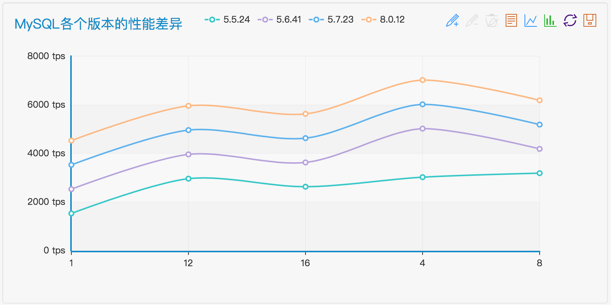

# sysbench使用手册

主编&作者:**蒋乐兴**

wechat:**jianglegege**

email:**1721900707@qq.com**

homepage:**http://www.sqlpy.com**

---
- [序言](#序言)
- [架构要求](#架构要求)
- [etc-ansible-hosts](#etc-ansible-hosts)
- [sysbench的个性化设置](#sysbench的个性化设置)
- [第一步：prepare](#第一步：prepare)
- [第二步：run](#第二步：run)
- [结果分析](#结果分析)
- [分析脚本](#分析脚本)
- [用echarts来画图](#用echarts来画图)

---

## 序言
   **作为一个MySQL-DBA一个比较常见的需求就是针对给定的数据库进行基准测试；由于这种事务重复的太多了，我想从这种重复的劳动中解放出来，于是对sysbench的测试也做了自动化**

   ---

## 架构要求
   **为了进行自动化测试，这就涉及到了三个不同的主机 1):master这个就是MySQL数据库所在的主机 2): sysbench这个就是sysbench所在的主机 3):ansible这个就是ansible所在的主机；2&3可以是同一台主机。**

   主机名            | 角色                 | ip
   -----------------|---------------------|-------------------|
   master           | mysql主库            | 172.16.192.100    |
   sysbench         | sysbench主机         | 172.16.192.101    |
   ansible          | ansible主机          | 172.16.192.2      |

   ---

## etc-ansible-hosts
   **/etc/ansible/hosts 文件内容如下**
   ```
   [ss]
   master      ansible_host=172.16.192.100 ansible_user=root
   sysbench    ansible_host=172.16.192.101 ansible_user=root
   ```
   ---

## sysbench的个性化设置
   **针对sysbench测试的配置在var/sysbench.yaml文件中定义**
   ```yaml
   ---
   mysql_release: mysql-5.7.22
   mysql_cpu: 80
   mysql_mem: 256
   mysql_disk: hdd
   mysql_host: 172.16.192.100
   mysql_port: 3306
   sysbench_user: sysbench
   sysbench_password: sysbench
   database: tempdb
   table_count: 128
   table_row: 100
   # table_count: 128 ,table_row: 10000 数据量大概2G
   time: 13
   sysbench_max_threads: 16
   sysbench_min_threads: 1
   sysbench_thread_setp: 4
   
   ...
   ```

## 第一步：prepare
   **prepare会做一些初始化操作**
   ```yaml
   ---
    - hosts: master #master数据库主机的名字
      remote_user: root
      become_user: root
      vars_files:
       - ../../../config.yaml
       - vars/sysbench.yaml
      tasks:
       - name: create sysbench user and tempdb database on master
         #when: 1 == 2 
         import_tasks: common/init_database.yaml
   
    - hosts: sysbench #sysbench主机的名字
      remote_user: root
      become_user: yes
      vars_files:
       - ../../../config.yaml
       - vars/sysbench.yaml
      tasks:
       - name: prepare database
         import_tasks: common/prepare.yaml
   ...
   ```

## 第二步：run
   **run会进行真正的压力测试**
   ```
   ---
    - hosts: sysbench #sysbench主机的名字
      remote_user: root
      become_user: root
      vars_files:
       - ../../../config.yaml
       - vars/sysbench.yaml
       - vars/benchs.yaml
      vars:
       variable_name: tuning
       variable_value: 0
   
      tasks:
       - name:
         file:
          path: /tmp/{{mysql_release}}
          state: directory
   
       - name:
         template:
          dest: /tmp/{{mysql_release}}
          src: template/master_info.cnf
   
       - name: run
         when: (item.benchtype =='oltp_read_write' and item.threads <=sysbench_max_threads and item.threads >=sysbench_min_threads and item.threads % sysbench_thread_setp == 0 ) or ( item.benchtype =='oltp_read_write' and item.threads==1 )  
         shell: /usr/local/sysbench/bin/sysbench --mysql-host={{ mysql_host }} --mysql-port={{ mysql_port }} --mysql-user={{ sysbench_user }} --mysql-password={{ sysbench_password }} --tables={{ table_count }} --table_size={{ table_row }} --mysql-db=tempdb --time={{time}} --threads={{item.threads}} {{item.benchtype}} run > /tmp/{{mysql_release }}/{{item.benchtype}}#{{item.threads}}.log
         loop: "{{benchs}}"
   ...
   ```

## 结果分析
   **测试结果保存在/tmp/{{mysql_release}}/目录下要解析目录只的文件**
   
   **1): master_info.cnf数据信息**
   ```ini
   [masterinfo]
   cpu=80
   mem=256
   disk=hdd
   table=128
   row=100
   mysql=mysql-5.7.22
   os=centos-7
   ```

   **2): oltp_xxx.#thread.log**
   ```
   sysbench 1.1.0 (using bundled LuaJIT 2.1.0-beta3)
   
   Running the test with following options:
   Number of threads: 1
   Initializing random number generator from current time
   
   
   Initializing worker threads...
   
   Threads started!
   
   SQL statistics:
       queries performed:
           read:                            13202
           write:                           3772
           other:                           1886
           total:                           18860
       transactions:                        943    (72.49 per sec.)
       queries:                             18860  (1449.74 per sec.)
       ignored errors:                      0      (0.00 per sec.)
       reconnects:                          0      (0.00 per sec.)
   
   Throughput:
       events/s (eps):                      72.4871
       time elapsed:                        13.0092s
       total number of events:              943
   
   Latency (ms):
            min:                                  9.41
            avg:                                 13.78
            max:                                 31.56
            95th percentile:                     29.19
            sum:                              12996.49
   
   Threads fairness:
       events (avg/stddev):           943.0000/0.00
       execution time (avg/stddev):   12.9965/0.00
   ```

## 分析脚本
   ```python
   #!/usr/bin/env python3
   
   import argparse
   import os
   import sys
   from collections import Counter
   
   def log_parser(args):
       """解析sysbench的日志
       """
   
       # 拼接出文件全名
       files = os.listdir(args.log_dir)
       files = [os.path.join(args.log_dir,f) for f in files]
   
       # 定义保存结果的变量
       mysql_release=None
       counter = Counter()
   
       # 专用于解析master_info.cnf
       def parser_cnf(file_name):
           with open(file_name) as master_info:
               for line in master_info:
                   if 'mysql=' in line:
                       nonlocal mysql_release 
                       _,mysql_release = line.split('=')
       
       # 专用于解析sysbench的日志
       def parser_sysbench_log(file_name):
           nonlocal counter
           _,s = file_name.split('#')
           threads,_ = s.split('.')
           with open(file_name) as sysbench_log:
               for line in sysbench_log:
                   if 'transactions:' in line:
                       _,s = line.split('(')
                       tps,_ = s.split('per')
                       tps = float(tps)
                       continue
                   if 'queries:' in line:
                       _,s = line.split('(')
                       qps,_ = s.split('per')
                       qps = float(qps)
               
           total = int(tps) + int(qps)
           counter[threads]=total
   
       # sorted.key专用函数，按线程排序结果集
       def order_by_threads(item):
           return item[0]
   
       # 处理日志目标中的文件
       for file_name in files:
           if file_name.endswith('.cnf'):
               parser_cnf(file_name)
           elif file_name.endswith('.log'):
               parser_sysbench_log(file_name)
   
       # 在打印前对结果进行处理
       mysql_release = mysql_release.strip()
       t_s = counter.most_common()
       t_s = sorted(t_s,key=order_by_threads)
       ks=[k for k,v in t_s]
       vs=[v for k,v in t_s]
   
       # 打印结果
       print(mysql_release)
       print(ks)
       print(vs)
  
   
   if __name__=="__main__":
       parser=argparse.ArgumentParser()
       parser.add_argument('--log-dir',default='/tmp/mysql-5.7.32/',help='sysbench日志保存的目录')
       args=parser.parse_args()
       log_parser(args)
   
   ```
   **使用样例**
   ```bash
   python3 analysis.py --log-dir=/Users/jianglexing/Desktop/log
   mysql-5.7.22
   ['1', '12', '16', '4', '8']
   [1521, 2953, 2622, 3015, 3180]
   ```

## 用echarts来画图
   **url: http://echarts.baidu.com/echarts2/doc/example/line1.html**

   **样例**
   ```json
   option = {
       title : {
           text: 'MySQL各个版本的性能差异',
       },
       tooltip : {
           trigger: 'axis'
       },
       legend: {
           data:['5.5.24','5.6.41','5.7.23','8.0.12']
       },
       toolbox: {
           show : true,
           feature : {
               mark : {show: true},
               dataView : {show: true, readOnly: false},
               magicType : {show: true, type: ['line', 'bar']},
               restore : {show: true},
               saveAsImage : {show: true}
           }
       },
       calculable : true,
       xAxis : [
           {
               type : 'category',
               boundaryGap : false,
               data : ['1', '12', '16', '4', '8']
           }
       ],
       yAxis : [
           {
               type : 'value',
               axisLabel : {
                   formatter: '{value} tps'
               }
           }
       ],
       series : [
           {
               name:'5.5.24',
               type:'line',
               data:[1521, 2953, 2622, 3015, 3180],
           },
           {
               name:'5.6.41',
               type:'line',
               data:[2521, 3953, 3622, 5015, 4180],
           },
           {
               name:'5.7.23',
               type:'line',
               data:[3521, 4953, 4622, 6015, 5180],
           },
           {
               name:'8.0.12',
               type:'line',
               data:[4521, 5953, 5622, 7015, 6180],
           }
       ]
   };
      
   ```
   
   ---

